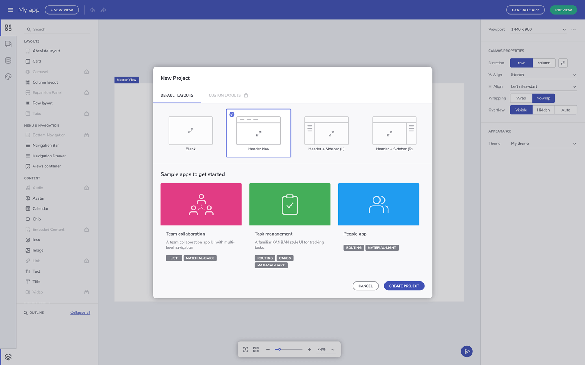
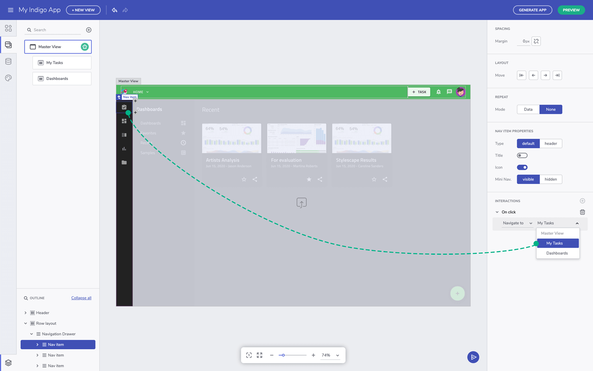

# Single page apps and navigation  

Another Indigo.Design App Builder feature is the single-page apps and navigation. Unlike a page-based design approach, Indigo Design App Builder lets you create separate views that are injected or switched based on how users navigate. To see this action, you can create a new app using the create new application button, then select one of the default layouts that shows a top navigation defined. 

#### Add layout preset from the Menu button, then select Create New App

## Parent view vs. Child views 

What you see here is the master view. And when you look at the views list in the toolbox, you can see that there are two child views nested under it. Each child view corresponds to the navigation buttons in the primary toolbar area. When you preview the app, you will see that clicking on view 1 shows you content available inside view 1, and similarly for view 2. 

#### Switch between views - layout preset

Regarding the master view and child view concept, it should be noted that the master view represents the shell of your app, and can container UI elements that will be shared across all it's child views. In this case, the navigation toolbar and the side navigation are the shared components. To inject the child views based on navigation, you can add a component called a views-container to serve as a place-holder. And this is the area where child-views are rendered. The Views-container, by default, occupies the available space. 

#### Switch between views - sample app

The views-container has a property to define which of the two child views will be shown by default when the app loads. Once the Views container is selected, from the Views Container Properties can be defined which is the default child view displayed.

#### Views container component - sample app

#### Change views interaction - sample app

## Add navigations (routing)  

To connect the navigation to the child views, a navigation action to the button in the 'interactions' section can be added. Currently, we offer Navigate to and Toggle (for components like Nav Drawer, Dropdown and Select) actions, but we'll be adding more actions in future releases. 

#### Define navigation - sample app

That's it for single page apps and the navigation feature. To summarize, child views are injected inside the master view based on navigate action. Child views are hosted inside the master view using the views-container component. And components added to the master view are shared across all it's children views. 

## Additional Resources

* [Preview Code and Generate App](preview-code-and-generate-app.md)
* [Angular Routing](https://angular.io/start/start-routing)