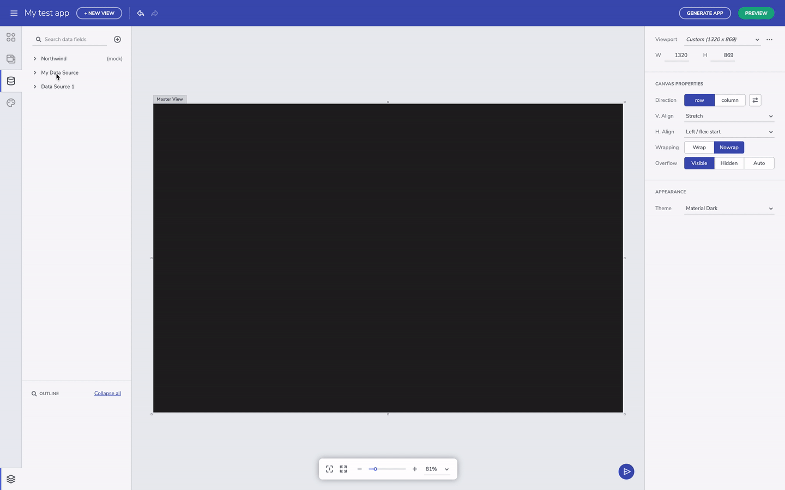
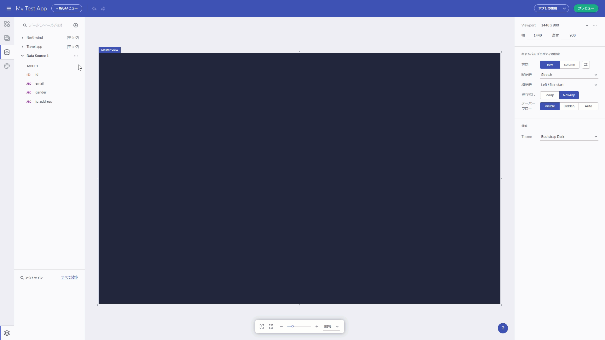

# データ機能の概要
Indigo Design App Builder のデータ機能を使用して、開発中のアプリケーションで外部データソースを追加、編集、使用できます。デフォルトで、Indigo Design App Builder には、ユーザーが参照に使用できる Northwind データ ソースが含まれています。現在、JSON タイプのデータ ソースを追加できるため、ユーザーは独自の JSON ファイルをアップロードすることや、データ ソースに Rest API URL を提供することができます。追加されたすべてのデータ ソースはデータ ツールボックスに配置され、ユーザーは各データ ソースを展開/縮小して、含まれているテーブルおよび選択したフィールドを表示できます。

URL からデータ ソースを追加する

## データ ソースを追加する
Indigo Design App Builder のデータ機能を使用して、JSON (Rest API)、Excel、CSV ファイルなどの外部データ ソースを、ファイルのアップロードまたは外部公開ソースへのリンクによって追加できます。この機能の最初のリリースでは、REST API オプションのみ使用できます。

> [!NOTE]
> Indigo Design App Builder に追加されたデータ ソースはユーザー スペースに制限され、追加したユーザーまたはチーム スペース (チーム機能が利用可能な場合) のみに表示されます。

URL からデータ ソースを追加する

ファイルをアップロードしてデータ ソースを追加する

## データ フィールドの選択とフィールド タイプの変更
データ ソースが追加されると、ユーザーは特定のデータ フィールドをコンポーネント セクションに接続できます。これを行うには、最初にコンポーネント (以下の例ではカード コンポーネントを使用)を選択し、[繰り返し] モードを Data に変更してメニューをスクロールダウンし、接続するデータ ソースからテーブルを見つけて選択します。最後に、カード セクションを選択したテーブル フィールドに接続します。

データ フィールドを選択する

データ ソース テーブルのフィールド タイプを変更する

## データ ソースを繰り返しコンポーネントに接続する
データ ソースが追加されると、ユーザーは特定のデータ フィールドをコンポーネント セクションに接続できます。これを行うには、最初にコンポーネント (以下の例では Card コンポーネントを使用) を選択し、[繰り返し] モードを [Data] に変更してメニューをスクロールダウンし、接続するデータ ソースからテーブルを見つけて選択します。最後に、Card セクションを選択したテーブル フィールドに接続します。

データ ソース テーブルのフィールドをコンポーネント セクションに接続する

## その他のリソース

* [Indigo Design App Builder コンポーネント](indigo-design-app-builder-components.md)