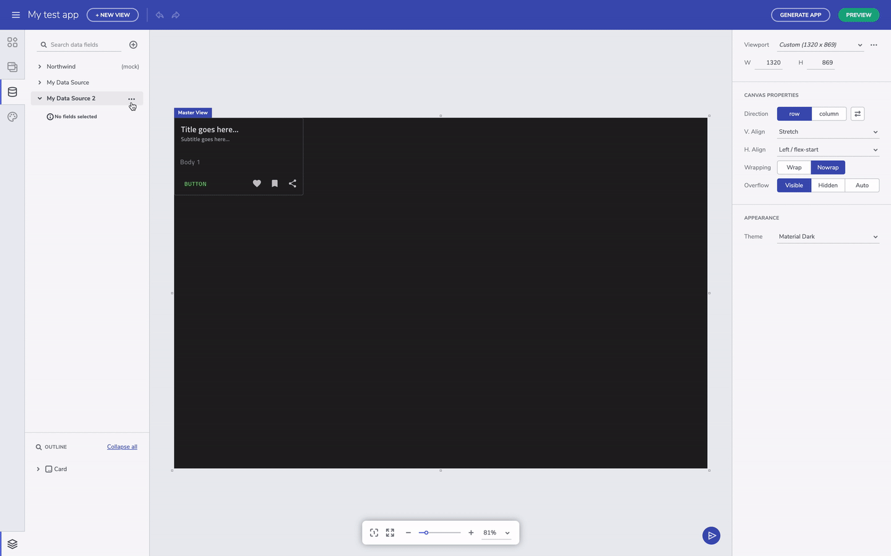
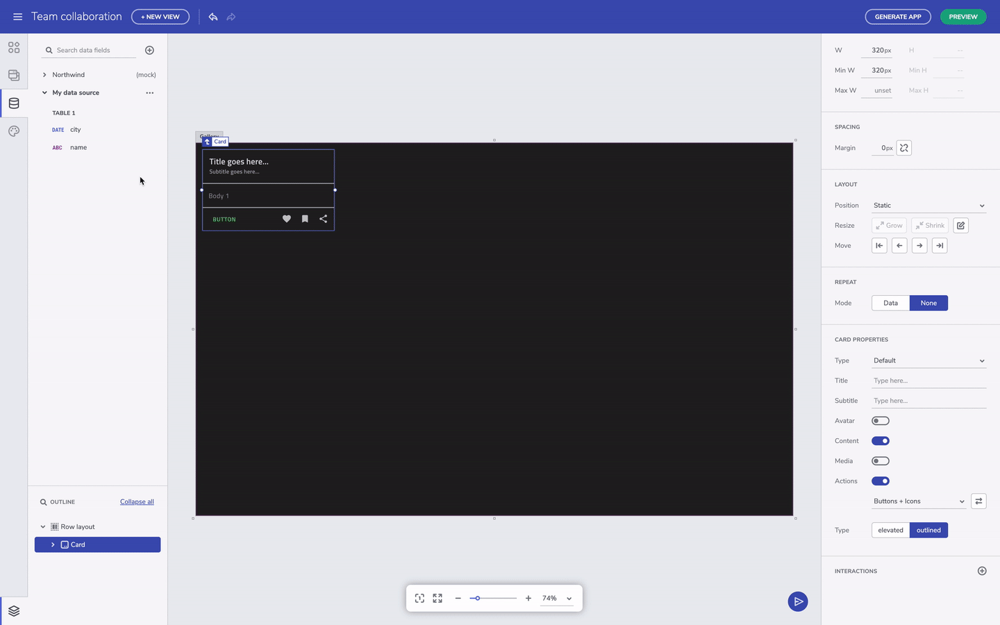

# データ機能の概要
Indigo Design App Builder のデータ機能を使用して、開発中のアプリケーションで外部データソースを追加、編集、使用できます。デフォルトで、Indigo Design App Builder には、ユーザーが参照に使用できる Northwind データ ソースが含まれています。Currently, a JSON type data sources can be added, enabling users to upload their own JSON file or provide a Rest API URL with the data source. All added data sources are placed in the data toolbox and users can expand/collapse each data source in order to see the included tables and selected fields.

URL からデータ ソースを追加する

## データ ソースを追加する
Indigo Design App Builder のデータ機能を使用して、JSON (Rest API)、Excel、CSV ファイルなどの外部データ ソースを、ファイルのアップロードまたは外部公開ソースへのリンクによって追加できます。この機能の最初のリリースでは、REST API オプションのみ使用できます。

> [!NOTE]
> Indigo Design App Builder に追加されたデータ ソースはユーザー スペースに制限され、追加したユーザーまたはチーム スペース (チーム機能が利用可能な場合) のみに表示されます。

URL からデータ ソースを追加する

ファイルをアップロードしてデータ ソースを追加する

## データ フィールドの選択とフィールド タイプの変更
When a data source has been added, users can connect a particular data field to a component section. In order for this to be done, first select the component (a card component is used in the example below), then change Repeat mode to Data and scroll down the menu to locate and select the table from the Data Source that you want to connect to. Finally, connect the card section with the selected table field.

データ フィールドを選択する

データ ソース テーブルのフィールド タイプを変更する

## データ ソースを繰り返しコンポーネントに接続する
データ ソースが追加されると、ユーザーは特定のデータ フィールドをコンポーネント セクションに接続できます。これを行うには、最初にコンポーネント (以下の例ではカード コンポーネントを使用)を選択し、Repeat モードを Data に変更してメニューをスクロールダウンし、接続するデータ ソースからテーブルを見つけて選択します。最後に、カード セクションを選択したテーブル フィールドに接続します。

データ ソース テーブルのフィールドをコンポーネント セクションに接続する

## その他のリソース

* [Indigo Design App Builder コンポーネント](indigo-design-app-builder-components.md)