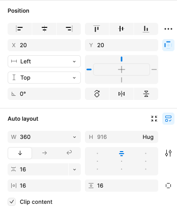

# レイアウトのベスト プラクティス

このトピックはアプリケーション レイアウトでコンポーネントの配置およびレスポンシブ アプリ デザインを実装するためにサイズ変更ルールの設定に関連するデザイン ガイダンスを提供します。以下のおすすめは、Figma で指定したレスポンシブ動作を含む Angular アプリを生成できます。

## レイアウト

Figma では、絶対配置のフレーム / グループを使用できます。この場合、レイアウト生成は [絶対レイアウト](./best-layout-practices.md#レイアウト) ルールに従います。または、自動レイアウト オプションを利用できます。

### 自動レイアウト

自動レイアウトは、コンテナー (フレーム、コンポーネント、グループなど) を構造化して、画面サイズに応じて適応するレスポンスの速いレイアウトを実現できる Figma 独自の機能です。コンテンツの流れ、配置、サイズ、コンテナー内での広がり方に関するルールを設定できます。そのため、Web のフレックスボックスと概念が非常に似ています。

自動レイアウト オプションは、デザイナーが Figma の UI を介して設定できます。

以下に、それぞれの特定の設定に関する詳細情報を示します。

#### レイアウト方向

Vertical、Horizontal、または Wrap のいずれかにすることができ、コンテナー内で要素が流れる方向を決定します。
垂直レイアウトの場合は `flex-direction: column`、水平レイアウトの場合は `flex-direction: row`、ラップ レイアウトの場合はネストされた列の `flex-direction: row` と `flex-direction: column` を生成します。

#### 配置

このコンテナー内で項目をどのように配置するかを決定します。`justify-content` および `align-items` CSS オプションと関連付けます。`justify-content` は主方向軸 (列の場合は垂直、行の場合は水平) に沿った配置を決定するのに対し、align-items は対抗軸 (列の場合は水平、行の場合は垂直) に沿った配置を決定することに注意してください。したがって、これらはレイアウトの方向にも依存します。

#### その他

Figma の Gap Between Items と Padding オプションを使用して、項目間のスペースとパディングを設定することもできます。これらは CSS で `gap` と `padding` として解析されます。

## サイズ変更

Figma には、親またはコンテンツに対して項目のサイズを変更する方法を決定する、Horizontal Resizing および  Vertical Resizing オプションがあります。

使用可能なオプションは、Fixed、Hug、または Fill です。以下に、それぞれが生成するものを示します。

**Fixed** - サイズはピクセル単位で固定されています。

**Hug** - サイズは子コンテンツに基づきます。この場合、サイズは適用されません。

**Fill** - サイズは親に基づきます。親を埋めるために伸びる必要があります。`flex: 110px;` または `self-align: stretch` に関連します。

## その他のリソース

関連トピック:

- [Input](components/input.md)
- [Bottom Navigation](components/bottom-nav.md)
- [Navbar](components/navbar.md)
- [Navigation Drawer](components/nav-drawer.md)
  

コミュニティに参加して新しいアイデアをご提案ください。
