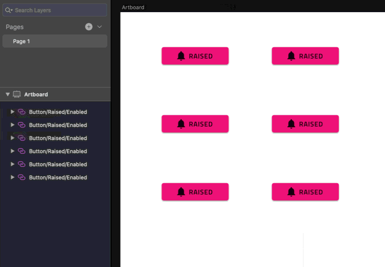
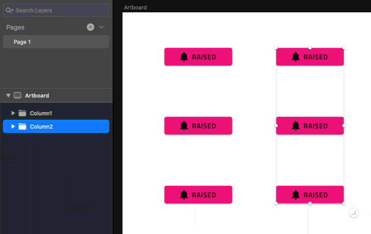
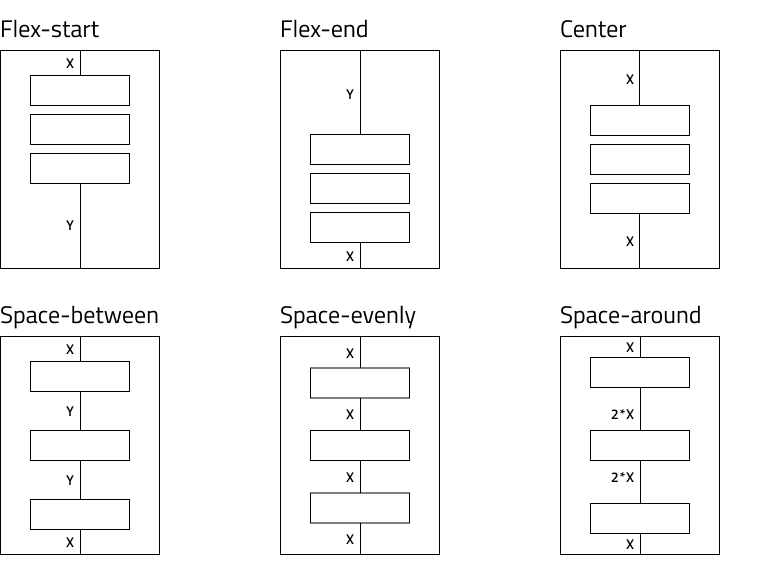
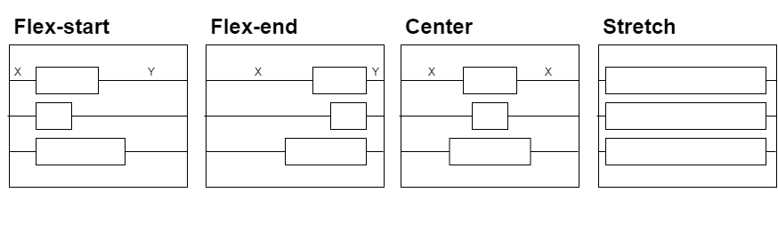
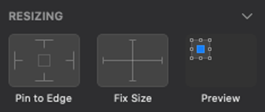

# レイアウトのベスト プラクティス

このトピックはアプリケーション レイアウトでコンポーネントの配置およびレスポンシブ アプリ デザインを実装するためにサイズ変更ルールの設定に関連するデザイン ガイダンスを提供します。以下のおすすめは、Sketch で指定したレスポンシブ動作を含む Angular アプリを生成できます。

## レイアウト
このセクションでは、Sketch で要素をグループ化して最適な結果を得る方法についてのガイダンスを提供します。

コード生成アルゴリズムは、レイアウトを水平方向に作成します。最初に行を作成します。デザインが列指向の場合、より良い結果を得るために Sketch のグループを利用できます。以下のデザインでは、6 つのボタンがあり、グループはありません。

生成されたアプリには 3 つの行があり、各行には 2 つのボタンが含まれています。

デザイナーは、Sketch でグループを適用することにより、このレイアウトを 2 つの列に簡単に構成できます。

このデザインから生成されたアプリには、単一の行と 2 つの列が含まれます。

このようにして、デザイナーは Sketch グループ化を使用して生成された結果を制御できます。Sketch では要素を常にグループ化することをお勧めします。これにより、クリーンで整理されたデザインが作成されるだけでなく、要素をまとめることができます。コード生成で Sketch グループの要素に追加の行または列が適用される場合があります。これは、flex-display コンテナー内の要素の位置をさらに改善するために行われます。

## 両端揃えと配置
実際のシナリオでは、flex コンテナーを念頭に置いて設計されたアプリは、`justify-content` と `align-items` を使用してグループと要素を配置します。ジェネレーターも同様です。両端揃えと配置のプロパティを行と列に適用します。これにより、それらの行と列のスペースでの要素の配置が決定されます。ジェネレーターは、要素の位置、サイズ、オフセットなどの複数のパラメーターを考慮して、`justify-content` および `align-items` CSS プロパティに適切な値を適用します。

`justify-content` に指定できる値は `flex-start`、`flex-end`、`center`、`space-around`、`space-between`、`space-evenly` です。使用方法は次の図に示しています。

レスポンシブな配置を実現するには、要素を配置し、以下の構成のいずれかでグループを形成する必要があります。

一致する場合、ジェネレーターは対応する値を適用します。シナリオによっては、どちらのオプションもレイアウトと一致しません。この場合、ジェネレーターは要素を分割して小さなグループを作成します。次に、各グループがレイアウトに最も適した両端揃えになるまで、これらの小さいグループに対して同じロジックを実行します。

`align-items` の利用可能な値は `flex-start`、`flex-end`、`center` および `stretch` です。使用方法は次の図に示しています。

同様のルールが `align-items` にも適用されます。最高のレスポンシブな配置を実現するには、デザインをこれらの構成のいずれかに近づける必要があります。

> [!Note]
> グループによっては、複数の適切な値がある場合があります。そのような場合、ジェネレーターは最初に一致したものを適用します。

## サイズ変更
Sketch では、要素に固定サイズを設定できます。ジェネレーターは、要素が親コンテナーのサイズ変更に応答するかどうかを決定するときにこの設定に従います。

デザイナーが要素に固定サイズを適用する場合、生成される要素またはコンテナーのサイズはピクセル単位で設定されます。

固定サイズ、特にグループには設定しないようにしてください。ジェネレーターは、固定されていないサイズの要素を引き伸ばし、パーセンテージ ベースのサイズ要素に適用します。

固定サイズが必要な場合があります。Avatar など、Indigo.Design UI キットのコンポーネントのサイズも固定されています。特定の要素を引き伸ばしたくない場合は、固定幅または高さを適用します。ただし、固定サイズグループはアプリの応答を制限する場合があることに注意してください。

また、要素はデザインの幅と高さに等しい `min-width` または `min-height` を受け取ります。これは、特定の要素がデザインで指定したレイアウトより小さくならないようにするためです。

## ピン固定
コード ジェネレーターは、デザインのすべての要素を flex レイアウトに配置しようとしますが、ビューポートのサイズ変更に応答する場合でも、他の要素の上に配置するか、画面上の特定の位置を保持する必要がある場合があります。レイアウトで要素を絶対に配置するには、要素をコンテナーの端にピン固定します。要素を別の要素の上または右に配置するには、右または下にピン固定します。このようにして、ピン固定側から絶対位置と適切なマージンを受け取ります。

レスポンシブなアプリを向上させるために、Sketch で要素とグループが重複しないようにしてください。

> [!Note]
> 反対側のピン (左右/上下) は無視され、考慮されません。コード ジェネレーターは、絶対位置を受け取る代わりに要素を引き伸ばすことを前提としています。

## その他のリソース

関連トピック:

- [Input](components/input.md)
- [Bottom Navigation](components/bottom-nav.md)
- [NavBar](components/navbar.md)
- [Navigation Drawer](components/nav-drawer.md)
  

コミュニティに参加して新しいアイデアをご提案ください。

