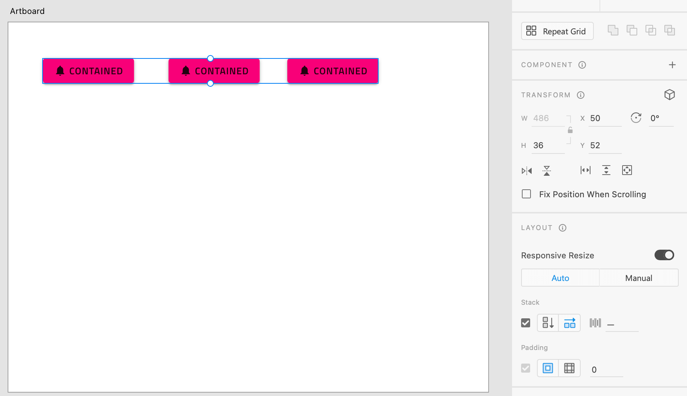

# レイアウトのベスト プラクティス

このトピックはアプリケーション レイアウトでコンポーネントの配置およびレスポンシブ アプリ デザインを実装するためにサイズ変更ルールの設定に関連するデザイン ガイダンスを提供します。以下のおすすめは、Adobe XD で指定したレスポンシブ動作を含む Angular アプリを生成できます。

## レイアウト
このセクションでは、Adobe XD で要素をグループ化して最適な結果を得る方法についてのガイダンスを提供します。 
ほとんどの場合、絶対レイアウト規則が適用されます。詳細については、[こちら](./best-layout-practices.md#レイアウト)を参照してください。

### スタック

Adobe XD が Sketch に提供する追加機能の 1 つに、スタックを使用して動的なデザインを作成するためにグループを使用する機能があります。 
スタックは、垂直または水平レイアウトを作成するオプションを提供し、パディングとマージンの間隔を決定することもでき、作成するレイアウトをより詳細に制御できます。

スタック方向は、フレックス行またはフレックス列を生成するかどうかを決定します。

行レイアウトはグループの `flex-direction: row` を生成します。

列レイアウトはグループの `flex-direction: column` を生成します。

パディングとマージンもグループに指定でき、DOM の関連要素の CSS としても生成されます。

## サイズ変更

このセクションは要素のサイズ変更を決定します。

要素のサイズ変更は、Adobe XD のレイアウト設定によって決定されます。
2 つのオプションがあります: Auto および Manual です。

Auto の場合、生成される要素はページに対して相対的にサイズ変更されます。ページ`のサイズとともに拡大/縮小します。

Manual を使用すると、要素の絶対サイズがピクセルで指定されるように幅または高さを固定できます。

## 固定
このセクションは、固定方向が要素の位置にどのように影響するかを決定します。

固定は Manual Layout メニューからも指定できます。要素に異なる固定方向を設定でき、要素に相対位置または絶対位置があるかどうかに影響します。[Sketch ピン固定](./best-layout-practices-sketch.md#ピン固定)と同じルールが適用されます。 

## その他のリソース

関連トピック:

- [Input](components/input.md)
- [Bottom Navigation](components/bottom-nav.md)
- [Navbar](components/navbar.md)
- [Navigation Drawer](components/nav-drawer.md)
  

コミュニティに参加して新しいアイデアをご提案ください。

