---
title: レイアウトのベスト プラクティス - デザイン システム
_description: Sketch でレイアウトの作成のベスト プラクティスおよび Sketch とコード生成後の Angular アプリでレスポンシブ動作の結果になるサイズ変更構成のベスト プラクティス。 
_keywords: デザイン システム, デザイン システム UX, UI キット, Sketch, Ignite UI for Angular, Sketch to Angular, Angular, Angular デザイン システム, Sketch からコードをエクスポート, Angular 用のデザイン キット, Sketch HTML, Sketch to HTML, Sketch UI キット
_language: ja
---

# レイアウトのベスト プラクティス

このトピックはアプリケーション レイアウトでコンポーネントの配置およびレスポンシブ アプリ デザインを実装するためにサイズ変更ルールの設定に関連するデザイン ガイダンスを提供します。以下のおすすめは、Sketch で指定したレスポンシブ動作を含む Angular アプリを生成できます。

> [!Note]
> Input、Radio Button、Slider、Checkbox、Hyperlink、Switch、Progress Bar、Toast、Snackbar、Avatar、Dialog、Icon、およひ Title / Paragraph Text はコンポーネントのレイアウトまたはテキスト コンポーネントの場合にフォント サイズによって制限されるプリセット高さがあります。全般的なシナリオで正しく操作するため、このコンポーネントのデフォルト高さを使用して Sketch で固定してください。

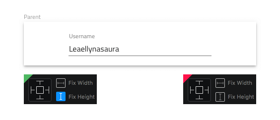

## 垂直レイアウト

このセクションは、含まれるグループまたはアートボードの高さの変更に基づいたサイズの変更方法に影響するコンポーネントおよびパターンの垂直レイアウトに関連するデザイン ガイダンスを提供します。

### 垂直中央揃え

レイアウトを属するグループまたはアートボードの垂直中央に配置するには、そのコンポーネントおよびパターンを固定高さを持つ新しいグループにグループ化します。このグループを元のグループまたはアートボードの上下境界から同じ距離に配置します。新しいグループが上下にピン固定されないことを確認してください。

**グループが水平方向にスケールすると、含まれる入力もスケールします。含まれるグループは垂直の中央揃えになります。**

**Sketch でこのシナリオが以上の例と同じように動作しますが、2 つの入力の周りにグループがない場合、Angular で予期される結果は生成しません。**

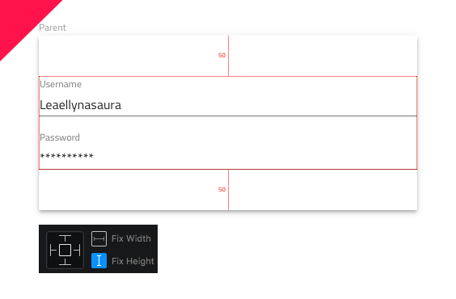

新しいグループの幅が固定され、元のグループまたはアートボードの左右境界から同じ距離に配置される場合、新しいグループも水平方向に中央揃えになります。

**グループはディメンションを保持し、垂直および水平方向に中央揃えになります。**

### 要素を上にピン固定

コンポーネントまたはパターンを含まれるグループまたはアートボードとの関連で上マージンを保持するには、サイズ変更プロパティによって上にピン固定する必要があります。このピン固定設定は、要素が含まれるグループまたはアートボードの上下境界から同じ距離に配置される場合にも適用されます。

**入力は常に 40px の上マージンを保持します。**

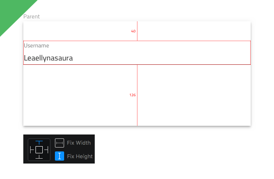

**Sketch で要素を上にピン固定しない場合、親グループの高さが変更されると上マージンが変更します。**

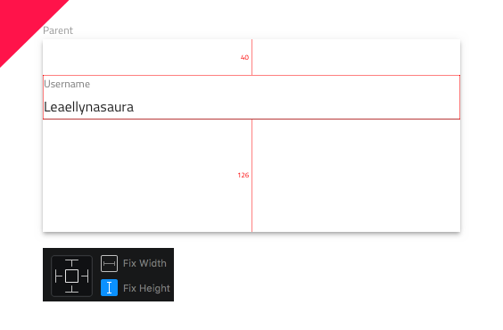

複数の要素のレイアウトの場合、グループまたはアートボードの上マージンまたは垂直軸で要素の間にスペースを追加するマージンを保持するために、各要素をサイズ変更プロパティで上にピン固定する必要があります。

**入力は常に上マージンと垂直軸の要素間にスペースを追加するマージンを保持します。**

**Sketch で要素を上にピン固定しない場合、親グループの高さが変更されると上マージンと入力の間のマージンが変更されます。**

複数の要素のレイアウトがグループに配置される場合、上ピン固定ルールをグループおよびそのコンテンツに適用します。

**グループはその上マージンを保持し、入力は垂直軸で要素の間のマージンを保持します。**

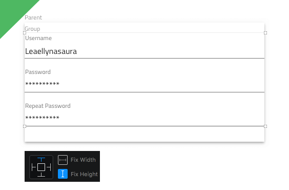

## 水平レイアウト

このセクションは、含まれるグループまたはアートボードの幅の変更に相対してサイズ変更する方法に影響するコンポーネントおよびパターンの水平レイアウトに関連するデザイン ガイダンスを提供します。

### フレキシブル幅

Component または Pattern を属するグループまたはアートボードの全幅に拡張する場合、右側と左側がグループやアートボードの右側または左側と一致することを確認します。

**Input は、親内の幅の変更で拡張します。右側と左側が属しているグループまたはアートボードと一致するため、右または左にピン固定すると、どちら側もピン固定されていない場合に同様のレスポンシブ動作になります。**

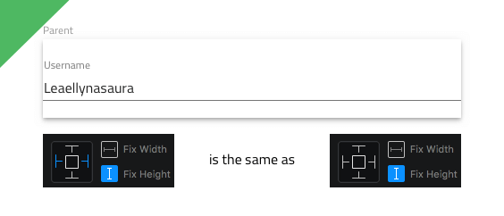

**Input は、左右のマージンを保持し親の幅が変更されたときに正しく拡張します。ただし、Input はグループに配置する方がより適切な柔軟性のある幅動作となり、グループで右または左マージンに設定します。**

**Input は左マージンを保持して親幅が変更されたときに比例的に拡張するため、結果的に不適切なレスポンシブ動作になります。**

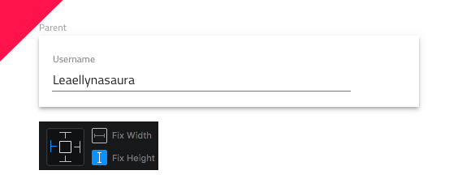

**Input は、比例的に拡張して親幅が変更されたときに右や左に移動すると結果的に不適切なレスポンシブ動作になります。**

### 固定幅

Component または Pattern の幅を保持するために、固定幅を設定し、属するグループまたはアートボードの右または左側にピン固定してください。これらの要素にコンポーネント (Avatar、Circular Progress Bar、Icon、Toast など) としてデフォルトの固定幅がある以外、ほとんどの場合でレイアウト行に単独で表示される要素に柔軟性のある幅を使用することをお勧めします。

**Input は、レスポンシブ時に変更されない固定幅を持つ左マージンを常に保持します。**

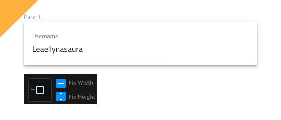

**Input は、レスポンシブ時に変更されない固定幅を持つ右マージンを常に保持します。**

**Input は、幅を常に保持しますが右または左にピン固定しない場合、結果的に不適切なレスポンシブ動作になります。**

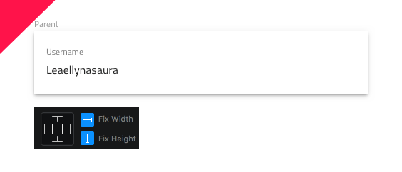

### 2 要素を水平にレイアウト

2 要素を水平レイアウトで各要素のサイズを正しく調整するには、レイアウトの右か左にピン固定して 2 要素がグループに配置される必要があります。この Sketch のグループまたはアートボードは属しているグループの左右両方にピン固定する必要があります。

**左 Input は左にピン固定、右 Input は右にピン固定されます。配置するグループは左右両方にピン固定されます。**

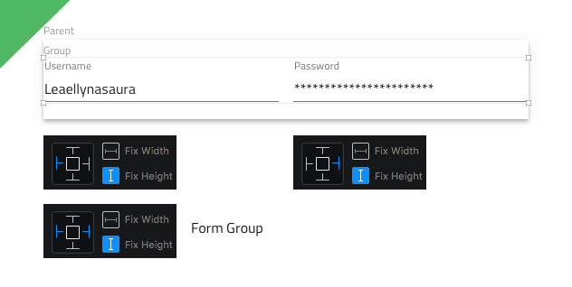

要素を 2 要素水平レイアウトで各要素のサイズを正しく調整するには、最初の要素は左右両方にピン固定、2 つ目の要素は右 (レイアウトの左に表示される場合) または左 (レイアウトの左に表示される場合) どちらかにピン固定、そして 2 つの要素をグループに配置する必要があります。この Sketch のグループまたはアートボードは属しているグループの左右両方にピン固定する必要があります。

**左 Input は左右両方にピン固定する必要があり、右 Input は右側にのみピン固定されて幅も固定されています。配置するグループは左右両方にピン固定されます。**

2 要素を水平レイアウトで各要素のサイズを正しく調整するには、レイアウトの右 (レイアウトの右に表示する場合) または左 (レイアウトの左に表示する場合) にピン固定して 2 要素がグループに配置される必要があります。

**左 Input は左にピン固定、右 Input は右にピン固定されます。配置されるグループの幅以外に固定する必要のある幅はありません。**

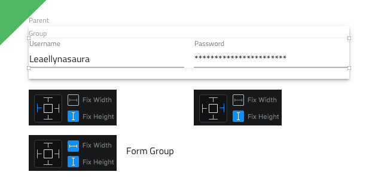

> [!Note]
> グループに要素を配置して各幅が固定されていない、またはグループの幅も固定されていない場合、レスポンシブ レイアウトで比例的に要素の幅を変更することができます。

**左 Input は左にピン固定、右 Input は右にピン固定されますが、幅は固定されません。両要素が比例的にスケールされますが、Sketch 要素間のマージンも同様にスケールされます。ただし、生成されたコードはマージンを優先し、エクスポート時にそれを値に設定して、属しているグループの幅が変更された時に実際の要素のみを比例的に拡張します。**

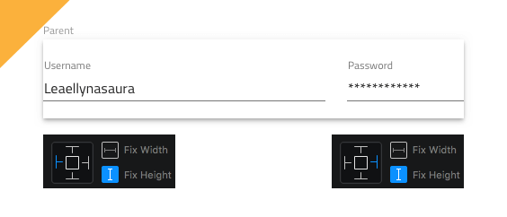

### その他の幅要素を水平にレイアウト

レスポンシブな状況で複数要素のレイアウトを正しく動作させるには必要に応じてグループ化し、レイアウトを構成する要素とグループに定義したルールを適用します。

**左 Input は、高さを固定し左にピン固定しますが、右 Input は高さを固定して右にピン固定されます。両方ともグループに配置されます。Button と Hyperlink は幅と高さの両方が固定され、個別のグループに配置されます。**

**Input グループは、高さを固定し左右にピン固定しますが、その他のグループは幅と高さを固定して右にピン固定されます。2 つのグループはレイアウトを他のグループに配置して全体のレイアウトを統合し、右と左に固定されて高さも固定されます。フォームの幅を変更する場合、内側の Input Group と Input 要素を利用可能なスペースに正しくサイズ変更します。一方、Button や Link グループは、常にサイズとその要素のサイズを保持し、フォームの右端と左端に同じスペースを占有するようにします。**

属しているグループまたはアートボードに関連する常に中央揃えにした幅を固定したフォームを使用します。

**両 Input、Button、 Hyperlink は、幅と高さが固定されていて、幅と高さが固定されている共通グループに配置され、水平および垂直にその親の端から等しく離れて配置されます。すべての要素は、レスポンシブでディメンションを保持し、フォーム全体が両方向に中央揃えになります。**

### 複数要素のデフォルト水平レイアウト

Component または Pattern の左に距離が空いている場合、属しているグループまたはアートボードの上境界線を優先するために左と上にピン固定してください。

**各要素は左と上にピン固定して描画するためのコードを生成し、親に関連して左と上マージンが優先されます。親がサイズ変更される場合にサイズ変更されないように各要素の幅と高さも固定します。**

## すべてのマージン

レイアウトでグループやアートボードに関連するすべての側のマージンを保持するために、4 方向すべてピン固定された新しいグループで Components および Patterns をグループ化する必要があります。

**グループは上下左右にそれぞれマージン 16px を常に保持してサイズを必要に応じて変更します。グループ内のコンテンツは指定したルールに基づいて各要素に適応します。その場合 Input は高さ、上マージン 0 px、垂直軸間のマージンを保持します。**

> [!Note]
> 特定のコンポーネントでは、Bottom Navigation、Navbar、Navigation Drawer、その他の要素で 3 方向ピン固定し、アプリ レイアウトの Components の望ましい配置に基づいて幅や高さをピン固定していない方向に沿って固定します。

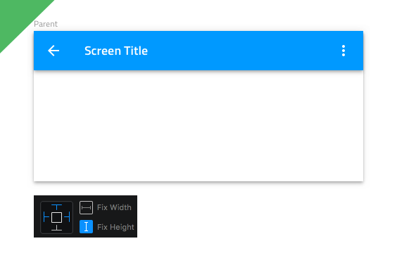

## その他のリソース

関連トピック:

- [Input](components/input.md)
- [Bottom Navigation](components/bottom-nav.md)
- [Navbar](components/navbar.md)
- [Navigation Drawer](components/nav-drawer.md)
  

コミュニティに参加して新しいアイデアをご提案ください。

