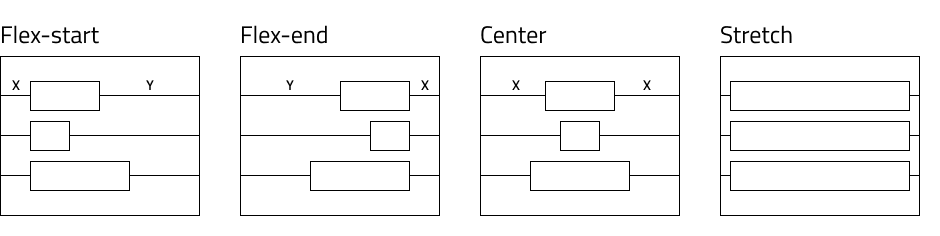

# 概要

このトピックはアプリケーション レイアウトでコンポーネントの配置およびレスポンシブ アプリ デザインを実装するためにサイズ変更ルールの設定に関連するデザイン ガイダンスを提供します。

各デザイン ツール (Figma、Sketch、XD) は、ビュー内の要素の位置とサイズを構成する独自の方法を提供します。

一般に、これらのツールを使用すると、次のいずれかを指定できます。

## 絶対レイアウト デザイン

  これは、すべての要素がビュー上の絶対位置で並べられ、追加の位置情報やサイズ情報がないデザインです。それらの目的は、特定の解像度でのみデザインを表示することです。

  このようなデザインでは、要素がビューのサイズ変更にどのように反応するかについてのデザイナーの意図が必ずしも明確ではないため、意味のあるレスポンシブ レイアウトを決定することは困難です。

  Design to Code アルゴリズムは、レイアウトの絶対位置に基づいて、可能な限りレスポンシブ デザインを構築しようとします。絶対レイアウトからレスポンシブ レイアウトへの特定のルールとガイドラインについては、[絶対レイアウトのベスト プラクティス](./best-layout-practices.md#レイアウト) セクションを参照してください。
  
## レスポンシブ レイアウト デザイン

  これは、特定のツールの機能を利用して、レイヤーをサイズ変更に反応するものとしてマークし、それらのレイアウトとその子が従うべき反応ルールを決定するデザインです。
    これは各ツールに固有のものであり、関連するトピックで詳細を確認できます。

  - [Figma のレスポンシブ レイアウト](./best-layout-practices-figma.md)
  - [Sketch のレスポンシブ レイアウト](./best-layout-practices-sketch.md)
  - [XD のレスポンシブ レイアウト](./best-layout-practices-xd.md)
  
  このアプローチでは、サイズ変更にどのように反応するかについて、デザインから得られる情報が多くなり、常に App Builder の元のデザインにより近い生成結果が得られます。このため、より良い結果を得るには、特定のツールのレスポンシブ レイアウト オプションを利用することをお勧めします。

# 絶対レイアウトのベスト プラクティス

このセクションでは、アプリ レイアウトでのコンポーネントの配置に関するデザイン ガイダンスを提供します。以下のおすすめは、レスポンシブ動作を含むアプリを生成できます。

## レイアウト

コード生成アルゴリズムは、レイアウトを水平方向に作成します。最初に行を作成します。デザインが列指向の場合、より良い結果を得るために Sketch のグループを利用できます。以下のデザインでは、6 つのボタンがあり、グループはありません。

生成されたアプリには 3 つの行があり、各行には 2 つのボタンが含まれています。

デザイナーは、Sketch でグループを適用することにより、このレイアウトを 2 つの列に簡単に構成できます。

このデザインから生成されたアプリには、単一の行と 2 つの列が含まれます。

このようにして、デザイナーは生成された結果のグループ化を制御できます。要素を常にグループ化することをお勧めします。これにより、クリーンで整理されたデザインが作成されるだけでなく、要素をまとめることができます。コード生成でグループの要素に追加の行または列が適用される場合があります。これは、flex-display コンテナー内の要素の位置をさらに改善するために行われます。

## 両端揃えと配置
実際のシナリオでは、flex コンテナーを念頭に置いて設計されたアプリは、`justify-content` と `align-items` を使用してグループと要素を配置します。ジェネレーターも同様です。両端揃えと配置のプロパティを行と列に適用します。これにより、それらの行と列のスペースでの要素の配置が決定されます。ジェネレーターは、要素の位置、サイズ、オフセットなどの複数のパラメーターを考慮して、`justify-content` および `align-items` CSS プロパティに適切な値を適用します。

`justify-content` に指定できる値は `flex-start`、`flex-end`、`center`、`space-around`、`space-between`、`space-evenly` です。使用方法は次の図に示しています。

レスポンシブな配置を実現するには、要素を配置し、以下の構成のいずれかでグループを形成する必要があります。

一致する場合、ジェネレーターは対応する値を適用します。シナリオによっては、どちらのオプションもレイアウトと一致しません。この場合、ジェネレーターは要素を分割して小さなグループを作成します。次に、各グループがレイアウトに最も適した両端揃えになるまで、これらの小さいグループに対して同じロジックを実行します。

`align-items` の利用可能な値は `flex-start`、`flex-end`、`center` および `stretch` です。使用方法は次の図に示しています。

同様のルールが `align-items` にも適用されます。最高のレスポンシブな配置を実現するには、デザインをこれらの構成のいずれかに近づける必要があります。

> [!Note]
> グループによっては、複数の適切な値がある場合があります。そのような場合、ジェネレーターは最初に一致したものを適用します。

## サイズ変更

要素にサイズ変更オプションが設定されていない場合、要素は引き伸ばされ、パーセンテージ ベースのサイズになります。

また、要素はデザインの幅と高さに等しい `min-width` または `min-height` を受け取ります。これは、特定の要素がデザインで指定したレイアウトより小さくならないようにするためです。

## その他のリソース

関連トピック:

- [Input](components/input.md)
- [Bottom Navigation](components/bottom-nav.md)
- [Navbar](components/navbar.md)
- [Navigation Drawer](components/nav-drawer.md)
  

コミュニティに参加して新しいアイデアをご提案ください。

