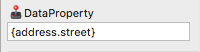

# データ バインディング

Ignite UI for Angular コンポーネントの多くはデータ バインディングをサポートします。Sketch で特定のオーバーライドを公開したデータ バインド機能を使用する場合、コード生成中に使用するプロパティ名でバインドを設定できます。Sketch でこれらｒのプロパティはコンポーネントごとに異なるため、各コンポーネントでデータ バインド時にサポートされるオーバーライドについて確認することをお勧めします。

## 使用方法

データ バインドは Sketch でプロパティ名を波括弧で囲んで指定します。コード生成に波括弧間のコンテンツがデータ バインディングに使用するプロパティであることを通知します。このプロパティを使用して適切な HTML を生成します。


特定のオーバーライドは補間文字列をサポートします。補間文字列は標準テキストをデータバインド テキストと組み合わせます。この場合もバインドするプロパティの周りに波括弧は必要です。文字列補間がサポートされるかどうかは、使用するコンポーネントのヘルプを確認してください。たとえば、テキスト表示プロパティは文字列補間をサポートしますがデータソース プロパティはサポートされません。


> [!NOTE]
> テキスト プロパティの一部で文字列補間がサポートされません。使用する各コンポーネントのヘルプでバインドをサポートするオーバーライドを確認してください。

## ネスト プロパティ

ネスト プロパティがサポートされます。他のプロパティ内に含まれるプロパティをバインドできます。`User` という Typescript クラスがあり、このクラスに `Address`オブジェクトのであった `address` プロパティがあります。

```typescript
export class Address {
  street: string;
  city: string;
  state: string;
}

export class User {
  address: Address;
}
```

Sketch では、ネスト プロパティを使用して `Address` の `street` プロパティにバインドを指定できます。



このバインドは、`User` がコード生成時に [Indigo.Design Code Generator](TODO) 拡張子で指定したモデル オブジェクト名になります。データ バインディングがネスト プロパティをサポートするかどうかも重要です。
