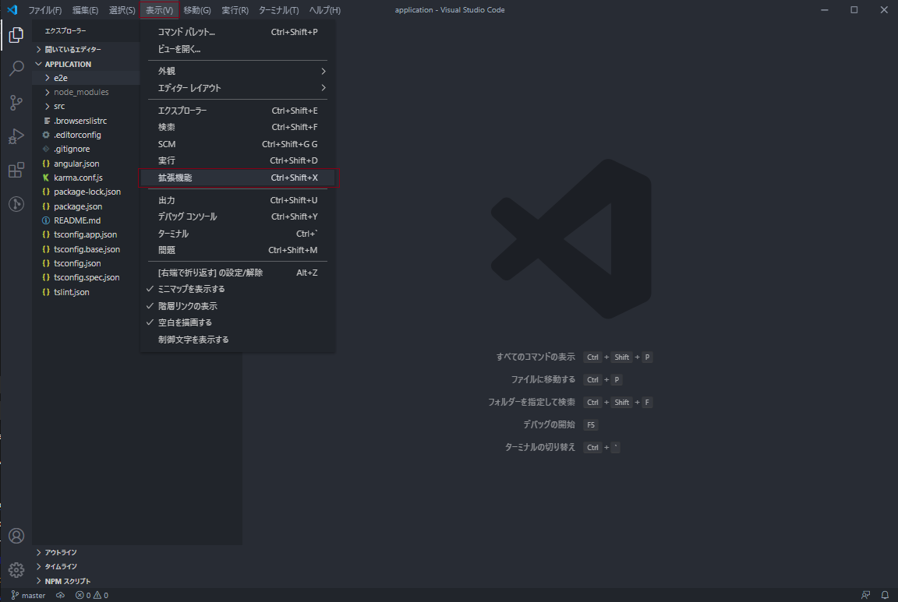
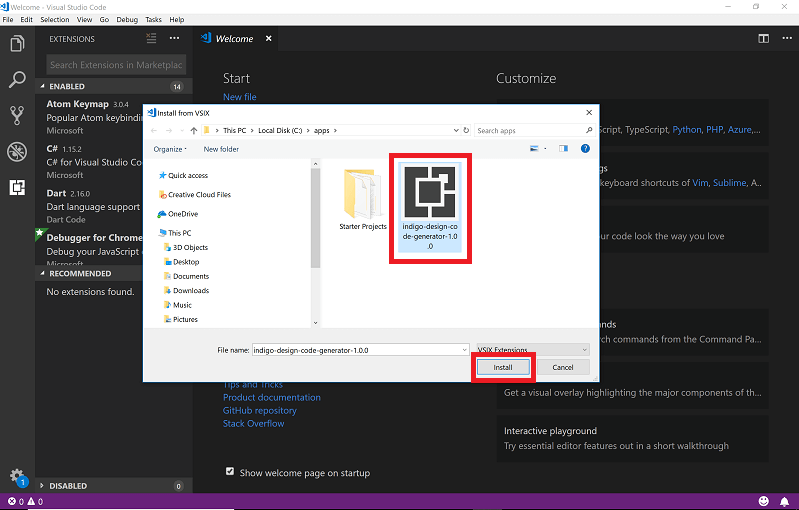
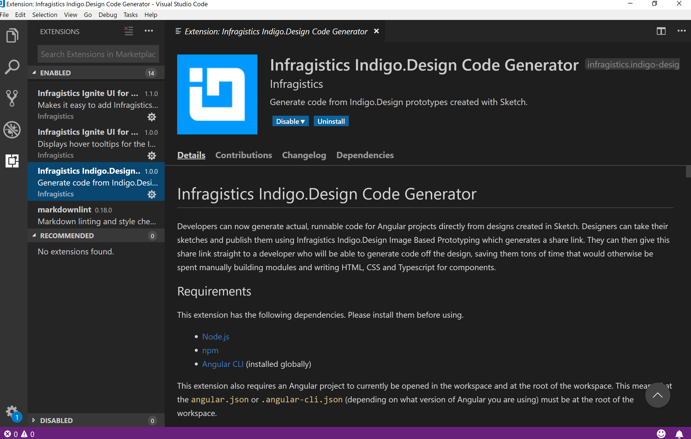

## Visual Studio Code 拡張機能のインストール

VS Code 拡張機能をインストールする前に、Visual Studio Code がインストールされていることを確認してください。コードを生成し、Angular アプリケーションを実行するには、Node.js もインストールしてください。このリンクから取得できます。

1.  NodeJS: [ダウンロード](https://nodejs.org/ja/download/)してインストール
2.  Visual Studio Code: [ダウンロード](https://code.visualstudio.com/download)してインストール

## 詳細手順

1.  パッケージをハード ドライブに解凍します。

2.  Visual Studio Code を開いて、メイン メニューで「表示」> 「拡張機能」を選択します。

    

    
    

    

    

    

    

3.  拡張機能ペインで、右上の「その他のオプション」(3 つの水平ドット) ボタンをクリックします。

4.  ドロップダウン メニューから「VSIX からインストール」を選択します。

    

    
    

    

    

    

    

5.  ダウンロードして解凍したファイルの場所に参照し、VS Code 拡張機能を選択します。
    

    
    

    

    

    

    

拡張機能がコンピューター上でインストール済みになりました。

## その他のリソース

コミュニティに参加して新しいアイデアをご提案ください。

