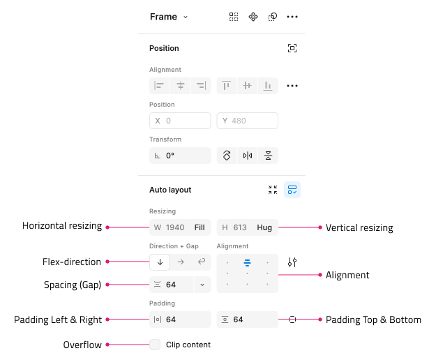

## Figma パーサーの概要

Figma パーサーの主な目的は、Figma デザイン ツールと App Builder の間のギャップを埋めることです。必要なヒューリスティックを使用することで、パーサーはユーザーがアプリにどのような外観を望んでいるかを読み取り、Web 開発者がアプリをどのように構造化および構成しようとしているかの意味のある表現を提供します。これにより、後でコード生成によって実際のアプリとそのコードの外観が作成されます。

## Figma の Auto-Layout を一般的なモデルの Flex レイアウトに適用

デザイナーが Figma の Auto-Layout を使用してデザインを作成すると、パーサーはこれを活用し、それを考慮してアプリのレイアウトを構築します。Auto-Layout が使用されない場合、パーサーはデフォルトで絶対レイアウトを使用します。

Figma の Auto-Layout は、Figma 内での Flexbox レイアウトの実装です。デザイナーには少し異なる方法で公開されますが、その目的は、デザインされたレイアウトと Web レイアウトを橋渡しすることです。

### 前提条件

- Designer は、Frame 全体を Auto-Layout として設定することから始めて、Figma でデザインを作成するときに Auto-Layout を有効にします。
- ネストされた Frame を使用し、各 Frame 内で Auto-Layout も有効にします。

## Figma の Auto-Layout と App Builder

Auto-Layout は、適切なプロパティを持つ flex コンテナーと見なされます。これらは、方向、配置、項目間の間隔を持つ DIV 要素を表します。Auto-Layout 内のすべての項目は flex 項目として扱われ、適切な flex/CSS プロパティを生成する必要があります。

- Direction: 子レイヤーの積み重ねが Horizontal  か Vertical かを定義します
- Alignment: Top/Top-center/Top-right/Center-left/Center-center/Center-right/Bottom-left/Bottom-center/Bottom-right; Packed/Space-between のいずれかにすることができます。
- Spacing (Gap): 方向に基づいた垂直または水平の間隔。各子レイヤー間の間隔を定義します
- Padding: top & bottom、left & right、custom
- Overflow: Clipped (ブール値)、essential Overflow hidden vs. visible
- 子項目の垂直方向と水平方向のサイズ変更: Hug/Fill/Fixed

### プロパティを App Builder にマッピングする

次のサンプル デザインは、App Builder でフレームをレイアウトにマップする方法を示しています。

## その他のリソース

関連トピック:

- [Figma でフレームを作成](../creating-a-frame-in-figma.md)
- [Figma プラグイン](../plugins/figma-plugin.md)
- [Figma のレスポンシブ レイアウト](../best-layout-practices-figma.md)
- [クイック ヒント](../quick-tips.md)

外部のリンク:

- [Ignite UI for Angular](https://jp.infragistics.com/products/ignite-ui-angular)
- [App Builder の概要](https://www.appbuilder.dev/ja/help/app-builder-overview)
- [デザインからコード作成へのストーリー](https://www.appbuilder.dev/ja/help/ui-kits/figma)
- [レスポンシブ Fluid レイアウト](https://www.appbuilder.dev/ja/help/how-to/responsive-fluid-layout)
- [Flex レイアウト](https://www.appbuilder.dev/ja/help/flex-layouts/flex-layouts)

コミュニティに参加して新しいアイデアをご提案ください。

