## レイアウトの生成

## コード生成のためのアートボードまたはグループを選択

選択した各アートボードまたはグループは単一の Angular コンポーネントを作成します。作成された各コンポーネントは [Angular Reactive Forms](https://angular.io/guide/reactive-forms) を使用します。
アートボードまたはグループのみをコード生成のために選択できます。通常、開発者はアートボードからグループを 1 つ以上選択してコンポーネントを生成します。
アートボード全体がコード生成に選択されない理由は、通常 Sketch デザインがフォームの周りにクロームがあり、同じクロームが各アートボードに存在するためです。アプリケーション クロームはアプリケーションの構築で一度のみ作成されます。クロームにナビゲーションなどの必要なアプリケーション サービスを提供する複雑な操作があります。

以下の 2 つの画像はコード生成の選択例です。

以下の画像で `peopleEdit` の Sketch Group がコード生成のために選択されます。その他の要素はアプリケーションおよびコンポーネントをコンテキストに表示するクロームです。

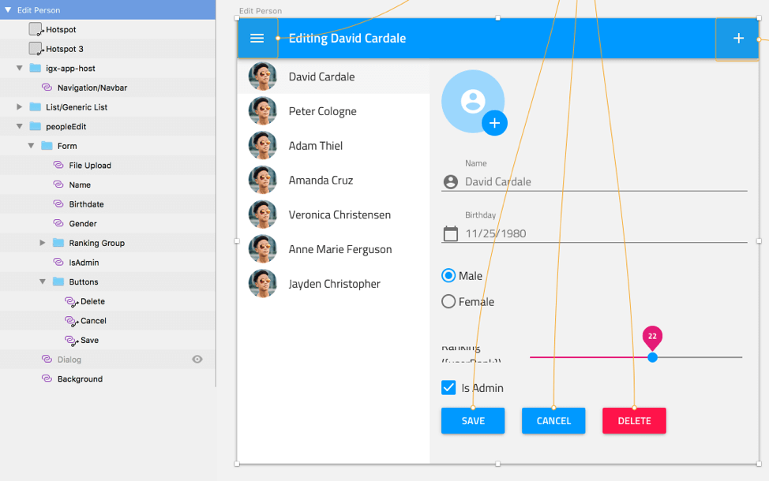

以下の画像で `peopleList` および `peopleDetails` の Sketch Group を選択し、ナビゲーションのクローム要素を無視します。

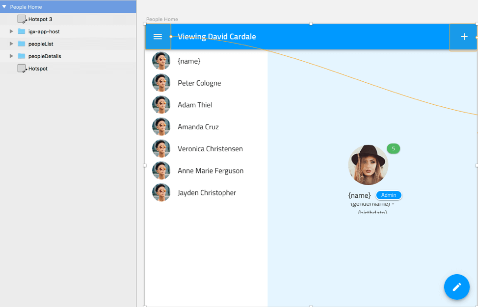

### コンポーネントのサイズ

> [!Note]
> Sketch のアートボードに固定された高さまたは幅の設定はありません。このコンポーネントのサイズ セクションはコード生成のために選択されたグループにのみ適用します。

グループがコンポーネントのコード生成のために選択され、グループに固定高さまたは固定幅が設定される場合、その固定サイズ値は生成されたコンポーネントの CSS に追加されます。
通常 Angular コンポーネントがランタイムに親によってサイズ設定またはサイズ変更されます。ただし、コンポーネントが Angular アプリケーションで固定サイズ要素になるデザイン シナリオがあります。コード生成はこのデザイン シナリオをサポートします。

### テーマ色およびコード生成

コード生成は Sketch 描画から色選択の読み込みおよび Ignite UI コンポーネントに Ignite UI Theme API を使用して色の適用をサポートします。以下の「Ignite UI Theme から作成された div 要素」セクションは、テーマ色をブラウザーに適用するためにすべての Ignite UI コンポーネントを div にラップする要件について説明します。
コード生成は Sketch の色がデフォルト色かどうか決定できないため、Sketch 描画からすべての色を出力します。これは Ignite UI コンポーネントで統一のコード生成を提供します。注: これは必要に応じて出力された CSS および HTML に追加します。
デザイナーが web 開発者が使用されているデフォルトのカラー パレットと一致する場合、Ignite UI コンポーネントが色をデフォルト パレットから取得するため、HTML でテーマ色の CSS および追加の div 要素である必要はありません。
コード生成ですべてのテーマ色の出力を回避するには、「Ignite UI テーマ色のみの使用」コード生成オプションを選択します。テーマ色をサポートするために必要な div がないクリーン HTML を出力します。注: このオプションを使用する場合、色選択は Ignite UI コンポーネントでコード生成されません。

### コンポーネントのコード生成からブラウザー描画までの手順

開発者はブラウザーで描画する前に生成されたコンポーネントで以下の編集を実行する必要があります。

- HTML に formControlName 要素がある場合、`<form>` タグの下にある formGroup コメントをコメントインします: `<!-- [formGroup]="customerForm" -->`
- TypeScript で `<!-- // TODO – uncomment-->` を検索して、ある場合に FormGroup コメントをコメントインします。
- TypeScript で `ngOnInit` メソッドを検索してフォーム コードをコメントインします。

## Sketch 要素の名前

コード生成を実行するには、Sketch Layer List で各要素に名前が必要です。名前がない要素はスキップされ、処理されません。また、スキップされた要素の子もスキップされます。

## CSS クラス名

コード生成が CSS クラス名を作成している場合、CSS に適用する Sketch 要素の名前を CSS 名として使用します。Sketch 描画で要素に意味のある名前を設定すると、よりわかりやすくなり、生成されている HTML および CSS の編集が可能になります。名前が Sketch のデフォルト名の場合、CSS が分かりにくくなります。
複製した名前が使用され、その要素に CSS クラス名が必要な場合、一意の CSS 名を生成するために数値が名前に追加されます。たとえば、描画に「row」と呼ばれる 3 つのグループがあり、そのグループが CSS を生成された場合、最初のグループの CSS 名は「row」で、2 番目は「row-1」で、3 番目は「row-2」などになります。
名前の大小文字はダッシュで区切った単語に分けます。以下の生成された CSS クラス名を参照してください。

| 要素名|生成された CSS クラス名 |
| ------------ | ------------------------ |
| Save         |save                     |
| SAVE         |save                     |
| FirstName    |first-name               |
| firstname    |firstname                |
| First Name   |first-name               |

## Ignite UI テーマ のために生成された div 要素

Angular でコンポーネントがネストされた子コンポーネントがある場合、親コンポーネントのローカル CSS 値を直接子コンポーネントに適用できません。回避策として、Angular で子コンポーネントを div にラップし、CSS をそのラッパー div に適用できます。
コード生成は、テーマ色またはフォントが指定される場合に Ignite UI コンポーネントを div にラップします。これでコード生成がプロジェクトのデフォルト パレットを使用できます。[Ignite UI Theming](https://jp.infragistics.com/products/ignite-ui-angular/angular/components/themes/index.html) でカラー パレットを変更すると、ブランディングを簡単に変更できます。

## レイアウト グループ化

コード生成は Sketch ファイルを読み込み、ネイティブ Sketch スキーマによって定義されるレイアウト プロパティを使用します。注: サード パーティ Sketch プラグインが Sketch 描画の作成および保持のために使用される場合、そのプラグインがカスタム プロパティを持つ可能性があります。コード生成でそのプロパティを HTML および CSS の作成で使用しません。
コード生成はレイアウトの作成で Sketch グループを使用します。コード生成は [Flexbox](https://css-tricks.com/snippets/css/a-guide-to-flexbox/) を使用する HTML および CSS を描画します。Flexbox は要素を列または行に配置します。
グループまたはアートボードなどの Sketch コンテナー要素が div として描画され、flex CSS が適用されます。

コード生成から_一貫性のあるレイアウト_を取得するために[レイアウトのベスト プラクティス](../best-layout-practices.md)を参照してください。このトピックは Sketch デザインの全般的なレイアウト シナリオについて説明します。Sketch のレイアウト要件を HTML と CSS レイアウトに移動するガイダンスを提供します。このトピックはコード生成が Sketch ファイルのレイアウトを処理する方法を説明します。
必要な Sketch 動作およびコード生成動作を実装するためにデザイナーが要素をグループ化できます。
各コンテナー要素 (アートボードまたはグループ) で、コード生成はすべての子要素を Y 軸値そして X 軸値によって並べ替えます。アートボードまたはグループの子である各グループのため、そのグループで同じ処理が実行されます。
Y 軸の並べ替えは、コード生成が同じまたは近い Y 軸値を持つ要素を Flexbox 行にグループ化することを許可します。「同じまたは近い Y 軸値」は、要素が水平軸で交差することの意味があります。

> [!Note]
> コード生成された行の項目の右ピン固定および下ピン固定属性が false に設定されます。要素のブロックを右または下へピン固定する必要がある場合、その要素を Sketch グループに挿入し、グループを必要に応じてピン固定します。

以下の描画で、2 つの「Row A」ボタンがこの動作を紹介します。2 つの「Row B」ボタンはその他の例です。以下の描画は 3 つの div を含む HTML になります。1 つは親 div で、1 つは「Row A」の子 div で、1 つは「Row B」の子 div です。「Row C」の行に単一の子があるため、div が作成されません。

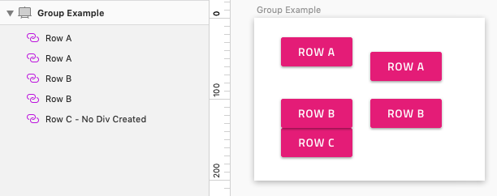

以下の画像で 2 つのグループ (div) が動的に生成されます。1 つは州、市、郵便番号を含み、もう一方は 2 つのボタンを含みます。名前が行の単一の子であるため、div は作成されません。
親がアートボード (親も単一のグループにあることが可能) のため、生成された div の CSS クラス名の生成で、親名は CSS クラス名の生成で使用されます。以下の例で、州、市、郵便番号を含むグループの CSS 名は "form" で、ボタンのグループの名前は "form-1" になります。

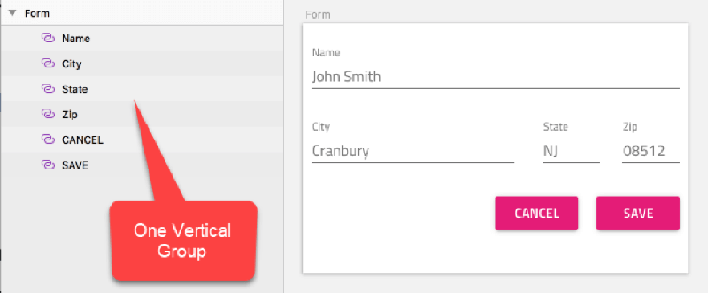

以下のように要素が Sketch 描画でグループ化される場合、コード生成が各グループに同じレイアウト グループ処理を適用します。以下の画像で、グループ内の要素が同じまたは近い Y 軸値があり、同じ div に描画されます。結果は Address の div および Buttons の div があります。

以下の画像で Buttons グループは 3 つのボタンを含みます。2 つのボタンは同じまたは同様の Y 軸値があり、その他のボタンは下に配置されます。コード生成は Buttons div、CANCEL および SAVE ボタンの div を作成し、DELETE ボタンを Buttons div の子として描画します。

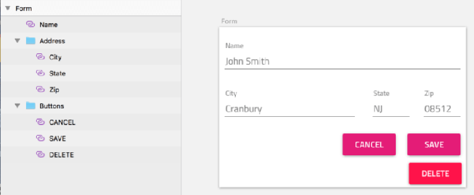

レイアウト グループがグループに含まれない要素のために作成された場合に動的に生成された div (行) に追加される Group があると、生成されたレイアウトは無効になります。以下の画像では、上部の Artboard で一貫性のあるレイアウトを生成するために正しくグループ化されています。Battleship および Actions は ImageButtons グループにグループ化されます。
Battleship 要素が水平方向に Actions Group と配置されますが、グループ化されないため、下の Artboard に無効なグループ化があります。このルールはその他の Group と行に配置される要素のみに適用します。

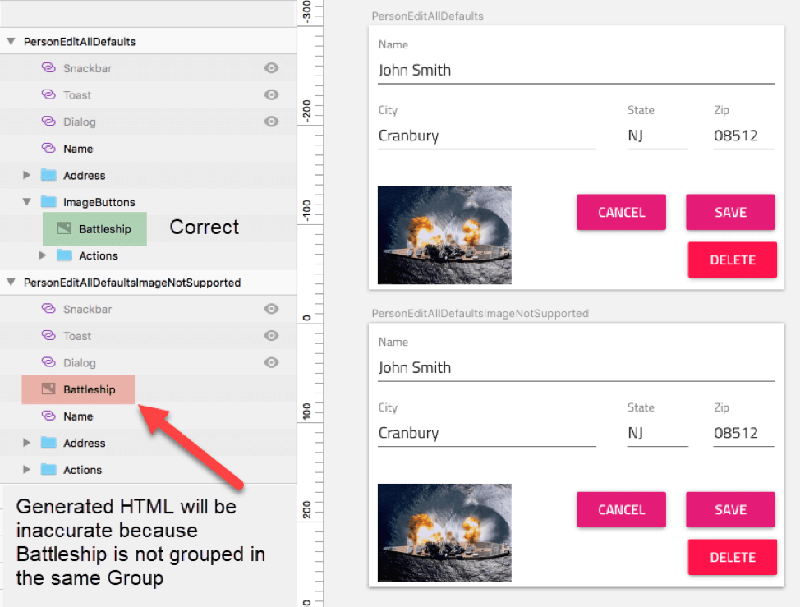

## 生成された HTML

わかりやすく、変更可能な CSS を生成します。
コード生成は以下の理由で HTML div 要素を作成します。

- Flexbox レイアウトのために列または行に要素をグループ化します。
- ネストされた子コンポーネントにテーマ CSS を適用します。

これは、以下の画像の HTML および CSS を生成するために使用されるソースの Sketch 描画です。

以下の画像で、緑の div はレイアウト div で、黄の div は Ignite UI Theming の div です。

| div のクラス名|目的                                                                                                                                                                                                                                             |
| -------------- | --------------------------------------------------------------------------------------------------------------------------------------------------------------------------------------------------------------------------------------------------- |
| actions        |これは最初に作成された div です。このネストされた div は flex 行で Cancel および Save ボタンを配置するために動的に作成されます。                                                                                                                          |
| cancel         |Cancel ボタンに Theme CSS を提供します。                                                                                                                                                                                                           |
| save           |Save ボタンに Theme CSS を提供します。                                                                                                                                                                                                             |
| delete         |Delete ボタンに Theme CSS を提供します。                                                                                                                                                                                                           |
| actions-1      |これは最後に作成された CSS クラス名です。そのため、-1 が名前に追加されます。この div は Sketch の Actions グループ要素のために作成されます。このグループは子の親 div になり、子を上記のレイアウト手順によって描画します。 |

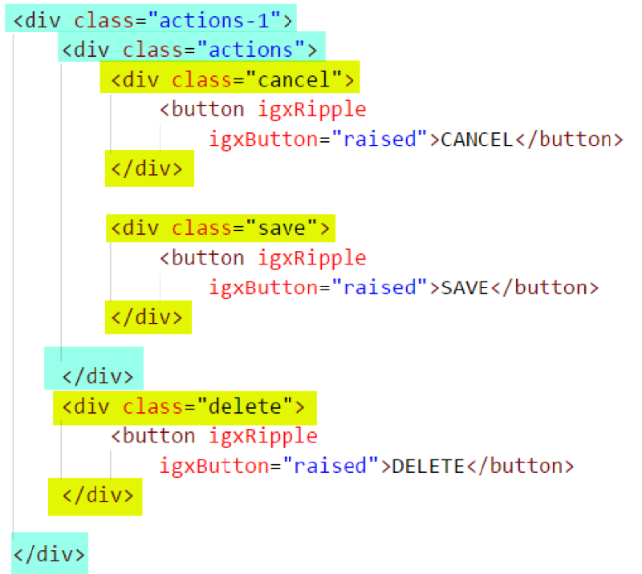

## グループの背景色

Sketch デザイナーはグループまたはアートボードの背景として塗りつぶされた長方形を使用します。このベータ版では Indigo-Styling Color 要素を以下のように使用できます。このように使用される色の高さおよび幅を親に対して +- 3 に設定する必要があります。以下の Artboard および Group の色要素の使用に注意してください。
上下左右へのピン固定はオプションです。上記のマージン ルールが適用される場合に背景色が作成されます。

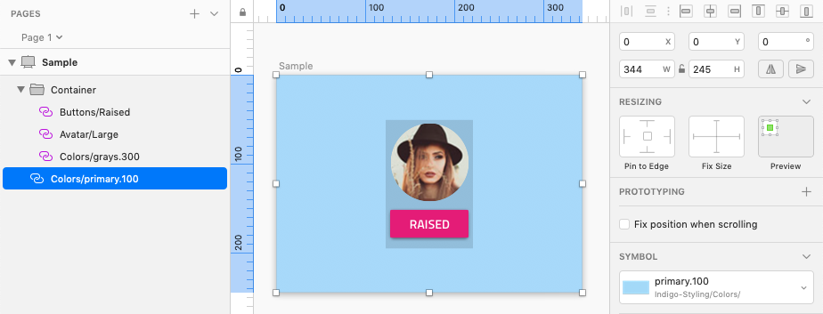

## 高さ

Sketch 描画のシナリオでレイアウトの CSS 生成時に Sketch および HTML/CSS の間に 1:1 マッピングがない場合があります。親コンテナーのサイズ変更時に Sketch で要素をサイズ変更しないように要素の高さを固定します。要素の高さは固定されますが、Web 開発者が CSS を作成する方法と一致しない場合があります。高さを設定する代わりに、複数の HTML 要素のデフォルトの高さが使用されます。
コード生成で、以下のコントロールはコントロールの HTML によって提供されるデフォルトの高さを使用して描画します。つまり、コード生成で固定高さが無視され、この要素のために高さの CSS は生成されません。

- Avatar
- Checkbox
- Circular Progress
- Dialog
- Hyperlink
- Icon
- Inputs
- Linear Progress
- Paragraph
- Radio
- Slider
- Snackbar
- Switch
- Time Picker
- Title
- Toast
- Typography

コード生成で、以下のコントロールは、高さが固定される場合以外にコントロールの HTML によって提供されるデフォルトの高さを使用して描画されます。

- Badge
- Bottom Nav
- Button
- Button Group
- Calendar
- Card
- Carousel
- Nav Bar
- Nav Drawer
- Paragraph
- Title
- Typography

> [!Note]
> The Grid, Hierarchical Grid and Tree Grid height will default to `[height]="'100%'"` in HTML to ensure that grid rows are visible at runtime.  Alternatively if the height is fixed in Sketch it will generate a pixel height (i.e.: `[height]="'100px'"`).

> [!Note]
> Category Chart height is always fixed to match with height in Sketch.

> [!Note]
> Image always uses fixed height from Sketch.

For all other elements not listed above, when height is not fixed or the top and bottom are pinned, the height will be set to 100% in CSS. When the height is fixed the height in CSS will be set to the pixel size defined in Sketch.

## 幅

要素の幅の計算で以下の Sketch 設定が影響します。設定しない場合は、別の要素は要素のタイプ、行で単一の子または行で子のグループにあるかどうかに基づいて別のルールに適用されます。
以下の表で、「行で単一の子」は以前の例のようにレイアウト エンジンによって計算される行で単一の子の意味があります。

**全般的なレイアウト ルール**
**例外は表の下に説明されます**

| Sketch のレイアウト設定                            |幅                                                                                                                                                                                                         |
| ------------------------------------------------- | ------------------------------------------------------------------------------------------------------------------------------------------------------------------------------------------------------------- |
| 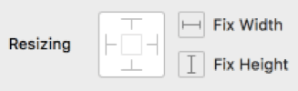|デフォルトの状態です。要素が行で単一の子の場合、幅は 100% です。要素が複数の要素がある行にある場合、以下比例的な幅サイズ変更ルールが適用されます。 |
| |幅は固定されます。                                                                                                                                                                                          |
| |要素が行で単一の子である場合、その幅は 100% です。要素が複数の要素がある行にある場合、以下比例的な幅サイズ変更ルールが適用されます。                           |

### サイズ変更の例外

以下のコントロールは、幅を固定または左右にピン固定する場合以外、コントロールの HTML によって提供されるデフォルト幅を使用して描画します。

- Badge
- Bottom Nav
- Button
- Button Group
- Calendar
- Card
- Carousel
- Checkbox
- Dialog
- Grid
- Hierarchical Grid
- Hyperlink
- Linear Progress
- Nav Bar
- Nav Drawer
- Paragraph
- Radio
- Slider
- Switch
- Time Picker
- Title
- Tree Grid
- Typography

以下のコントロールは常に、Sketch のサイズ設定またはピン固定に関係なく、コントロールの HTML によって提供されるデフォルト幅を使用して描画します。

- Avatar
- Circular Progress
- Icon
- Toast

> [!Note]
> Snackbar is always rendered with a width of 100%.

> [!Note]
> Category Chart width is always fixed to match the width in Sketch.

> [!Note]
> Image is always fixed to match the width in Sketch.

### 固定サイズ

上記の例外以外の要素で、幅を Sketch で固定する場合、幅は生成されたコードで固定されます。

### 左右ピン固定のサイズ

上記の例外以外の要素で、Sketch で左右ピン固定される場合、幅は生成されたコードで 100% になります。

### 幅を比例的にサイズ変更

上記の例外以外の要素で、幅が固定されない場合、要素は比例的な幅サイズを使用します。
要素が行の単一の要素の場合、幅は 100% になります。
要素に含まれる行に固定幅がある場合、要素は固定幅を使用してサイズ設定されます。
このベータ版で、すべての比較的な幅値は 100% で、開発者がその値を変更できます。

## グループの幅

Sketch グループに固定幅がある場合、その幅値が適用されます。それ以外の場合、幅値は CSS に割り当てられません。

## 配置

### 中央揃え

以下の中央揃えロジックは Sketch Group にのみ適用します。その他の要素に適用しません。また、コード生成のために選択された Group は Artboard または Group の子である必要があります。  
中央揃えに設定されるすべてのグループにコンテンツがある必要があります。コンテンツはその他のグループまたはその他の要素が可能です。背景色が要素ではないため、コンテンツは背景色にできません。
以下の画像で選択されたグループ ("Inner No Children") に背景色として Color 要素があるため、このグループは描画しません。ただし、同じ Color 要素が背景色として設定されない場合、含まれるグループの中央に色を描画します。

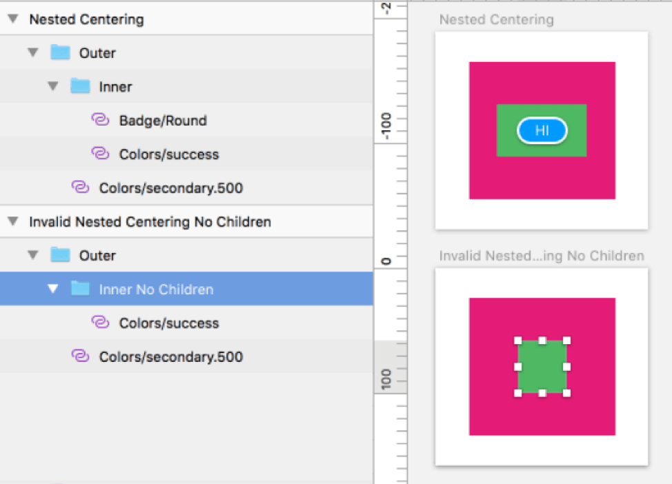

> [!Note]
> Group がコード生成のためのコンポーネントとして選択され、固定高さまたは幅が設定される場合、中央揃えがレイアウトの親によって実行されるため、以下の中央揃えロジックは適用しません。

### 垂直方向

要素の高さが固定され、上下のマージンが等しく (+-3px)、要素が上下にピン固定される場合、要素が親と垂直に中央揃えになります。

### 水平方向

要素の幅が固定され、左右のマージンが等しく (+-3px)、要素が左右にピン固定される場合、要素が親と水平に中央揃えになります。

### 両方

要素の高さと幅が固定され、左右と上下の距離が等しく (+-3px)、左右にピン固定される要素がない場合、オブジェクトが親と中央揃えになります。

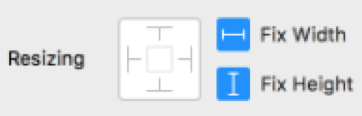

### 重複するオブジェクトのピン固定

左上、右上、左下、右下のみにピン固定して他の要素と重複 (Color 要素を除く) する場合、以下の絶対位置が生成されます。
絶対位置が強制された場合、その他のピン固定または配置のルールは使用されません。
以下の画像の両方のグループで確認でき、バッジはアバターと重複してバッジが右下にピン固定されることにより、この要素は親グループからの絶対位置を使用して配置されます。
2 つ目の例では、3 つ目の要素 (ボタン) がグループに追加されています。ボタンはその他の配置ルールを使用して配置され、バッジの絶対位置の一部ではありません。2 番目の場合はサポートされますが、絶対位置の重複を要求する要素のみがグループに含まれる必要があります。

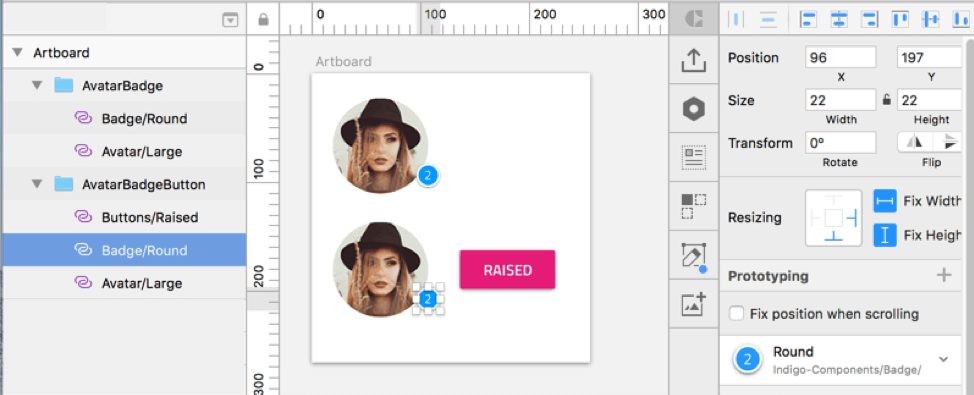

### 右に整列またはピン固定

要素グループの単一要素が右にピン固定されている場合、要素は `margin-left: auto;` を要素の CSS に追加して右に整列されて親の右に整列およびピン固定されます。
要素グループの 1 要素以上が右にピン固定した際に要素に Sketch グループを作成して Group を右にピン固定します。

### 下に整列またはピン固定

要素グループの単一要素が下にピン固定されている場合、要素は `margin-left: auto;` を要素の CSS に追加して下に整列されて親の下に整列およびピン固定されます。  
要素に HTML の下ピン固定ランタイム動作が必要な場合、要素を下にピン固定のみ使用します。またはピン固定せずに要素配置で上マージンを許可します。
要素グループの 1 要素以上が下にピン固定した際に要素に Sketch グループを作成して Group を下にピン固定します。  
最適なコード生成のために各要素ではなくグループのみピン固定してください。

### 角にピン固定

要素が左上にピン固定されている場合、 HTML が既に構成されているためピン固定は実行されません。
要素が右上のみにピン固定されている場合、右配置のみ CSS に追加されます。
要素が左下のみにピン固定されている場合、下配置のみ CSS に追加されます。
要素が右下のみにピン固定されている場合、右配置と下配置が CSS に追加されます。

### 行項目の垂直方向の配置

子が下にピン固定または絶対位置でない限り、親の上端から要素までの距離を調整するために子要素が上マージンを使用して垂直に配置されます。

### 行項目の水平方向の配置

親の左端から要素までの距離を調整するために、項目が右にピン固定または絶対配置出ない限り、子要素が左マージンを使用して水平に配置されます。

## マージン

3px 以下ののマージンの値は無視されます。要素の配置が完ぺきでない Sketch 描画を構成します。
要素を親の左または左の要素の左に配置するために左マージンが追加されます。
要素を親の下または上の要素の下に配置するために上マージンが追加されます。
要素を親の右または右の要素の右に配置するために要素が右にピン固定される場合に右マージンが追加されます。
要素を親の上または下の要素の上に配置するために要素が下にピン固定される場合に下マージンが追加されます。

## Dialog、Toast、Snackbar

Dialog、Toast、Snackbar の共通点は、 TypeScript のフォームを使用して UI に動的に表示される点です。
コードを使用しない限り通常 UI に表示されないため、デザイナーが表示ステートで Artboard を表示しない限り Sketch には表示されません。
Artboard を複数のステートで表示するためのデザイナーの要件とコンポーネントを一度のみコード生成する開発者の要件の相違を解決するには、以下のガイダンスを参考にしてください。
必要な Dialog、Toast、Snackbar を描画に追加し、そのほかの要素を設定してから以下のように非表示にします。このフォームは、開発者がコード生成のために選択するフォームです。
オブジェクト パネルの要素の非表示はコード生成に影響がありません。コード生成は非表示かどうかに関係なくすべての要素をここに生成します。
Dialog、Toast、Snackbar 要素をコンポーネント HTML の下に配置し、ビューに入るのが動的なランタイム配置であるためその他の要素と混同されません。

以下の画像はデザイナー状態の描画の例です。ダイアログがランタイムで配置するグレー オーバーレイをシミュレートするための別の色要素があるため、この描画はコード生成に使用しないでください。

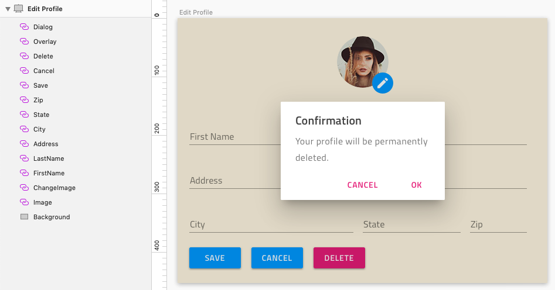

## 制限

Code Generation のベータ リリースでは、テキスト、ベクター、マーク、ペンシルなどのネイティブ Sketch オブジェクトは生成されません。Sketch 5.1 の新しい Text Styles 機能に含まれます。これらの要素は生成されません。
すべてのテキストは、Indigo-Styling ライブラリから Typography シンボルを使用するこのベータ版を使用して生成する必要があります。
デザイナーは Indigo-Components の要素と Indigo-Styling ライブラリのみ使用してください。
Indigo-Styling から Artboard に Color と Typography 要素の追加のみサポートされます。その他は Beta で生成されません。
Sketch 画像はサポートされます。画像は、Sketch で固定した高さと幅で描画されます。画像の幅がアートボードの表示範囲を超える場合、コード生成で画像をクリップしないことに注意してください。Image をピン固定または中央揃えにするには、Image を Sketch の Group にラップし、ピン固定および中央揃えをグループで実行します。
コード生成のベータ リリースと Indigo.Design UI Kit では、テキスト要素が常にピクセル仕様で完ぺきな垂直配置になるとは限りません。この制限は今後のアップデートで解決される予定です。開発者はランタイムで生成コンポーネントを検証し、CSS margin-top 調整を行う必要があります。

まれなケースで Sketch は子要素が親 Group 境界ボックスを超えることを許可します。マージンが負数ですというエラーが返された場合は、デザイナーは以下の手順に従って修正してください。

1.  Group と子のすべての固定の高さと幅を削除します。
2.  Group と子のすべてのピン固定を削除します。
3.  Group に追加する要素を選択し、それらをグループ化します。
4.  固定サイズとピン固定の端を再度適用します。

## その他のリソース

外部のリンク:

- [Flexbox](https://css-tricks.com/snippets/css/a-guide-to-flexbox/)
- [Ignite UI for Angular](https://jp.infragistics.com/products/ignite-ui-angular)

コミュニティに参加して新しいアイデアをご提案ください。

