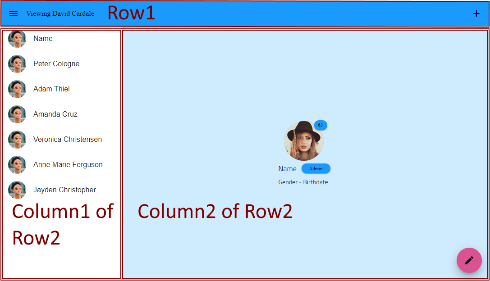
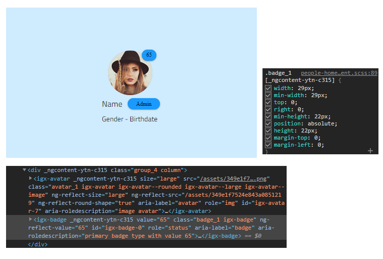
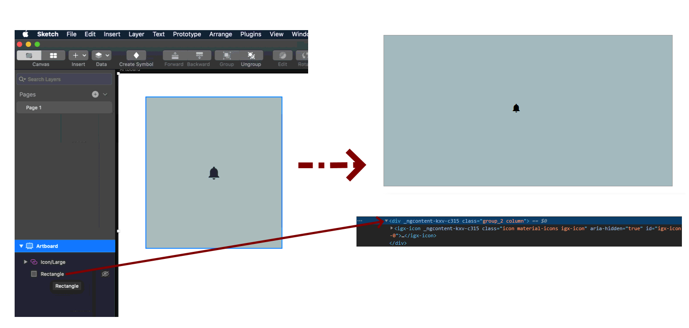

# レイアウトの生成

このトピックでは、レイアウトとサイズ変更が、サポートされているツール (Figma、Sketch、XD) のいずれかから生成されたコードにどのように変換されるかについての情報を提供します。

各デザイン ツールは、ビュー内の要素の位置とサイズを構成する独自の方法を提供します。各レイアウトは、絶対レイアウトまたはレスポンシブ レイアウトのいずれかを持つことができ、構成はツールに固有です。

デザイン レイアウト タイプの詳細については、[レイアウトのベスト プラクティス](../best-layout-practices.md) トピックを参照してください。

## レスポンシブ レイアウトの生成ルール

レスポンシブ レイアウト デザインの作成は、各ツールに固有のものであり、関連するトピックで詳細を確認できます。

  - [Figma のレスポンシブ レイアウト](../best-layout-practices-figma.md)
  - [Sketch のレスポンシブ レイアウト](../best-layout-practices-sketch.md)
  - [XD のレスポンシブ レイアウト](../best-layout-practices-xd.md)
  
このアプローチでは、サイズ変更にどのように反応するかについて、デザインから得られる情報が多くなり、常に元のデザインにより近い生成結果が得られます。

## 絶対レイアウト生成ルール

多くの場合、Top、Left、Width、Height などの固定値を使用して、静的/絶対配置で配置要素を設計します。多くの場合、これらのデザインは流動的でレスポンシブなアプリケーションを表す必要があります。このようなデザインから構築されたほとんどの Web アプリケーションは、フレックスやグリッド表示コンテナーなどのモダンなパラダイムを使用しています。Code Generation の目的は、開発者がデザインから構築するアプリケーションに可能な限り近づけることです。Code Generator は、一連のヒューリスティックを適用して、Sketch の絶対/静的デザインからリキット デザインを生成します。

Code Generator はデザイン ファイルを読み込み、ネイティブ ツール スキーマによって定義されるレイアウト プロパティを使用します。描画レイアウトを作成または維持するために使用されるサードパーティのプラグインには、通常、独自のプロパティ セットがあることに注意してください。Code Generator はこれらのプロパティを認識しないため、HTML および CSS の作成時には使用されません。

Code Generator はレイアウトの作成でグループを使用します。Code Generator は [Flexbox](https://css-tricks.com/snippets/css/a-guide-to-flexbox/) を使用する HTML および CSS を描画します。Flexbox は要素を列または行に配置します。

グループまたはフレーム / アートボードなどの要素が div として描画され、flex CSS が適用されます。

### 操作方法
レスポンシブなレイアウトを構築する背後にある考え方は、コンポーネントをグループに結合することです。これにより、開発者が期待するものに近い構造が作成されます。これらのグループは Flexbox ルールを使用し、行または列で構成されているため、レイアウトは、相互の相対位置およびそれぞれのグループに基づいてすべての要素を含む行と列の階層で表されます。

アルゴリズムは、最初のコンポーネントの行を作成することから始まり、同じ X 軸に配置されたすべてのコンポーネントをその行に配置します。フレーム / アートボード上のすべてのコンポーネントが行に編成されると、同じ原則を使用して列にも配置します。コンポーネントが同じ Y 軸に配置されている場合、コンポーネントは同じ列の一部になります。このプロセスは、それ以上のグループ化が不要になるまで、行と列を交互に繰り返します。

流動レイアウトはツリー構造になっています。ブランチとルートは行と列であり、リーフはコンポーネントです。

## ヒューリスティックとルール
HTML の要素を適切に変換するために、Code Generator はヒューリスティックとルールを適用して、静的に配置された要素からレスポンシブ Web デザインを作成します。

> [!Note]
> 流動的なアプリケーション デザインへの変換は、ピクセル パーフェクトの結果を保証するわけではありません。一部のデザインでは、コンポーネントまたは生成されたグループ (行/列) がずれて表示される場合があります。ユーザーは生成されたコードを確認し、必要に応じて変更を適用する必要があります。

> [!Note]
> デザイナーが一部のコンポーネントが同じグループ (行または列) の一部であることを確認したい場合は、それらをグループ化する必要があります。Code Generator はこれらのグループを遵守します。

### ナビジェーション メニュー コンポーネント
Navbar、NavDrawer、および Bottom Navigation には、特別な処理が必要です。これらの要素は通常、ルート レベルのメニューを表します。レイアウトを作成するとき、これらの特殊のコンポーネントはグループの最後で移動されます。これにより、他の要素の上に表示されます (重複がある場合)。

### 重複
Code Generator は、互いに重複する要素を識別します。部分的または完全に他の要素の上にある要素は、以降のヒューリスティックから削除され、適切な z-index を使用して絶対位置を受け取ります。さらに、重なり合っている要素がグループ化され、新しい流動レイアウトで上部の要素が上にとどまるようにします。このように、アプリケーションのレスポンシブが適用された場合、ビューポートのサイズに関係なく、デザインは変更されません。この典型的な例は、バッジ付きのアバターです。

### 背景
図形は、ページのグループまたは部分の背景を表すためによく使用されます。それらのために、Code Generator は HTML コンテナー要素 (通常は DIV) を作成し、これらのコンテナー内に完全に含まれるすべての子要素を保存します。これは特定の図形にのみ適用されます。それらの上に、そして完全にそれらの境界に要素がある必要があります。現在、背景コンテナの作成には、画像のない単純な図形 (長方形と楕円形) のみが使用されています。

### ピン固定要素
要素を親にピン固定すると、Code Generator は次のルールを使用してこれらを処理します。

- 要素に右または下のピンがあると、絶対位置と対応するマージンがその要素に適用されます。
- 左または上のピンは無視され、これらの要素はピンがないかのようにレイアウト グループに含まれます。
- 反対側のピン (左と右/上と下) は破棄され、考慮されません。ルールの背後にある仮定は、マージンを適用するのではなく、反対のピンを持つ要素を引き伸ばす必要があるということです。たとえば、要素への左右のピンは、要素にピンがない場合と同じように処理されます。

### パーセンテージ ベースのサイズ
要素は、流動 (パーセンテージ ベース) の幅と高さを受け取ります。固定サイズとして明示的に設定されていない限り、グループ内の比率は維持されます。

### Dialog、Toast、Tooltip
Dialog、Toast、および Tooltip は、オーバーレイを介してコンテンツの上に表示されるため、デザイン上、より高い z-index レベルに属します。Code Generator は、行と列を作成するデフォルトのメカニズムからそれらを除外します。それらはより高い z-index を受け取り、グループの両端揃えまたは配置ルールでは考慮されません。

Dialog、Toast、および Tooltip コンポーネントには、もう 1 つの共通点があります。これらはすべて、コードを使用して動的に UI に表示されます。これらは通常、プログラムで表示されるまで表示されないため、デザイナーが開いた状態のフレーム / アートボードを作成していない限り、通常はデザインに表示されません。ビューを複数のステートで表示するためのデザイナーの要件とコンポーネントを一度のみコード生成する開発者の要件の相違を解決するには、以下のガイダンスを参考にしてください。必要な Dialog、Toast、Tooltip を描画に追加し、他の要素と同様に構成してから、以下のように非表示にします。このフォームは、開発者がコードを生成するために選択するフォームです。オブジェクト パネルで要素を非表示にしても、Code Generator には影響しません。非表示かどうかに関係なく、ここですべての要素が生成されます。Dialog、Toast、および Tooltip 要素をコンポーネント HTML の下に配置し、ビューに入るのが動的なランタイム配置であるためその他の要素と混同されません。

以下の画像はデザイナー状態の描画の例です。Dialog がランタイムで配置するグレー オーバーレイをシミュレートするための別の色要素があるため、この描画はコード生成に使用しないでください。

### レイアウトの位置
レイアウトの位置は、親を基準にしています。レイアウトの作成中に、グループに子が 1 つある場合、グループは子の寸法 (位置とサイズ) を取得します。子は、親に対して相対的な位置 (0、0) を取ります。新しい子をグループに含める必要がある場合、グループの寸法に影響を与える可能性があります。その場合、グループ内の他のすべての子が更新されます。

グループに子が 1 つ残っている場合、構造は最適化され、グループは省略されます。

### グループ サイズ
  - 列 - 列の幅は、その子の幅を表します。高さについては、列はその親によって決定された垂直領域を完全に埋めます。
  - 行 - 行の高さは、その子の高さを表します。幅については、行はその親によって決定された水平方領域を完全に埋めます。

> [!Note]
> 両端揃えタイプに基づいて両端揃えが解決された後、追加のパディング/マージンが適用されます。

### 両端揃えと配置
行は `flex-direction` css プロパティの `row` 値を受け取り、列は `column` を受け取ります。

コード生成は、css の `justify-content` プロパティに最も適切な値を識別します。グループ内の要素の位置とサイズを使用することにより、グループ全体が要素を最初、最後、中央などに両端揃えできます。ここでの意思決定は、子と親の端の間の領域です。コード ジェネレーターは、対抗軸の `align-items` css プロパティに最適な値を決定しようとします。

たとえば、グループ内の項目が水平方向と垂直方向の中央に配置されている場合、`justify-content` が `center` になり、`align-items` が `center` になります。

### パディングとマージン
パディングとマージンは、解決された両端揃えタイプに基づいて次のように適用されます:

  - flex-start - Padding-left は、親と最初の子の間の領域をカバーするために適用されます。Margin は、兄弟要素間の内部領域をカバーするために適用されます。
  - flex-end - Padding-right は、親と最初の子の間の領域をカバーするために適用されます。Margin は、兄弟要素間の内部領域をカバーするために適用されます。
  - center - Margin は、兄弟要素間の内部領域をカバーするために適用されます。
  - space-between - Padding-left と Padding-right は、親と最初/最後の子の間の領域をカバーするために適用されます。内部領域は両端揃えによって完全にカバーされているため、マージンは必要ありません。
  - space-around/space-evenly - すべての領域 (開始/終了領域と内部領域の両方) がカバーされているため、パディングやマージンは必要ありません。

### コンポーネントのサイズ

要素に固定高さまたは固定幅が設定される場合、その固定サイズ値は生成されたコンポーネントの CSS に追加されます。
通常、Angular コンポーネントの親は、実行時のサイズ設定またはサイズ変更を行います。ただし、コンポーネントが Angular アプリケーションで固定サイズ要素になるデザイン シナリオがあります。コード生成はこのデザイン シナリオをサポートします。

## 制限

### Sketch

- このリリースの Code Generator では、ベクター、マーク、ペンシル、複雑な図形などのネイティブ Sketch オブジェクトは生成されません。Sketch 5.1 の新しい Text Styles 機能に含まれます。これらの要素は生成されません。
- Indigo.Design プラグインで適用されたスタイルのみがサポートされます。特定のコンポーネントに適用された他のすべてのカスタム スタイルは無視されます。
- デザイナーは Indigo.Design ライブラリの要素のみを使用してください。
- Sketch 画像はサポートされます。画像は、Sketch で固定した高さと幅で描画されます。

## その他のリソース

外部のリンク:

- [Ignite UI for Angular](https://jp.infragistics.com/products/ignite-ui-angular)

コミュニティに参加して新しいアイデアをご提案ください。

