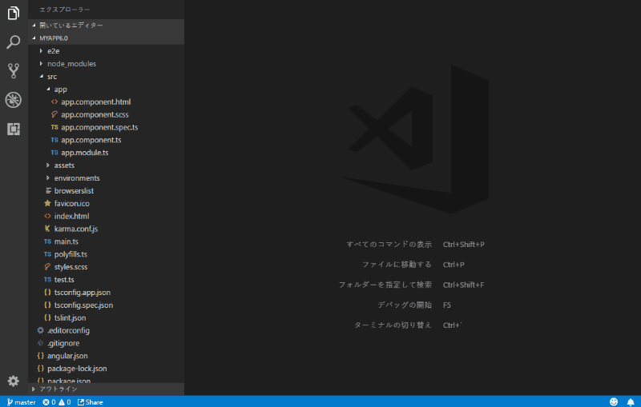
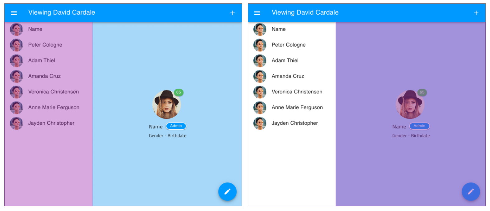
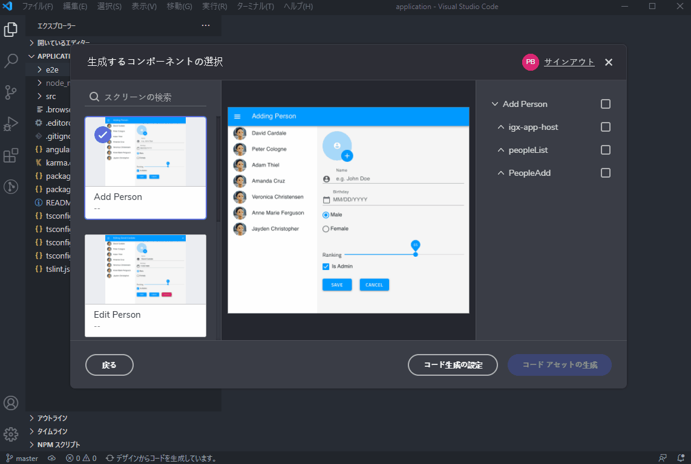

## コード ジェネレーター プラグインの使用

このトピックは、コードを簡単に生成できる Visual Studio Code 拡張機能を説明します。Visual Studio Code でこの拡張機能を使用して実行可能な Angular プロジェクトのコードを直接生成できます。デザイナーは Sketch ファイルを [Indigo.Design](https://cloud.indigo.design) でクラウドに公開し、共有リンクを開発者に送信します。次に開発者がこの共有リンクを拡張機能に入力し、デザインからコードを生成します。手動でコンポーネントのモジュール、HTML、CSS、および TypeScript を書く必要はありません。


### 要件

Indigo.Design UI キットのコンポーネントを含む Sketch ファイルが必要です。Sketch ファイルで見つかった Indigo.Design UI キットのコンポーネントにのみコードを生成します。

この拡張機能は、以下の依存関係があります。使用する前に依存関係をインストールしてください。

- [Node.js](https://nodejs.org/)
- [npm](https://www.npmjs.com/)
- [Angular CLI](https://cli.angular.io/) (グローバル インストール)

この拡張機能もワークスペースのルートにあるワークスペースに開いている Angular プロジェクトが必要です。つまり、`angular.json` または `.angular-cli.json` (Angular のバーションに基づいて) ファイルはワークスペースのルートにある必要があります。

コード ジェネレーターは [SCSS](https://sass-lang.com/) を出力するため、Angular プロジェクトを SCSS を使用するために構成します。新しい Angular プロジェクトを作成する場合、以下のコマンドを使用して構成できます:

```
ng new my-app --style=scss
```

既存の Angular プロジェクトを使用する場合、Angular json ファイルでデフォルト スタイル拡張属性を更新できます。

**angular.json**

```json
"@schematics/angular:component": {
    "styleext": "scss"
}
```

**.angular-cli.json**

```json
"defaults": {
    "styleExt": "scss",
}
```

Angular CLI が拡張機能に使用するコンポーネントの生成で CSS の代わりに SCSS を生成することを構成します。

既存の Angular プロジェクトを使用し、既に [Ignite UI for Angular](https://www.npmjs.com/package/igniteui-angular) パッケージを使用する場合、そのパッケージのバーションを 6.1.0 以上にアップデートします。以前のバージョンを使用する場合、この拡張機能はプロジェクトを正しく更新しないことが可能です。

## 操作方法

Sketch ファイルから開始します。デザイナーが Sketch ファイルを完了した後、[Indigo.Design](https://cloud.indigo.design) サイトにアップロードします。アップロード後にファイルを公開し、ユーザビリティ スタディの作成やコメントを有効にできます。ファイルの公開時に Indigo.Design は共有リンクを提供します。この拡張機能はそのリンクを使用できます。



> [!Note]
> この拡張機能を**はじめて**実行する場合、セットアップがバックグラウンドで実行されます。このセットアップは 45 秒程かかる場合があります。通常より時間がかかる場合、以下の 「トラブルシューティング」セクションを参照してください。

共有リンクからアプリケーションのデザインのさまざまな画面を表示できます。ここから開発者が画面の部分を選択し、コードを生成できます。通常デザイン時に各画面に複製した要素があるため、画面全体は生成されません。この複製した要素はアプリケーションの「クローム」と呼ばれます。クロームは、ページの上側にあるナビゲーション メニューまたは右左からスライドインするメニューなどのアプリケーションの画面間で変更しない要素です。




アプリケーションのすべての画面間で変更しないため、この要素を生成されません。この要素を書くのは一度のみです。`<router-outlet>` によって変更しているアプリケーション領域の周りに配置します。開発者は Angular で `<router-outlet>` を使用し、ページでコンテンツが変更する領域を指定します。この変更コンテンツは、コードが生成される要素です。以下は選択の例です。




設定が完了したらコードを生成します。[Generate Code Assets] ボタンをクリックして処理を開始します。

拡張機能は以下のようにプロジェクトをアップデートします。

- [Ignite UI for Angular](https://jp.infragistics.com/products/ignite-ui-angular) などの必要な NPM パッケージをインストールします。
- 選択した Sketch コンポーネントから Angular コンポーネントを作成します。
  - このコンポーネントには生成されたコードがあります。
- このコンポーネントの周りにモジュールを作成します。
- ナビゲーションを有効にするためにモジュールで基本ルートを作成します。ルートの構成の詳細については、以下の「設定」セクションで `basicRoutes` 構成を参照してください。
- プロジェクトを [Ignite UI for Angular](https://jp.infragistics.com/products/ignite-ui-angular) のデフォルト テーマを使用するためにアップデートします。

## コード生成後の手順

コードをプロジェクトに生成後したら実行まであと少しです。コード生成後の手順の詳細については、この[トピック](after-codegen.md)を参照してください。

## 設定

この設定は`ユーザー設定`ウィンドウにアクセスできます。

| 名前                                       |説明                                                                                                                                                                                |デフォルト |
| ------------------------------------------ | ------------------------------------------------------------------------------------------------------------------------------------------------------------------------------------------ | ------- |
| `infragistics.codegen.sharedModule`        | 共有モジュールを Ignite UI for Angular モジュール用に生成するかどうかを制御します。                                                                                                      | `true`  |
| `infragistics.codegen.routingModules`      | ルーティング モジュールを生成するかどうかを指定します。'inferRoutingModules' が false の場合のみ適用されます。                                                                         | `false` |
| `infragistics.codegen.inferRoutingModules`| 現在のプロジェクトでルーティング モジュールを使用しているかに基づいて拡張が生成するかを決定するかどうか。true の場合、AppModule がある場合はルーティング モジュールが作成されます。| `true`  |
| `infragistics.codegen.basicRoutes`         | true の場合、ルートがアプリケーションに追加されます。新しいプロジェクトを開始する場合便利です。ルートがすでに設定されている既存のプロジェクトを無効にします。                   false |

## トラブルシューティング

#### 拡張機能が初期設定でフリーズした。

VS Code のプラットフォームをサポートするために Sketch アートボードを選択するための UI を表示するには Electron を使用します。ただし、各利用可能なプラットフォームの Electron バイナリ ファイルはパッケージに含まれません。代わりに[npm](https://www.npmjs.com/) を使用して拡張機能のディレクトリにホスト プラットフォームの正しいバージョンをインストールします。これで拡張機能のファイル サイズを縮小します。最初の構成通知が表示されたときに `npm install` コマンドを `electron` 引数とともに実行します。インストールに時間がかかりますが、完了しない場合、インストールのサブプロセスをキャンセルするために VS Code を閉じます。閉じた後、手動的に `npm install` コマンドを実行します。空のフォルダーでターミナルを開いて、以下を実行します。

```
npm install electron
```

出力でエラーがないことを確認します。このコマンドはすべての拡張機能が実行されているプロセスで、正しく完了した場合は拡張機能も正しく動作します。成功した場合、VS Code をもう一度開いて拡張機能を再実行します。

#### コードはプロジェクトに生成されていません。

Angular アプリケーションはテスト用に `e2e` フォルダーを含みます。通常は問題ありませんが `e2e` プロジェクトの `angular.json` で `sourceFolder` を指定した場合、これが Angular CLI を中断するため、結果的にこの拡張機能がプロジェクトにコードを生成しない、あるいはコードを `e2e` フォルダーに生成することになります。この拡張機能は、`angular.json` に `sourceFolder` プロパティが指定される単一のプロジェクトのみがあることを前提としています。以下の例を参照してください。

```json
{
    ...
    "projects": {
        "my-app": {
            "root": "",
            "sourceRoot": "src",
            ...
        },
        "my-app-e2e": {
            "root": "",
            "sourceRoot": "e2e",
            ...
        }
    }
}
```

この `angular.json` で my-app および my-app-e2e の 2 つのプロジェクトがあります。`angular.json` がこの例のような場合、拡張機能はプロジェクトのアップデートに失敗します。`sourceRoot` が指定した複数のプロジェクトがあるため、コードに追加するプロジェクトを決定できないためです。

解決するには、`sourceRoot` 値を `root` プロパティに移動し、`sourceRoot` プロパティを削除します。このプロパティは、CLI を使用して新しい Angular プロジェクトの作成で設定されません。以下のようになります。

```json
{
    ...
    "projects": {
        "my-app": {
            "root": "",
            "sourceRoot": "src",
            ...
        },
        "my-app-e2e": {
            "root": "e2e",
            ...
        }
    }
}
```

## その他のリソース

関連トピック:

- [コード生成後の手順](after-codegen.md)
  <div class="divider--half"></div>

外部のリンク:

- [Ignite UI for Angular](https://jp.infragistics.com/products/ignite-ui-angular)
- [Angular モジュール](https://angular.io/guide/ngmodules)
- [Angular コンポーネント](https://angular.io/guide/architecture-components)
- [Angular ルーティングおよびナビゲーション](https://angular.io/guide/router)

コミュニティに参加して新しいアイデアをご提案ください。


