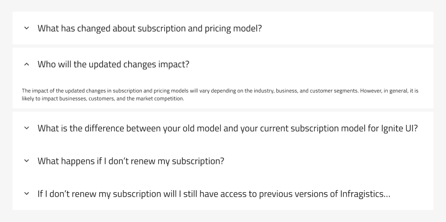
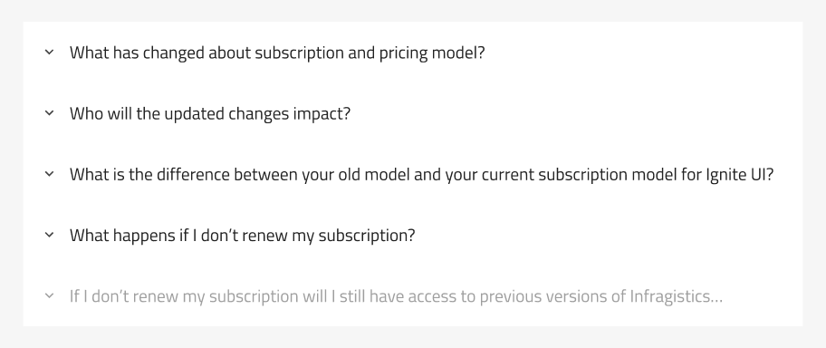
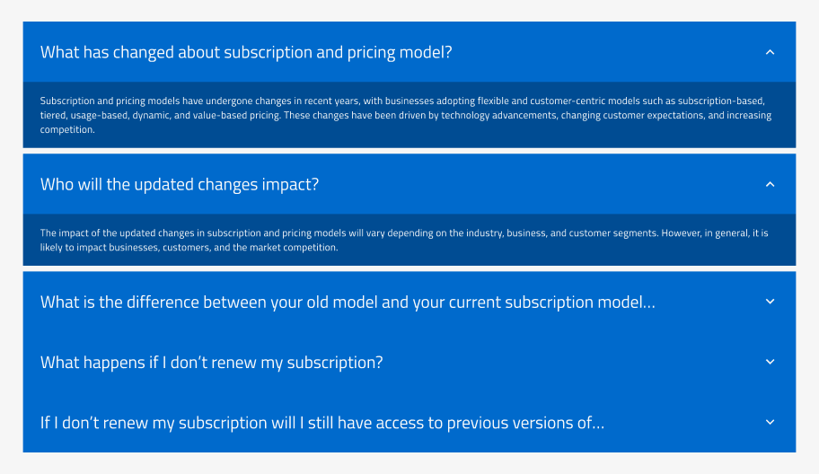
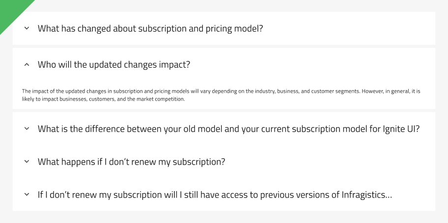
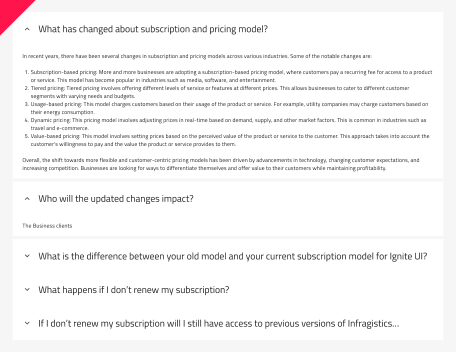

## Accordion

Accordion  コンポーネントを使用すると、ユーザーは垂直スタックのコンテンツを段階的に表示できます。通常、これは [Expansion Panel](expansion-panel.md) のリストで構成されており、各項目を展開または縮小することで、その内容を表示または非表示にすることができます。Accordion は、多くの場合、コンパクトなスペースで大量の情報を管理し、ユーザーが特定の情報に集中できるようにするために使用されます。Accordion は、[Ignite UI for Angular Accordion コンポーネント](https://jp.infragistics.com/products/ignite-ui-angular/angular/components/accordion)と視覚的に同じものです。

## Accordion のデモ

## Figma と Sketch で Accordion を使用する方法

Accordion には 5 つのパネルが付属しています。各パネルは上マージンと下マージンで構成され、ブール演算でオン/オフできます。ネストされた展開パネルに移動すると、その内容を変更できます。より多くの展開パネルを備えた Accordion を設計する必要がある場合、それを行う最も簡単な方法は、コンポーネントをデタッチすることです。コンポーネントをデタッチするには、ワークスペース (Frame または Artboard) に配置する必要があります。それを右クリックするとコンテキスト メニューが開き、`Detach Instance` (Sketch では `Detach from Symbol`) を選択します。

コンポーネントをデタッチした後、既存の展開パネルを複製して追加の展開パネルを追加できます。Figma では、Auto Layout によりサイズが自動で調整されます。Sketch では、追加された展開パネルの位置を手動で調整する必要があります。

## Adobe XD で Accordion を使用

> [!NOTE]
> 対応状況: 現在、Adobe XD では Accordion コンポーネントはサポートされていませんが、複数の `Expansion Panel` を組み合わせて同様の Accordion コンポーネントの動作を行うこともできます。ただし、これは App Builder では適切に生成されません。

## Expansion Panel の状態

拡張パネルには `Disabled` 状態と `Expanded` 状態があり、選択した Expansion Panel に対してオンとオフを切り替えることができます。[Expansion Panel](expansion-panel.md) を参照してください。

Figma では、`Expanded` プロパティを使用して、要件に応じてパネルの状態を構成できます。さらに、Layers パネルのパネル階層と展開されているパネルに基づいて、ブール値プロパティから上下マージンを有効にして、デザインにスペースを追加できます。Sketch には、パネルの展開状態とそのマージンをカバーする定義済みの `Single Branch Expanded` シンボルがあります。

## スタイル設定

Accordion コンポーネントは、カスタマイズのためのさまざまなオプションを使用して、スタイル設定の柔軟性を提供します。Header と Body の背景色を変更したり、テキストの色と太さを変更したりできます。さらに、アイコンの色とタイプをカスタマイズできます。

## 使用方法

Accordion を使用して情報をまとめている場合は、重要でない情報のみを中に入れてください。たとえば、製品ページでは、通常、Accordion の中に価格やブランド名を入れません。ただし、サイズ ガイド、配送に関する質問、および製品資料を 1 つの中に入れます。

さらに、単一のページまたは画面に簡単に表示できる少量のコンテンツにはアコーディオンを使用しないでください。また、アコーディオン セクションが多すぎたり、各セクション内のコンテンツが多すぎたりしてユーザーに過負荷を与えないようにしてください。

| 良い例                                                                             | 悪い例                                                                              |
| ------------------------------------------------------------------------------ | ---------------------------------------------------------------------------------- |
|  |  |

## その他のリソース

関連トピック:

- [Expansion Panel](expansion-panel.md)
- [Icon](icon.md)

コミュニティに参加して新しいアイデアをご提案ください。
