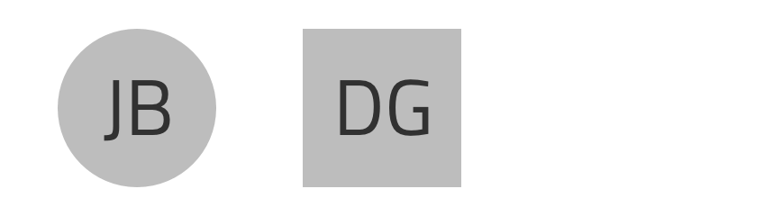
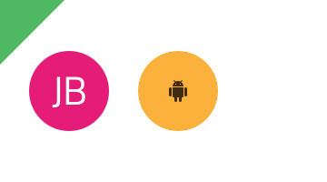
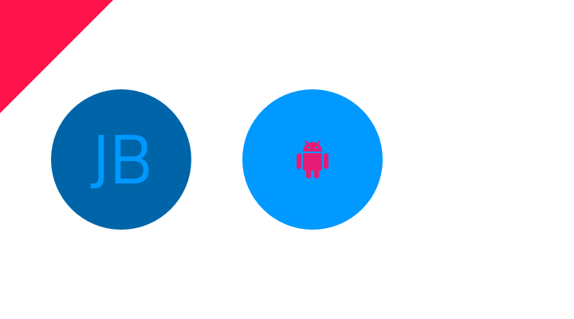

---
title: Avatar - デザイン システム コンポーネント
_description: Avatar コンポーネント シンボルは、個人情報を画像で表します。
_keywords: デザイン システム, デザイン システム UX, UI キット, Sketch, Ignite UI for Angular, Sketch to Angular, Angular, Angular デザイン システム, Sketch からコードをエクスポート, Angular 用のデザイン キット, Sketch HTML, Sketch to HTML, Sketch UI キット
_language: ja
---

# Avatar (アバター)

Avatar コンポーネント シンボルは、プロフィール写真、アイコン、イニシャル (文字列) で人をグラフィックで表現するために使用します。Avatar は、[Ignite UI for Angular Avatar コンポーネント](https://jp.infragistics.com/products/ignite-ui-angular/angular/components/avatar.html)と視覚的に同じものです。

## Avatar デモ

## タイプ

Avatar は、画像、イニシャルの文字列、アイコンなど、さまざまなタイプのコンテンツを使用できます。

## サイズ

Avatar のサイズは 3 つあります。

- Large - プロフィール ページに適しています。
- Medium - カスタム メニューや可視化に適しています。
- Small - コンタクト リストや繰り返しのシナリオに簡単に組み込めます。

## 図形

アバターは、円形と四角形の異なる 2 つの図形があります。

## スタイル設定

Avatar は、さまざまなオーバーライドで背景色、イニシャルとそのテキスト スタイル、アイコンとその色を制御することにより柔軟にスタイル設定できます。

## 使用方法

Avatar でイニシャルやアイコンを使用する場合に Avatar 背景色とのコントラストの高い色を選択します。同色の同様の色合いや色収差を生じる組み合わせなど、コントラストの低い色は避けるようにします。

| 良い例                                                                         | 悪い例                                                                             |
| ------------------------------------------------------------------------------ | ---------------------------------------------------------------------------------- |
|  |  |

## その他のリソース

関連トピック:

- [Avatar + Badge](../patterns/avatar-badge.md)
- [Card](card.md)
- [File Upload](../patterns/file-upload.md)
- [User Profile](../patterns/user-profile.md)
  

コミュニティに参加して新しいアイデアをご提案ください。

