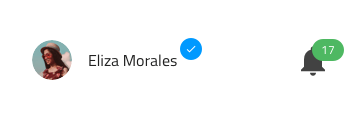
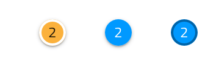

---
title: Badge - デザイン システム コンポーネント
_description: Badge コンポーネント シンボルは、追加情報のヒントを提供するコンプリメンタリ要素です。
_keywords: デザイン システム, Sketch, Ignite UI for Angular, コンポーネント, UI ライブラリ, ウィジェット
_language: ja
---

## Badge

Badge コンポーネント シンボルを使用して他のインターフェイス要素や通知を表示するために注意を促します。コンポーネントに対するインタラクションに応じてユーザーに追加情報を公開することにより  UX を向上できます。Badge は、[Ignite UI for Angular Badge コンポーネント](https://jp.infragistics.com/products/ignite-ui-angular/angular/components/badge.html)と視覚的に同じものです。

### Badge デモ



### 図形

Badge には、円形と四角形の 2 つの異なる図形があります。


### タイプ

Badge は、**数字**やアイコンなど、さまざまなタイプのコンテンツを使用できます。


### スタイル設定

Badge は、さまざまなオーバーライドで背景、境界線の色、元になるインターフェイス要素でキャストされた影の表示の制御などスタイル設定に柔軟性があります。



## 使用方法

Badge を使用して Avatar やテキスト タイトルなどのその他の UI 部分に印を付けます。Badge をそれ自体には使用しないでください。

| いい例                           | 悪い例                         |
| ---------------------------- | ------------------------------ |
|  |  |

## コードの生成

Badge に色を指定した場合、Badge HTML 要素は div でラップされます。ブラウザーによってネスト コンポーネント (他のコンポーネント内のコンポーネント) のスタイル設定が要求されます。

> [!WARNING]
> デザインの Badge のインスタンスで`シンボルからデタッチ`をトリガーすると、ほとんどの場合で Badge のためのコード生成機能が失われる結果となります。

### データ プロパティ バインディング

提供された場合、`🕹️DataProperty` バインドはネストあり/なしが可能です。このプロパティは Badge 値をデータ バインドします。値はバッジに表示されるテキストを指定します。Badge のタイプを Icon に設定した場合、`🕹️DataProperty` は無視されます。 

プロパティがネストされたプロパティの場合、ネストされたプロパティ チェーンを含みますがモデル オブジェクト名は含みません。例:

#### 例: ネストなし

```PseudoCode
Customer {
userRank: number;
}

DataProperty: {userRank}
```

#### 例: ネストあり

```PseudoCode
Profile {
userRank: number;
}

Customer {
profile: Profile;
}

DataProperty: {profile.userRank}
```

### Event プロパティ

`🕹️Event` プロパティはコンポーネント TypeScript のメソッドを作成するために使用されて HTML に Angular クリック シグネチャーを追加します。

## その他のリソース

関連トピック:

- [Avatar + Badge](avatar+badge.md)
  <div class="divider--half"></div>

コミュニティに参加して新しいアイデアをご提案ください。

- [Indigo Design **GitHub** (英語)](https://github.com/IgniteUI/design-system-docfx)
