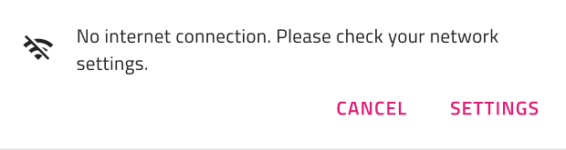
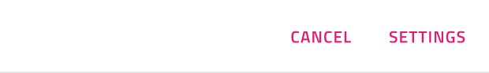
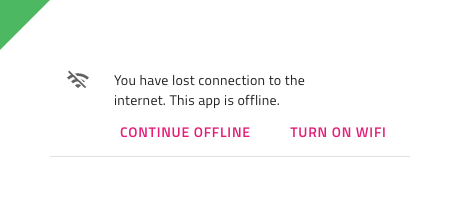
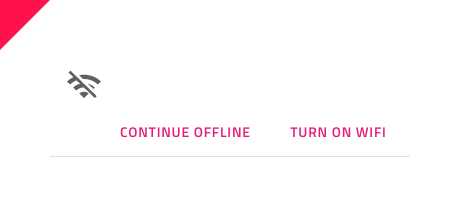
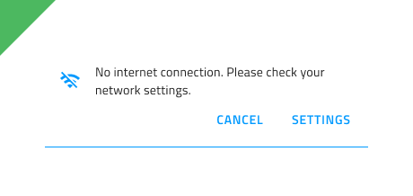

# Banner (バナー)

Banner コンポーネントを使用して、オプションのアクション付きで目立つメッセージを表示します。Banner は、[Ignite UI for Angular Banner コンポーネント](https://jp.infragistics.com/products/ignite-ui-angular/angular/components/banner)と視覚的に同じです。

## Banner のデモ

## Message (メッセージ)

Banner のメッセージ セクションは、Icon (アイコン) と Text field (テキスト フィールド) が含まれています。Figma では、プロパティ パネルから 「Icon」 ブール演算を使用して、アイコンの表示/非表示を切り替えることができます。

## Actions (アクション)

デフォルトでは、Actions セクションには 2 つのボタン コンポーネントが含まれています。Figma では、ボタンを 1 つ残し、レイヤー パネルから他のボタンを非表示にしたり、「Actions」 ブール演算を使用してアクション コンテナー全体を非表示にしたりすることで、表示されるアクションを管理できます。

## スタイル設定

Banner は、テキスト、背景と境界線の色、アイコンのグリフと色、およびスタイル設定オプションを備えたボタン タイプのオプションを通じて柔軟にスタイル設定ができます。

## 使用方法

イラストレーションはメッセージをサポートするために使用されます。アクションを宣伝するために説明文なしでそれらを使用しないでください。強調の異なるボタンを組み合わせないでください。これにより、あるアクションが他のアクションよりも促進されます。

| 良い例                                                                             | 悪い例                                                                              |
| ------------------------------------------------------------------------------ | ---------------------------------------------------------------------------------- |
|  |  | 
|  | |

## その他のリソース

関連トピック:

- [Button](button.md)
- [Icon](icon.md)
  

コミュニティに参加して新しいアイデアをご提案ください。
