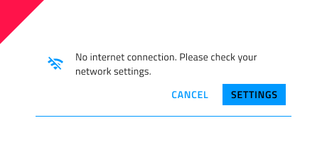

# Banner (バナー)

Banner コンポーネントを使用して、目立つメッセージとそれに関連するオプションのアクションを表示します。Banner は、[Ignite UI for Angular Banner コンポーネント](https://jp.infragistics.com/products/ignite-ui-angular/angular/components/banner)と視覚的に同じです。

## Banner のデモ

## Message (メッセージ)

Banner の Message は、Icon (アイコン) と Text (テキスト) フィールドで構成されています。Sketch のスマート レイアウトを使用して、~No Symbol に設定することでどちらか一方を非表示にし、Adobe XD の Stack を使用して、コンポーネントを追加または削除するときにレイアウトを自動的に処理します。Figma では、デフォルトのバナー デザインに変更を加えたい場合は、バナー コンポーネントをデタッチする必要があります。その後、変更を手動で行う必要があります。自動レイアウトは、次のバージョンの Figma UI キットで統合される予定です。

## Actions (アクション)

Actions 領域には、デフォルトで 2 つの Button コンポーネントが含まれています。1 つだけが必要な場合、または両方を削除する場合は、Sketch で ~No Symbol に設定すると、スマート レイアウトですべてが調整されます。Adobe XD では、不要なボタン レイヤーを削除し、適用された Stack に依存してインターフェイスを調整することで、同じことを実現できます。さらに、[Libraries] パネルから [Actions] 領域にドラッグすることで、アクションを追加したり、さまざまなコンポーネントを使用したりすることもできます。Figma では、バナーに表示されるアクションを管理するために、いずれを残しいずれを非表示にするかをレイヤー パネルから選択できます。アクションが必要ない場合は、「Actions」グループ全体を非表示にしてから、デザインを手動で調整する必要があります。自動レイアウトは、次のバージョンの Figma UI キットに統合されます。

## スタイル設定

Banner は、テキスト、背景と境界線の色、アイコンのグリフと色、およびスタイル設定オプションを備えたボタン タイプのオプションを通じて柔軟にスタイル設定ができます。

## 使用方法

強調の異なるボタンを組み合わせないでください。これにより、あるアクションが他のアクションよりも促進されます。イラストレーションはメッセージをサポートするために使用されます。アクションを宣伝するために説明文なしでそれらを使用しないでください。

| 良い例                                                                             | 悪い例                                                                              |
| ------------------------------------------------------------------------------ | ---------------------------------------------------------------------------------- |
|  |  | 
|  | |

## その他のリソース

関連トピック:

- [Button](button.md)
- [Icon](icon.md)
  

コミュニティに参加して新しいアイデアをご提案ください。
