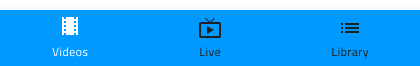
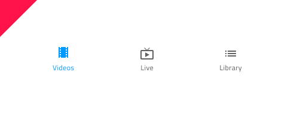

# Bottom Navigation (ボトム ナビゲーション)

Bottom Navigation コンポーネント は、関連ビュー間のブラウジングが可能な項目を 5 項目以下で画面下に配置してアプリケーション レベルのナビゲーションを実装します。Bottom Navigation は、[Ignite UI for Angular Bottom Navigation コンポーネント](https://jp.infragistics.com/products/ignite-ui-angular/angular/components/tabbar.html) と視覚的に同じものです。

## Bottom Navigation のデモ

## 項目数

In Sketch, the Bottom Navigation uses a smart layout allowing it to adjust accordingly when one or more of its items are set to ~No Symbol. In Adobe XD, you can delete the unused items and the layout will adjust through the use of Stacks. Bear in mind that the maximum number of items is limited to 5 and if you need to design application-level navigation with more items or views, consider using the [Navigation Drawer](nav-drawer.md) instead.

## 項目の状態

Bottom Navigation は、**Active**、Inactive、および Disabled の状態をサポートする項目で構成されています。Sketch ではこれを `Symbol Overrides` で実現していますが、Adobe XD では `Component States` パラダイムを使用して簡単に状態を切り替えることができます。Bottom Navigation には、常に 1 つのアクティブな項目と、任意の数の非アクティブおよび無効な項目があります。

## 項目コンテンツ テンプレート

The Bottom Navigation items come as a combination of icon and text by default. In Sketch, the smart layout rules applied to the item content template lets you remove the text label and have an icon-only item when you set the label to ~No Symbol. In Adobe XD, the content is in a Stack and you can achieve the same by deleting the label layer when it is not needed.

## スタイル設定

Bottom Navigation は、さまざまなオプションを通じて背景色、項目ラベル、アイコンの色を柔軟にスタイル設定できます。

## 使用方法

Bottom Navigation は常にその他のコンテンツの一番上に表示され、シャドウは大変重要な要素となります。レイヤーを画面コンテンツに配置し、シャドウは削除しないでください。

| 良い例                                                                                     |悪い例                                                                                      |
| -------------------------------------------------------------------------------------- | ------------------------------------------------------------------------------------------ |
|  |  |
|  |  |

## その他のリソース

関連トピック:

- [Navigation Drawer](nav-drawer.md)
  

コミュニティに参加して新しいアイデアをご提案ください。

