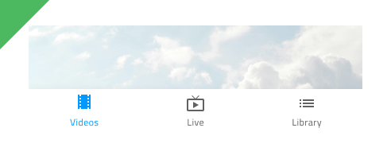

## Bottom Navigation

Bottom Navigation コンポーネント は、関連ビュー間のブラウジングが可能な項目を 5 項目以下で画面下に配置してアプリケーション レベルのナビゲーションを実装します。title: Bottom Navigation は、[Ignite UI for Angular Bottom Navigation コンポーネント](https://jp.infragistics.com/products/ignite-ui-angular/angular/components/tabbar.html) と視覚的に同じものです。

### Bottom Navigation デモ


### 項目数

Bottom Navigation は 2 項目 ～ 5 項目をサポートします。アプリケーション レベルで 5 項目以上のナビゲーションまたはビューをデザインする場合は、[Navigation Drawer](nav-drawer.md) の使用を検討してください。


### 項目のスタイル

Bottom Navigation 項目には、**アイコンとテキスト**の組み合わせ、またはアイコンのみが含まれます。常にアクティブな状態の項目が 1 つ、あり、残りの項目はインアクティブに設定する必要があります。


### スタイル設定

Bottom Navigation は、さまざまなオーバーライドで背景色、項目ラベル、アイコン色を制御することにより柔軟にスタイル設定できます。


## 使用方法

Bottom Navigation は常にその他のコンテンツの一番上に表示され、シャドウは大変重要な要素となります。レイヤーを画面コンテンツに配置し、シャドウは削除しないでください。

| 良い例                                                                                     |悪い例                                                                                      |
| -------------------------------------------------------------------------------------- | ------------------------------------------------------------------------------------------ |
| | |
| | |

## コードの生成

Sketch の制限によって Bottom Navigation コンポーネントの特定のタブとコンテンツを関連付けることはできません。Bottom Navigation コンポーネントを含む Artboard 全体の生成はお勧めしません。代わりに Bottom Navigation コンポーネントを生成してから個々のタブ コンテンツをそれぞれの Angular コンポーネントに生成してください。タブ コンテンツをそれぞれ Angular コンポーネントに生成後、Bottom Navigation コンポーネントで各タブ内で生成したタブ コンテンツに手動で参照できます。


> [!WARNING]
> デザインの Bottom Navigation のインスタンスで `Detach from Symbol` をトリガーすると、ほとんどの場合で Bottom Navigation のためのコード生成機能が失われる結果となります。

```html
<igx-bottom-nav>
    <igx-tab-panel>
        <!-- Manually add this component reference -->
        <app-tab1></app-tab1>
    </igx-tab-panel>
    <igx-tab-panel>
        <!-- Manually add this component reference -->
        <app-tab2></app-tab2>
    </igx-tab-panel>
</igx-bottom-nav>
```

> [!Note]
> Tab コンテンツは height: 100% で描画されないため、ページ全体は埋まりません。コンテンツに必要なスペースのみ使用します。

このセクションは、オーバーライドとコード生成にどのような影響があるかについて説明します。

### イベント

`Event` オーバーライドはコンポーネント TypeScript のメソッドを作成するために使用し、HTML に `onClick` シグネチャを追加します。波括弧構文 `{onEventName}` を使用して `Event` を指定する必要があります。

### 項目数

このオーバーライドは表示されるタブまたは項目の数を決定します。

### タブ

このオーバーライドは生成されるタブのタイプを決定します。アイコンまたはテキストとアイコンが可能です。

### テキスト

このオーバーライドはアイコンとテキストを含むタブのみに表示されます。タブで表示されるテキストを指定します。プレーン テキスト、[バインディング テキスト](../codegen/data-binding.md)、または両方を含むことができます。例:

- 設定
- {settingsLabel}
- 重要な {labelText}

## その他のリソース

関連トピック:

- [Navigation Drawer](nav-drawer.md)
- [Data Binding](../codegen/data-binding.md)
  <div class="divider--half"></div>

コミュニティに参加して新しいアイデアをご提案ください。


