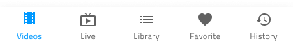

## Bottom Navigation

Bottom Navigation コンポーネント シンボルは、関連ビュー間のブラウジングが可能な項目を 5 項目以下で画面下に配置してアプリケーション レベルのナビゲーションを実装します。Bottom Navigation は、[Ignite UI for Angular Bottom Navigation コンポーネント](https://jp.infragistics.com/products/ignite-ui-angular/angular/components/tabbar.html)と視覚的に同じものです。

### Bottom Navigation デモ

### 項目数

Bottom Navigation は 2 項目 ～ 5 項目をサポートします。アプリケーション レベルで 5 項目/ビュー以上のナビゲーションをデザインする場合は、[Navigation Drawer](nav-drawer.md) の使用を検討してください。

### 項目のスタイル

Bottom Navigation 項目には、**アイコンとテキスト**の組み合わせ、またはアイコンのみが含まれます。常にアクティブな状態の項目が 1 つあり、残りの項目はインアクティブに設定する必要があります。

### スタイル設定

Bottom Navigation は、さまざまなオーバーライドで背景色、項目ラベル、アイコン色を制御することにより柔軟にスタイル設定できます。

## 使用方法

Bottom Navigation は常にその他のコンテンツの一番上に表示され、シャドウは大変重要な要素となります。レイヤーを画面コンテンツに配置し、シャドウは削除しないでください。

| いい例                                | 悪い例                               |
| --------------------------------- | ----------------------------------- |
|  |  |
|  |  |

## その他のリソース

関連トピック:

- [Navigation Drawer](nav-drawer.md)
  

コミュニティに参加して新しいアイデアをご提案ください。

- [Indigo Design **GitHub** (英語)](https://github.com/IgniteUI/design-system-docfx)
