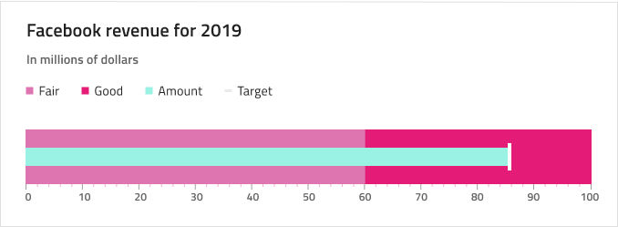

# Bullet Graph (ブレット グラフ)

Bullet Graph コンポーネントをデータ可視化に使用し、カラーコードされた下部の範囲で描かれたコンテキスト内の目標値を示します。Bullet Graph は、[Ignite UI for Angular Bullet Graph コンポーネント](https://jp.infragistics.com/products/ignite-ui-angular/angular/components/bulletgraph.html)と視覚的に同じです。

目標値がない場合や未関係の場合は、[Linear Gauge](linear-gauge.md) を代わりに使用します。

## ブレット グラフ デモ

## Title と Subtitle

Bullet Graph には、テキストを変更できる Title および Subtitle があります。~No Symbol に設定して不要な場合は非表示にできます。

## Legend

Bullet Graph には Legend があり、選択した Series Amount に合わせて調整できます。Legend 項目は、対応する Series を ~No Symbol に設定して削除、または Overrides/Charts/Legend/Series で検索して追加できます。また、アイコンのタイプを Square (四角)、Line (線)、または Circle (円) の間で変更できます。

## ツールチップ

Bullet Graph のツールチップは、オーバーライドを ~No Symbol に設定すると非表示になります。

## 範囲のサイズ

Bullet Graph は、定義済みの 3 つの範囲 (**2 つ**、3 つ、4 つ) 設定があります。

## Ticks と Values

Ticks と Values も構成できます。2 種類の目盛り: Ticks と Minor Ticks は、色を `Transparent` に設定することで非表示にできます。100 までのデフォルト Values 0、10、20 などは、必要に応じて調整できます。

## スタイル設定

Bullet Graph のスタイル設定は高い柔軟性があり、ブラシ範囲 (Value Brush、Target Value Brush、Tick Brush、Minor Tick Brush、Range Brushes のコレクション) のオーバーライドがあります。

## 使用方法

データ可視化時に情報ダッシュボードは目標値かどうかに基づいて Bullet Graph と Linear Gauge のどちらかを選択します。グラフとゲージは両方とも現在の値のみ表示し、過去の値を表示する方法はありません。アプリケーションでそのようなデータが必要な場合はまたは Line または Column Chart を検討してください。わかりやすく、鮮明なデータ可視化を簡単に作成するために Value や Target Value Brushes の色は範囲や背景と十分なコントラストのある色にし、読みづらい、解釈しずらい結果となる同色のバリアントは使用しないようにします。

| 良い例                                                                                 | 悪い例                                                                                  |
| ---------------------------------------------------------------------------------- | -------------------------------------------------------------------------------------- |
|  |  |

## その他のリソース

関連トピック:

- [Linear Gauge](linear-gauge.md)
- [Line Chart](line-chart.md)
- [Column Chart](column-chart.md)
  

コミュニティに参加して新しいアイデアをご提案ください。
