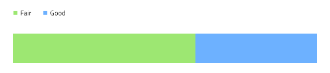

## ブレット グラフ

Bullet Graph コンポーネントをデータ可視化に使用し、カラーコードされた下部の範囲で描かれたコンテキスト内の目標値を示します。Bullet Graph は、[Ignite UI for Angular Bullet Graph コンポーネント](https://jp.infragistics.com/products/ignite-ui-angular/angular/components/bulletgraph.html)と視覚的に同じです。

目標値がない場合や不適切な場合は、[Linear Gauge](linear-gauge.md) を代わりに使用します。

### ブレット グラフ デモ

### 範囲のサイズ

Bullet Graph は、定義済みの 3 つの範囲 (2 つ、**3 つ**、4 つ) 設定があります。

### スタイル設定

Bullet Graph のスタイル設定は高い柔軟性があり、背景色の制御をオーバーライドやブラシ範囲 (Value Brush、Target Value Brush、Tick Brush、Minor Tick Brush、Range Brushes のコレクション) があります。

## 使用方法

データ可視化時に情報ダッシュボードは目標値かどうかに基づいて Bullet Graph と Linear Gauge のどちらかを選択します。Graphs と Gauges は両方とも現在の値のみ表示し、過去の値を表示する方法はありません。アプリケーションでそのようなデータが必要な場合は[Category Chart](chart-category.md) を検討してください。わかりやすく、鮮明なデータ可視化を簡単に作成するために Value や Target Value Brushes  の色は範囲や背景と十分なコントラストのある色にし、読みづらい、解釈しづい結果となる同色のバリアントは使用しないようにします。

| 良い例                                                                                       |悪い例                                                                                        |
| ---------------------------------------------------------------------------------------- | -------------------------------------------------------------------------------------------- |
| | |

## コードの生成

このセクションは、オーバーライドとコード生成にどのような影響があるかについて説明します。

> [!WARNING]
> デザインの Bullet Graph のインスタンスで `Detach from Symbol` をトリガーすると、ほとんどの場合で ブレット グラフ のためのコード生成機能が失われます。

### 最小値

このオーバーライドは、ブレット グラフで最小値を制御します。[データ バインド](../codegen/data-binding.md)と直接的な数値の設定ををサポートします。バインドで bound プロパティを使用する場合、ランタイムの結果が数値になる必要があります。バインドを使用しない場合は値が数値である必要があります。値が正しい書式でない場合、最小値を設定せずに Bullet Gauge を生成でき、コントロールのデフォルト値が使用されます。

バインディング:

非バインディング:

### 最大値

このオーバーライドは、ブレット グラフで表示する最小値を制御します。[データ バインド](../codegen/data-binding.md)と直接的な数値の設定ををサポートします。バインドで bound プロパティを使用する場合、ランタイムの結果が数値になる必要があります。バインドを使用しない場合は値が数値である必要があります。値が正しい書式でない場合、最大値を設定せずに Bullet Graph を生成でき、コントロールのデフォルト値が使用されます。

バインディング:

非バインディング:

### 範囲のサイズ

このオーバーライドは、Bullet Graph で表示する範囲の数を制御します。コード生成で単一範囲を表す `<igx-linear-graph-range>` 要素を作成します。この範囲要素には `startValue`、`endValue`、`brush` プロパティがあり、範囲の開始と終了位置および色を定義するために使用されます。これらは Minimum Value や Maximum Value オーバライドの設定に関係なくすべて自動生成され、Sketch で表示されていた外観を常に再現できます。

範囲で開始値と終了値を自動生成しないことをお勧めしますが、自動生成した場合は生成した HTML の範囲を手動で更新する必要があります。

### ValueDataProperty

このオーバーライドは、Bullet Graph で表示する現在値を制御します。

[データ バインディング](../codegen/data-binding.md) のみサポートするため、値は正しい書式にする必要があります。

バインド プロパティはランタイムの結果が数値である必要があります。

### TargetValueDataProperty

このオーバーライドは、Bullet Graph で表示するターゲット値を制御します。

[データ バインディング](../codegen/data-binding.md) のみサポートするため、値は正しい書式にする必要があります。

バインド プロパティはランタイムの結果が数値である必要があります。

## その他のリソース

関連トピック:

- [Linear Gauge](linear-gauge.md)
- [Category Chart](chart-category.md)
- [Data Binding](../codegen/data-binding.md)
  

コミュニティに参加して新しいアイデアをご提案ください。

- [Indigo Design **GitHub** (英語)](https://github.com/IgniteUI/design-system-docfx)
