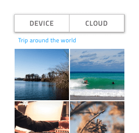
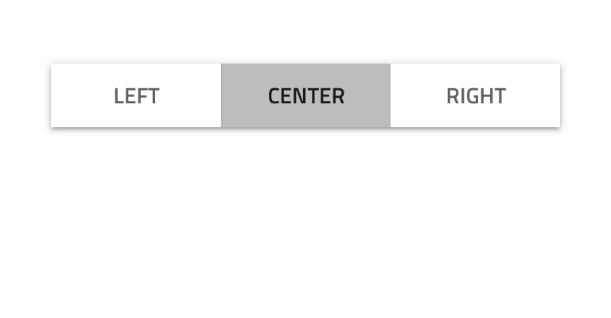
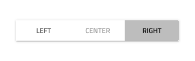
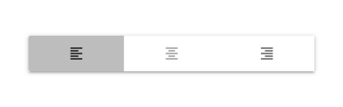
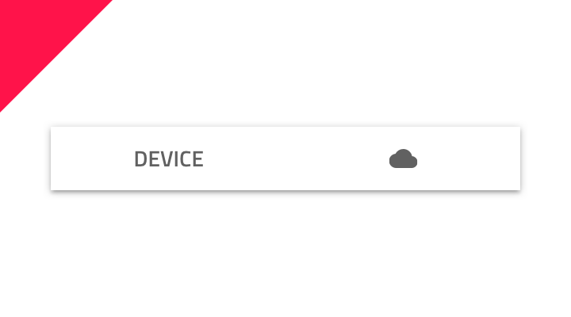
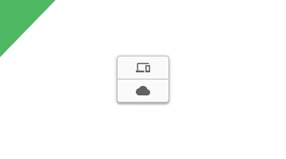
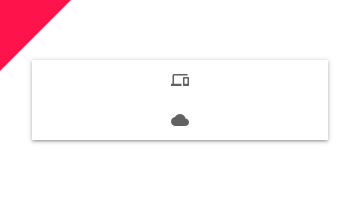
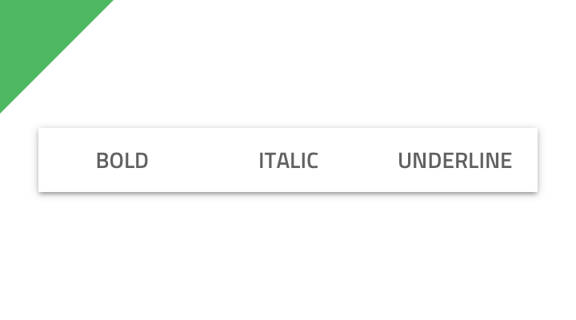
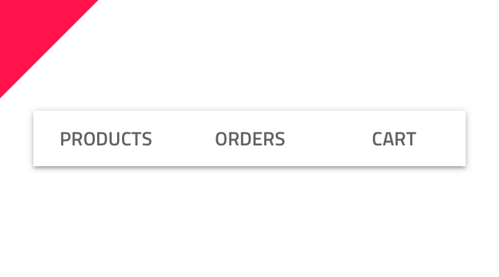

---
title: Button Group - デザイン システム コンポーネント
_description: Button Group コンポーネント シンボルは、同じコンセプトに属しているシンプルな操作を表すために使用します。
_keywords: デザイン システム, Sketch, Ignite UI for Angular, コンポーネント, UI ライブラリ, ウィジェット
_language: ja
---

## Button Group

Button Group コンポーネント シンボルは、関連する機能のトリガーを 1 インターフェイス要素として組み合わせます。1 つのボタンのみ押すことができる排他的な選択と 1 つ以上のボタンを押したままにできる複数選択の両方をサポートします。Button Group は、[Ignite UI for Angular Button Group コンポーネント](https://jp.infragistics.com/products/ignite-ui-angular/angular/components/buttongroup.html)と視覚的に同じものです。

### Button Group デモ

### レイアウト

Button Group は、2 方向レイアウトをサポートし、左から右の水平方向、上から下の垂直に配置できます。

### ボタン数

多くのケースで Button Group に 2 項目 ～ 4 項目が必要になります。4 項目以上必要な場合は、一連のリッチな操作を提供できるカスタム ツールバーをデザインすることを検討してください。

### ボタン タイプ

Button Group 内の各 Button には**テキスト**またはアイコンが含まれ、**デフォルト**、無効、ホバー、選択済みの状態で設定できます。選択済みの状態は、選択したボタンを分けるための追加の境界線があり、Button 配置に反映する必要のある 3 種類のバリアントが含まれます。

### スタイル設定

Button Group は、さまざまなオーバーライドで背景色、各ボタン境界線、背景、ラベル、アイコン色を制御することにより柔軟にスタイル設定できます。

## 使用方法

Button のスタイルは統一させます。同じ Button グループ内でテキスト Button とアイコン Buttons を組合さないようにします。Button Group のサイズはコンテンツに基づいて変更することにより、Button に空スペースが多く残らないようにします。Button Group は、シンプルで関連のある操作のみの表示に使用します。簡単なナビゲーションにも適していないため、[Tabs](tabs.md) の使用をお勧めします。 

| 良い例                                  | 悪い例                                 |
| ----------------------------------- | ------------------------------------- |
|  |  |
|  |  |
|  |  |

## その他のリソース

関連トピック:

- [Button](button.md)
  

コミュニティに参加して新しいアイデアをご提案ください。

- [Indigo Design **GitHub** (英語)](https://github.com/IgniteUI/design-system-docfx)
