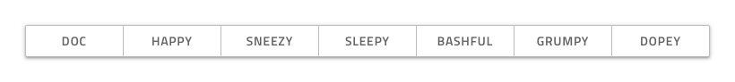
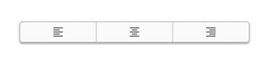

---
title: Button Group - デザイン システム コンポーネント
_description: Button Group コンポーネント シンボルは、同じコンセプトに属しているシンプルな操作を表すために使用します。
_keywords: デザイン システム, デザイン システム UX, UI キット, Figma, Ignite UI for Angular, Figma to Angular, Angular, Angular デザイン システム, Figma からコードをエクスポート, Angular 用のデザイン キット, Figma HTML, Figma to HTML, Figma UI キット
_language: ja
---

# Button Group (ボタン グループ)

Button Group コンポーネントを使用して、いくつかの関連機能のトリガーを 1 つのインターフェイス要素に結合します。Button Group は、[Ignite UI for Angular Button Group コンポーネント](https://jp.infragistics.com/products/ignite-ui-angular/angular/components/button-group.html)と視覚的に同じものです。

## Button Group のデモ

## レイアウト

Button Group は、2 方向レイアウトをサポートし、左から右の水平方向、上から下の垂直に配置できます。

## ボタン数

Figma では、ボタン グループは自動レイアウトを使用しているため、必要なボタンの正確な数を選択し、レイヤー パネルでネストされた余分なボタンを非表示にすると、それに応じて調整されます。

## ボタン レイアウト テンプレート

Button Group の各ボタンは Flat Button であり、同様のテンプレートを作成できます。

## スタイル設定

Button Group は、さまざまなオプションを通じて境界線と背景色、各ボタンのアウトライン、背景、テキスト、アイコンの色を柔軟にスタイル設定できます。

## 使用方法

Button のスタイルは統一させます。同じ Button グループ内でテキスト Button とアイコン Button を組合さないようにします。Button Group のサイズはコンテンツに基づいて変更することにより、Button に空スペースが多く残らないようにします。Button Group は、シンプルで関連のある操作のみの表示に使用します。簡単なナビゲーションにも適していないため、[Tabs](tabs.md) の使用をお勧めします。 

| 良い例                                  | 悪い例                                 |
| ----------------------------------- | ------------------------------------- |
|  |  |
|  |  |
|  |  |

## その他のリソース

関連トピック:

- [Button](button.md)
  

コミュニティに参加して新しいアイデアをご提案ください。

