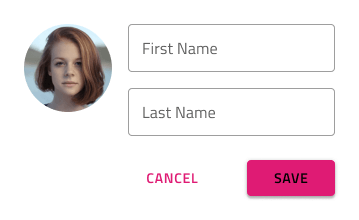
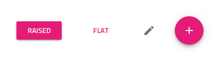
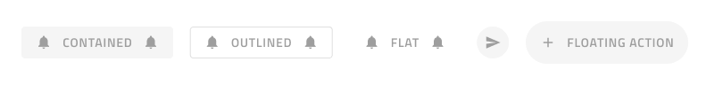
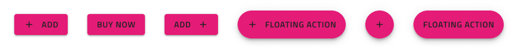
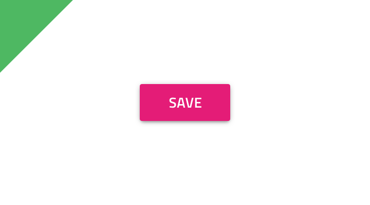
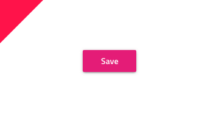
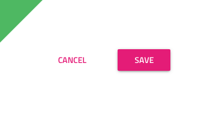
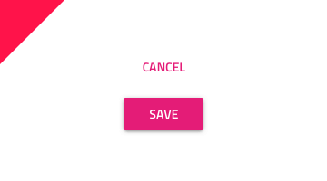
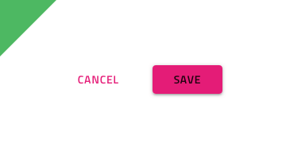
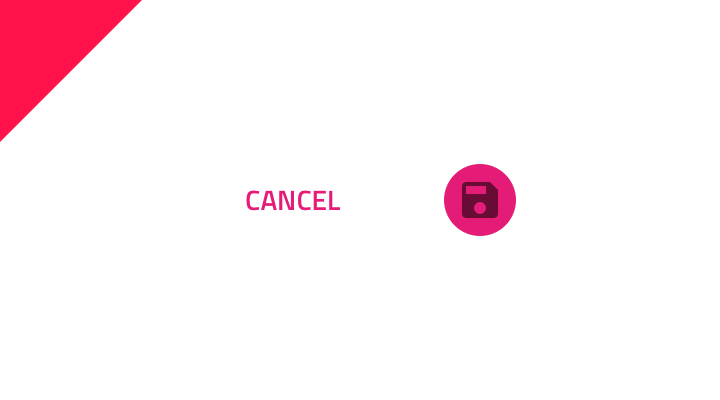

---
title: Button - デザイン システム コンポーネント
_description: Button コンポーネント シンボルはシンプルなアクションを表すために使用します。
_keywords: デザイン システム, デザイン システム UX, UI キット, Sketch, Ignite UI for Angular, Sketch to Angular, Angular, Angular デザイン システム, Sketch からコードをエクスポート, Angular 用のデザイン キット, Sketch HTML, Sketch to HTML, Sketch UI キット
_language: ja
---

# Button (ボタン)

Button コンポーネント シンボルは、シンプルなユーザー操作のためのトリガーを表します。Buttons は、カード、ダイアログ、フォーム、その他コンポーネントやパターンに使用します。Button は、[Ignite UI for Angular Button コンポーネント](https://jp.infragistics.com/products/ignite-ui-angular/angular/components/button.html)と視覚的に同じものです。

## Button のデモ

## タイプ

5 つの Button タイプがあります。

- 塗りつぶしや影付きの Raised Button は、操作を強調します。
- アウトライン付きの Outlined Button は、ほとんどのアクションに適しています。
- Flat Button は、通常あまり重要でない操作に使用します。
- Icon Button は、操作をアイコンでのみ表されます。
- Floating Action Button (fab) の塗りつぶしと影は、画面ごとに 1 回使用してメインの操作を強調します。

## 操作状態

これらのボタンはすべて、有効なバリアントと無効なバリアントの両方をサポートしているため、無効な状態で挿入することもできます。Adobe XD では `Component States` パラダイムを使用して簡単に状態を切り替えることができます。

## 状態

有効なボタンは、**Rest** と Hover 状態をサポートします。

## レイアウト テンプレート

Raised、Outlined、Flat、Floating Action ボタンは、オーバーライド パネルから非表示にする要素を ~No Symbol に設定することで、柔軟なアイコンとラベルのテンプレートをサポートします。

## スタイル設定

Button は、さまざまなオプションを通じて背景色、ラベル、アイコン色を柔軟にスタイル設定できます。

## 使用方法

Button のコンテンツにラベルを含む場合、大文字を太文字 (Medium または Semibold) を使用してください。Button がレイアウトで 1 つ以上必要な場合、同じ高さで揃え、互いに十分なスペースを保ちながら同じ水平面に配置することによりタップやクリックで発生する可能性のあるエラーを防止できます。このようなレイアウトの場合は、ボタン タイプは組み合わせないようにします。UI の特定のセクションにあるすべての操作に同じタイプを使用して統一感を持たせます。

| 良い例                                                                         | 悪い例                                                                             |
| ------------------------------------------------------------------------------ | ---------------------------------------------------------------------------------- |
|  |  |
|  |  |
|  |  |

## その他のリソース

関連トピック:

- [Button Group](button-group.md)
- [Card](card.md)
- [Dialog](dialog.md)
- [Snackbar](snackbar.md)
- [Time Picker](time-picker.md)
- [AV Player パターン](../patterns/av.md)
- [File Upload パターン](../patterns/file-upload.md)
- [Form パターン](../patterns/form.md)
  

コミュニティに参加して新しいアイデアをご提案ください。

