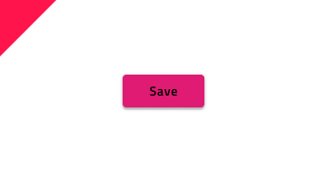

# Button (ボタン)

Button コンポーネント シンボルは、シンプルなユーザー操作のためのトリガーを表します。Buttons は、カード、ダイアログ、フォーム、その他コンポーネントやパターンに使用します。Button は、[Ignite UI for Angular Button コンポーネント](https://jp.infragistics.com/products/ignite-ui-angular/angular/components/button.html)と視覚的に同じものです。

## Button デモ

## タイプ

4 つの Button タイプがあります。

- Raised Button は、操作を強調し、**テキスト**およびアイコンとテキストの組み合わせ、および塗りつぶしやシャドウをサポートします。
- Flat Button は、通常あまり重要でない操作に使用し、**テキスト**およびアイコンとテキストの組み合わせをサポートします。
- Icon Button は、操作をアイコンでのみ表されます。
- Floating Action Button (fab) の塗りつぶしと影は、画面ごとに 1 回使用してメインの操作を強調します。

## 状態

各ボタン タイプは**デフォルト**、ホバー、無効の状態をサポートします。アイコンやラベル付きのボタンはデフォルト状態でも利用できます。

## スタイル設定

Button は、さまざまなオーバーライドで背景色、ラベル、アイコン色を制御することにより柔軟にスタイル設定できます。

## 使用方法

Button のコンテンツにラベルを含む場合、大文字を太文字 (Medium または Semibold) を使用してください。Button がレイアウトで 1 つ以上必要な場合、同じ高さで揃え、互いに十分なスペースを保ちながら同じ水平面に配置することによりタップやクリックで発生する可能性のあるエラーを防止できます。このようなレイアウトの場合は、ボタン タイプは組み合わせないようにします。UI の特定のセクションにあるすべての操作に同じタイプを使用して統一感を持たせます。

| 良い例                                                                         | 悪い例                                                                             |
| ------------------------------------------------------------------------------ | ---------------------------------------------------------------------------------- |
|  |  |
|  |  |
|  |  |

## コードの生成

Button の色またはフォントを指定した場合、Button HTML 要素は div でラップされます。これはネスト コンポーネント (他のコンポーネント内のコンポーネント) をスタイル設定する際にブラウザーによって要求されます。

> [!WARNING]
> デザインの Button のインスタンスで `Detach from Symbol` をトリガーすると、ほとんどの場合で Button のためのコード生成機能が失われる結果となります。

### Event プロパティ

`🕹️Event` プロパティはコンポーネント TypeScript のメソッドを作成するために使用し、HTML に Angular クリック シグネチャーを追加します。波括弧構文 ({onEventName}) を使用してイベントを指定する必要があります。

### Sketch エレベーション

Sketch 描画の Button エレベーション変更がコード生成で描画されません。各ボタン タイプにデフォルト エレベーションがあり、Ignite UI コンポーネントによって適用されます。これは Ignite UI for Angular 製品の既知の制限で、今後のリリースで修正予定です。

### テキスト

Text プロパティにテキスト、[テキストのバインディング](../codegen/data-binding.md)、または両方を含むことができます。例:

- 設定
- {settingsLabel}
- 重要な {labelText}

## その他のリソース

関連トピック:

- [Button Group](button-group.md)
- [Card](card.md)
- [Dialog](dialog.md)
- [Snackbar](snackbar.md)
- [Time Picker](time-picker.md)
- [AV Player パターン](../patterns/av.md)
- [File Upload パターン](../patterns/file-upload.md)
- [Form パターン](../patterns/form.md)
- [データ バインディング](../codegen/data-binding.md)
  

コミュニティに参加して新しいアイデアをご提案ください。

