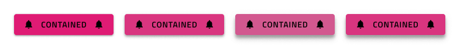
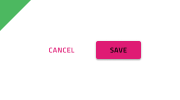
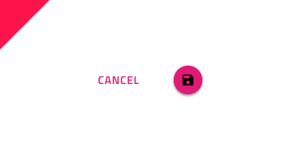

## Button

Button コンポーネント シンボルは、シンプルなユーザー操作のためのトリガーを表します。Buttons は、カード、ダイアログ、フォーム、その他コンポーネントやパターンに使用します。Button は、[Ignite UI for Angular Button コンポーネント](https://jp.infragistics.com/products/ignite-ui-angular/angular/components/button.html)と視覚的に同じものです。

### Button デモ

### タイプ

4 つの Button タイプがあります。

- Raised Button は、操作を強調し、**テキスト**およびアイコンとテキストの組み合わせ、および塗りつぶしやシャドウをサポートします。
- Flat Button は、通常あまり重要でない操作に使用し、**テキスト**およびアイコンとテキストの組み合わせをサポートします。
- Icon Button は、操作をアイコンでのみ表されます。
- Floating Action Button (fab) の塗りつぶしと影は、画面ごとに 1 回使用してメインの操作を強調します。

### 状態

各ボタン タイプは**デフォルト**、ホバー、無効の状態をサポートします。アイコンやラベル付きのボタンはデフォルト状態でも利用できます。

### スタイル設定

Button は、さまざまなオーバーライドで背景色、ラベル、アイコン色を制御することにより柔軟にスタイル設定できます。

## 使用方法

Button のコンテンツにラベルを含む場合、大文字を太文字 (Medium または Semibold) を使用してください。Button がレイアウトで 1 つ以上必要な場合、同じ高さで揃え、互いに十分なスペースを保ちながら同じ水平面に配置することによりタップやクリックで発生する可能性のあるエラーを防止できます。このようなレイアウトの場合は、ボタン タイプは組み合わせないようにします。UI の特定のセクションにあるすべての操作に同じタイプを使用して統一感を持たせます。

| いい例                            | 悪い例                           |
| ----------------------------- | ------------------------------- |
|  |  |
|  |  |
|  |  |

## その他のリソース

関連トピック:

- [Button Group](button-group.md)
- [Card](card.md)
- [Dialog](dialog.md)
- [Snackbar](snackbar.md)
- [Time Picker](time-picker.md)
- [AV Player Pattern](av-player.md)
- [File Upload Pattern](file-upload.md)
- [Form Pattern](forms.md)
  

コミュニティに参加して新しいアイデアをご提案ください。

- [Indigo Design **GitHub** (英語)](https://github.com/IgniteUI/design-system-docfx)
