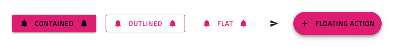
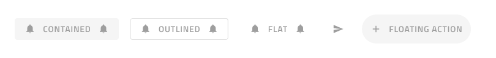
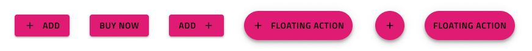

# Button (ボタン)

Button コンポーネントは、シンプルなユーザー操作のためのトリガーを表します。Buttons は、カード、ダイアログ、フォーム、その他コンポーネントやパターンに使用します。Button は、[Ignite UI for Angular Button コンポーネント](https://jp.infragistics.com/products/ignite-ui-angular/angular/components/button.html)と視覚的に同じものです。

## Button のデモ

## タイプ

5 つの Button タイプがあります。

- 塗りつぶしや影付きの **Contained Button** は、操作を強調します。
- アウトライン付きの **Outlined Button** は、ほとんどのアクションに適しています。
- **Flat Button** は、通常あまり重要でない操作に使用します。
- **Floating Action Button (Fab)** の塗りつぶしと影は、画面ごとに 1 回使用してメインの操作を強調します。
- **Icon Button** は、操作をアイコンでのみ表されます。Icon Button は、Contained、Outlined、Flat、Fab の各タイプにすることもできます。

## サイズ

すべての Button タイプには、次の 3 つのサイズがあります。

- Large (大)
- Medium (中)
- Small (小)

## インタラクション状態

これらのボタンはすべて、有効なバリアントと無効なバリアントの両方をサポートしているため、無効な状態で挿入することもできます。Figma では、プロパティ パネルからブール演算を使用して切り替えることができます。

## 状態

Figma では、Enabled ボタンは **Idle (アイドル)**、Hover (ホバー)、Focused (フォーカス済み)、Focused and Hover (フォーカス済みおよびホバー) 状態をサポートしており、`State` プロパティを変更することで切り替えることができます。

## レイアウト テンプレート

Contained、Outlined、Flat、および Floating Action ボタンは、柔軟なアイコンおよびラベルのテンプレートをサポートします。Figma では、アイコンを表示または非表示にするには、`Left Icon` および `Right Icon` ブール値プロパティを使用できます。アイコン ボタンが必要な場合は、`Content` プロパティを Icon に設定できます。

## スタイル設定

Button は、さまざまなオプションを通じて背景色、ラベル、アイコンの色を柔軟にスタイル設定できます。

## 使用方法

Button のコンテンツにラベルを含む場合、大文字を太文字 (Medium または Semibold) を使用してください。Button がレイアウトで 1 つ以上必要な場合、同じ高さで揃え、互いに十分なスペースを保ちながら同じ水平面に配置することによりタップやクリックで発生する可能性のあるエラーを防止できます。このようなレイアウトの場合は、ボタン タイプは組み合わせないようにします。UI の特定のセクションにあるすべての操作に同じタイプを使用して統一感を持たせます。

| 良い例                                                                         | 悪い例                                                                             |
| ------------------------------------------------------------------------------ | ---------------------------------------------------------------------------------- |
|  |  |
|  |  |
|  |  |

## その他のリソース

関連トピック:

- [Button Group](button-group.md)
- [Card](card.md)
- [Dialog](dialog.md)
- [Snackbar](snackbar.md)
- [Time Picker](time-picker.md)
- [AV Player パターン](../patterns/av.md)
- [File Upload パターン](../patterns/file-upload.md)
- [Form パターン](../patterns/form.md)
  

コミュニティに参加して新しいアイデアをご提案ください。

