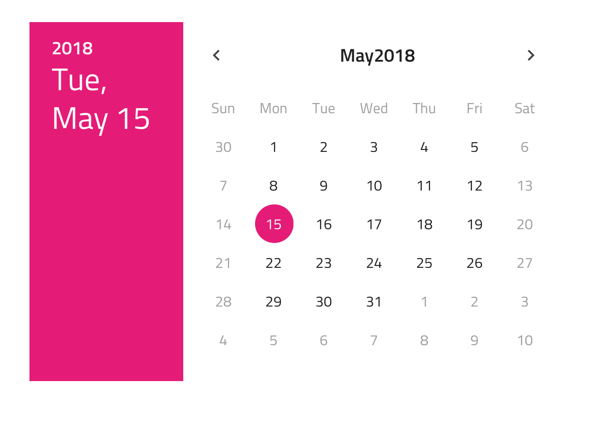

---
title: Calendar - デザイン システム コンポーネント
_description: Calendar コンポーネントシンボルは、日付選択に必要なメカニズムを提供する日付のビジュアル表現として使用します。
_keywords: デザイン システム, Sketch, Ignite UI for Angular, コンポーネント, UI ライブラリ, ウィジェット
_language: ja
---

## Calendar

Calendar コンポーネントシンボルは、日付を視覚的に表して年と月のコンビネーション表示で統一した選択 (日付選択) の手段をユーザーに提供します。Calendar は、さまざまなフォームで使用されるこのタイプのフィールドの日付を選択して設定する場合に適しています。Calendar は、[Ignite UI for Angular Calendar コンポーネント](https://jp.infragistics.com/products/ignite-ui-angular/angular/components/calendar.html)および [Ignite UI for Angular Date Picker コンポーネント](https://jp.infragistics.com/products/ignite-ui-angular/angular/components/date_picker.html)と視覚的に同じものです。

### Calendar デモ

### レイアウト

Calendar は、水平方向および垂直方向の日付選択モードをサポートします。基本のカレンダーはシンプルな表示とブラウジングを提供します。上記 2 つのコンポーネントはダイアログに使用しますが 2 つ目は他のコンテンツでインラインすることをお勧めします。

### ボタン

Calendar には 2 つのボタンがあります。1 つは選択されていた日付の変更を破棄するボタン、もう 1 つは今日に移動するためのボタンです。 Overrides で両方を none に設定してボタンレスのレイアウトを実現できます。

### コンテンツ

Calendar では 3 つの主な日付部分 (年、月、日) の選択が可能です。コンテンツ モードが 3 つあり、各モードはそれぞれの日付部分を処理します。

### 週の初め

週の初めは、最も一般的なシナリオ (日曜日または月曜日) から選択します。

### スタイル設定

Calendar は、柔軟なスタイル設定が可能でさまざまなオーバーライドによりヘッダー背景、タイトル色、コンテンツの年月、年選択項目、選択した年/月/日のテキストや背景色を制御できます。Cancel と Today のボタンは、[Flat Buttons](button.md) で状況に応じたスタイル設定が可能です。

## 使用方法

水平と垂直のカレンダーをダイアログで表示し、ダイアログ以外の UI は暗くなります。
特別なビジュアル効果を追加せずに基本の Calendar を残りの UI とインライン表示します。

| 良い例                                                                             | 悪い例                                                                                 |
| ---------------------------------------------------------------------------------- | -------------------------------------------------------------------------------------- |
|  |  |
|  |  |

## その他のリソース

関連トピック:

- [Time Picker](time-picker.md)
- [Form Pattern](../patterns/form.md)
  

コミュニティに参加して新しいアイデアをご提案ください。

- [Indigo Design **GitHub** (英語)](https://github.com/IgniteUI/design-system-docfx)
