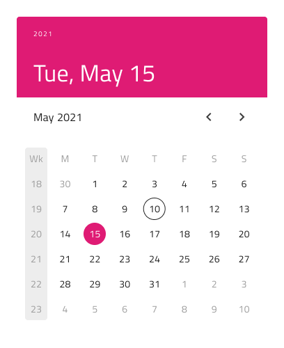
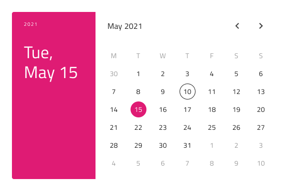

# Calendar (カレンダー)

Calendar コンポーネントは、日付を視覚的に表示し、年と月のコンビネーション表示で統一した選択方法をユーザーに提供します。Calendar は、日付の表示および選択を許可するためにビューでインラインに設定します。Calendar は、[Ignite UI for Angular Calendar](https://jp.infragistics.com/products/ignite-ui-angular/angular/components/calendar.html) コンポーネントと視覚的に同じもので、[Ignite UI for Angular Date Picker コンポーネント](https://jp.infragistics.com/products/ignite-ui-angular/angular/components/date_picker.html)に使用されます。

## Calendar のデモ

## サイズ

Calendar には 3 つのサイズがあります。

- Large (大)
- Medium (中)
- Small (小)

水平レイアウト:

垂直レイアウト:

## レイアウト

Calendar は水平と垂直のレイアウトをサポートしています。Figma では、`Orientation` プロパティを使用して切り替えることができます。

## 使用して

Calendar には、2 か月を並べて表示する Multiview (マルチビュー) オプションが含まれています。Figma では、`Multiview` ブール値プロパティを使用してこれを有効にし、`Orientation` プロパティを使用して Horizontal 方向または Vertical 方向を選択できます。

## コンテンツ

主要な日付部分のそれぞれの表示を容易にするために、Figma には `View` プロパティがあり、Day (日)、Month (月)、または Year (年) のビューを選択できます。

## 週のはじめ

Figma では、週の開始日を `Week Start` プロパティから選択できます。これは、週の最初の曜日の最も一般的な 2 つのシナリオをサポートしています: 日曜日と月曜日。

## Header (ヘッダー)

Calendar には組み込みヘッダーがあり、これを省略すると、シームレスにフォームへ埋め込むことができる基本カレンダーが作成されます。Figma では、これは `Header` ブール値プロパティを使用して実現できます。

## Week Numbers (週番号)

Calendar には週番号のサポートも組み込まれていますが、UI のこの部分を表示したくない場合は、Figma のプロパティ パネルから `Week Numbers` ブール値プロパティをオフにします。

## 選択

Calendar では、次の 3 つの選択モードから選択できます: **Single Day** ではユーザーが選択できる日付を 1 つだけに制限し、**Range** では開始日と終了日の間のすべての日付を選択でき、**Multiple Days** ではランダムな日付を選択できます。

## スタイル設定

Calendar は、さまざまなオプションを通じて背景、ヘッダー背景、タイトル色、コンテンツの年月選択項目、選択した年 / 月 / 日のテキストや背景色を柔軟にスタイル設定できます。これは、残りの構成に基づい適用されます。

## 使用方法

追加の視覚効果なしで、残りの UI とともに Calendar をインライン要素として使用します。モーダル、ダイアログ、またはドロップダウンを表示する必要がある場合は、代わりに Date Picker の使用を検討してください。

| 良い例                                                                                 |悪い例                                                                                  |
| ---------------------------------------------------------------------------------- | -------------------------------------------------------------------------------------- |
| | |

## その他のリソース

関連トピック:

- [Date Picker](date-picker.md)
- [Time Picker](time-picker.md)
  

コミュニティに参加して新しいアイデアをご提案ください。
