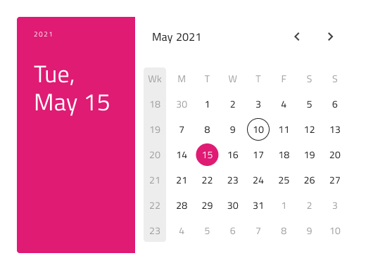
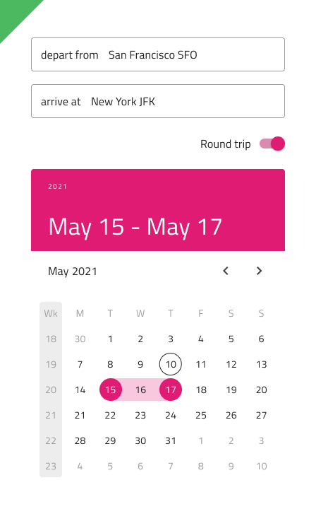

## Calendar

Calendar コンポーネントは、日付を視覚的に表示し、年と月のコンビネーション表示で統一した選択方法をユーザーに提供します。Calendar は、日付の表示および選択を許可するためにビューでインラインに設定します。Calendar は、Ignite UI for Angular Calendar コンポーネントと視覚的に同じもので、[Ignite UI for Angular Date Picker コンポーネント](https://jp.infragistics.com/products/ignite-ui-angular/angular/components/date_picker.html)に使用されます。

### Calendar デモ

### レイアウト

Calendar は、水平方向および垂直方向のレイアウトをサポートします。基本のカレンダーはシンプルな表示とブラウジングを提供します。

### コンテンツ

Calendar では 3 つの主な日付部分 (年、月、日) の選択が可能です。コンテンツ モードが 3 つあり、各モードはそれぞれの日付部分を処理します。

### 週のはじめ

週の初めは、最も一般的なシナリオ (日曜日または月曜日) から選択します。

### スタイル設定

Calendar は、柔軟なスタイル設定ができ、さまざまなオーバーライドによりヘッダー背景、タイトル色、コンテンツの年月選択項目、選択した年/月/日のテキストや背景色を制御できます。設定に基づいて使用できます。

## 使用方法

エレベーションなどの他の視覚効果を追加せずに、水平方向、垂直方向、またはベース Calendar をインライン要素として残りの UI とともに使用します。

| 良い例                                                                                 |悪い例                                                                                  |
| ---------------------------------------------------------------------------------- | -------------------------------------------------------------------------------------- |
| | |

## コードの生成

> [!WARNING]
> デザインの Calendar のインスタンスで `Detach from Symbol` をトリガーすると、ほとんどの場合で Calendar のためのコード生成機能が失われます。

`DataSource`
`Event`

## その他のリソース

関連トピック:

- [Time Picker](time-picker.md)
  

コミュニティに参加して新しいアイデアをご提案ください。

