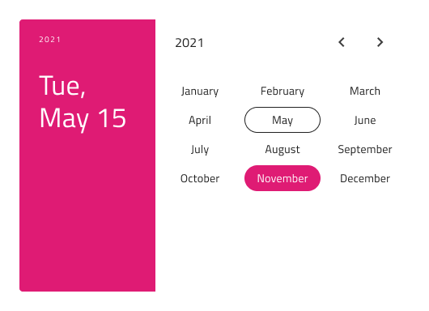
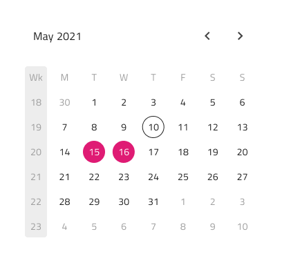

# Calendar (カレンダー)

Calendar コンポーネントは、日付を視覚的に表示し、年と月のコンビネーション表示で統一した選択方法をユーザーに提供します。Calendar は、日付の表示および選択を許可するためにビューでインラインに設定します。Calendar は、[Ignite UI for Angular Calendar](https://jp.infragistics.com/products/ignite-ui-angular/angular/components/calendar.html) コンポーネントと視覚的に同じもので、[Ignite UI for Angular Date Picker コンポーネント](https://jp.infragistics.com/products/ignite-ui-angular/angular/components/date_picker.html)に使用されます。

## Calendar のデモ

## レイアウト

Calendar は、一度に 1 か月を表示するのに適した Horizontal または Vertical のレイアウトで提供されますが、2 か月を並べて表示するための Multiview オプションもサポートしています。

## コンテンツ

Calendar は、主要な日付部分のそれぞれの表示を容易にするために、日、月、または年のビューに挿入できます。

## 週のはじめ

週の最初の日の最も一般的な 2 つのシナリオ (日曜日と月曜日) の間に Calendar を挿入するときに、オプションとして週の開始を選択することもできます。

## ヘッダー

Calendar には組み込み可能な Header があり、省略できます。Sketch でスマート レイアウトを使用すると、Header を ~No Symbol に設定できます。これにより、フォームにシームレスに埋め込むことができる基本の Calendar が作成されます。Adobe XD では、Header レイヤーを削除することで同じことができ、残りのレイアウトは自動的に調整されます。

## 週番号

Calendar には週番号のサポートも組み込まれていますが、UI のこの部分を表示したくない場合は、Sketch で Week Numbers を ~No Symbol に設定するか、Adobe XD でレイヤーを削除します。

## 選択

Calendar では、次の 3 つの選択モードから選択できます: ユーザーが 1 つの日付のみを選択できるように制限する **Single Day**、日付を複数選択できる Multiple Days、および開始から終了までのすべての日付を選択する手段を提供する Range。

## スタイル設定

Calendar は、さまざまなオプションを通じて背景、ヘッダー背景、タイトル色、コンテンツの年月選択項目、選択した年 / 月 / 日のテキストや背景色を柔軟にスタイル設定できます。これは、残りの構成に基づい適用されます。

## 使用方法

追加の視覚効果なしで、残りの UI とともに Calendar をインライン要素として使用します。モーダル、ダイアログ、またはドロップダウンを表示する必要がある場合は、代わりに Date Picker の使用を検討してください。

| 良い例                                                                                 |悪い例                                                                                  |
| ---------------------------------------------------------------------------------- | -------------------------------------------------------------------------------------- |
| | |

## その他のリソース

関連トピック:

- [Date Picker](date-picker.md)
- [Time Picker](time-picker.md)
  

コミュニティに参加して新しいアイデアをご提案ください。
