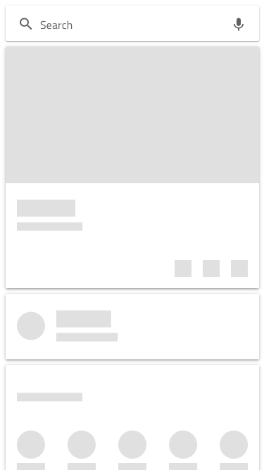
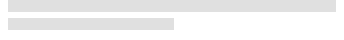
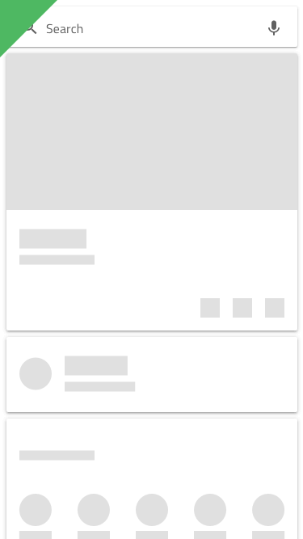
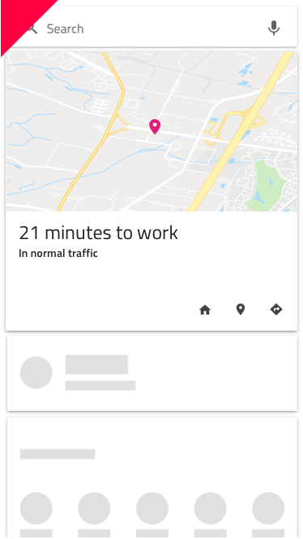

---
title: Skeleton Card - デザイン システム コンポーネント
_description: Skeleton Card は、カードのコレクションにコンテンツを提供するためにデータがバックグラウンドで読み込まれているときに表示される Card コンポーネントです。
_keywords: デザイン システム, デザイン システム UX, UI キット, Figma, Figma to Angular, Figma からコードをエクスポート, Figma to HTML, Figma UI キット, Ignite UI for Angular, Angular, Angular デザイン システム, Angular 用のデザイン キット, Figma HTML
_language: ja
---

# Skeleton Card (スケルトン カード)

Skeleton Card コンポーネントを使用して、標準の情報と同じタイプの情報をレイアウトしますが、現時点でデータが存在しない場合のアプリケーションの状態も示します。たとえば、データがリモート データ ソースから読み込まれる際、接続が不足しているか、時間がかかる場合などです。Skeleton Card は、既知のレイアウトの [Card](card.md) を視覚的に表したものですが、表示するデータはありません。

## Skeleton Card のデモ

## 領域

Skeleton Card は、標準の [Card](card.md) の `image` (画像)、`header` (ヘッダー)、`content` (コンテンツ)、および `actions` (操作) など、同じ 4 つの領域をサポートしています。  

## 画像

スケルトン画像領域は画像をサポートし、標準の [Card](card.md) で利用可能なマップをカバーします。

## ヘッダー

スケルトン ヘッダーは、標準の [Card](card.md) のヘッダーと一致しています。

## コンテンツ

コンテンツ領域は、短い説明テキストの Paragraph (段落) と、Contacts (連絡先) などのショートカットの Array をサポートしています。

## 操作

スケルトン操作には、標準の [Card](card.md) と同じレイアウトがあります。また、Figma の自動レイアウトで定義されているため、右側のサイドバーの [Design] タブからタイプを選択できます。

|                   |  	両端揃えの操作**オフ**                                             |  	両端揃えの操作**オン**                                             |
| ----------------- | --------------------------------------------------------------------- | --------------------------------------------------------------------- |
| Buttons + Icons   |  |  |
| Icons + Buttons   |  |  |
| Only Buttons    |  

  |  

  |
| Only Icons       |  

  |  

  |

## Skeleton Card のレイアウト

Figma の自動レイアウトを使用することで、Skeleton Card は特定の領域または要素を除外してさまざまなレイアウトを作成し、同じコンポーネントに基づいたさまざまなカードを最初に作成できます (標準の [Card](card.md) と同様の方法で)。

## 使用方法

複数のカードでレイアウトを作成する場合は、標準カードとスケルトン カードを組み合わせないでください。データはすべてのカードに存在するか、いずれにも存在しないため、2 つのタイプを同じグリッド レイアウト内で使用しないでください。

| 良い例                                                                         |悪い例                                                                          |
| -------------------------------------------------------------------------- | ------------------------------------------------------------------------------ |
|  |  |

## その他のリソース

関連トピック:

- [Card](card.md)
  

コミュニティに参加して新しいアイデアをご提案ください。
