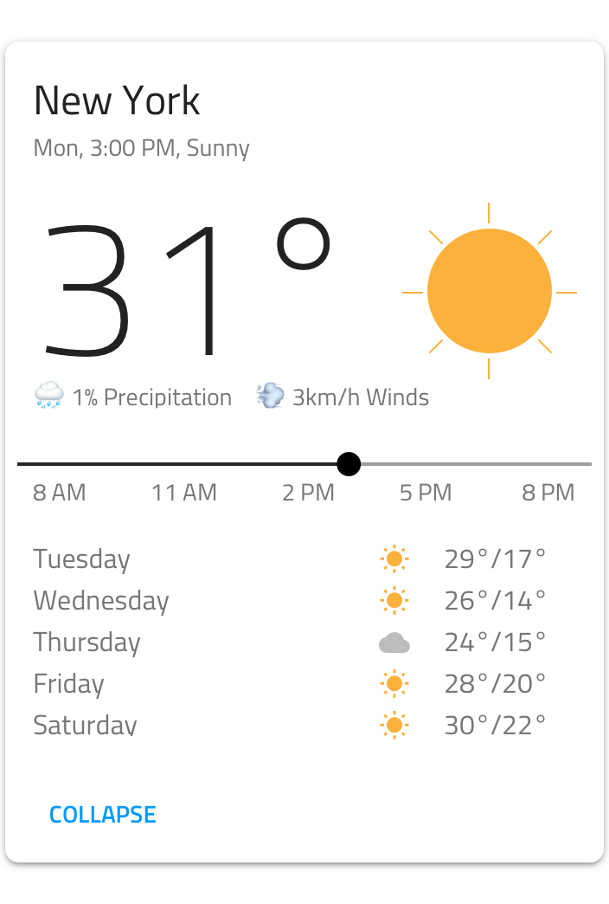
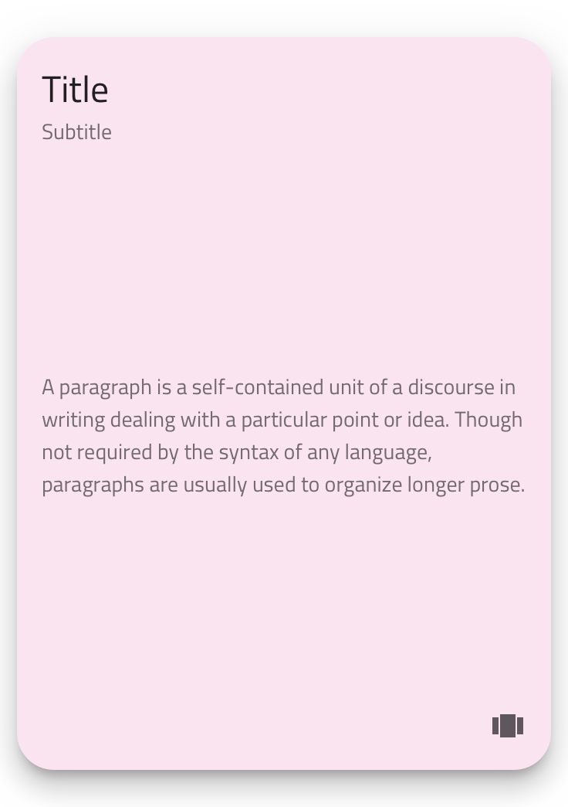
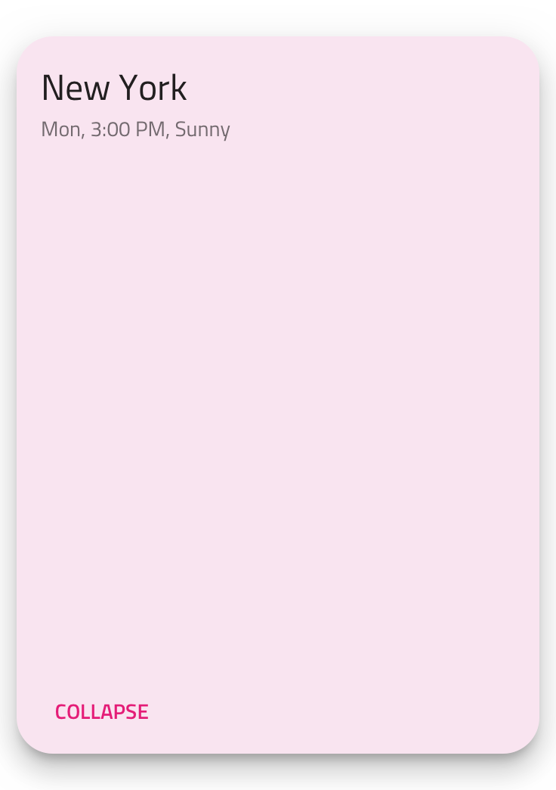
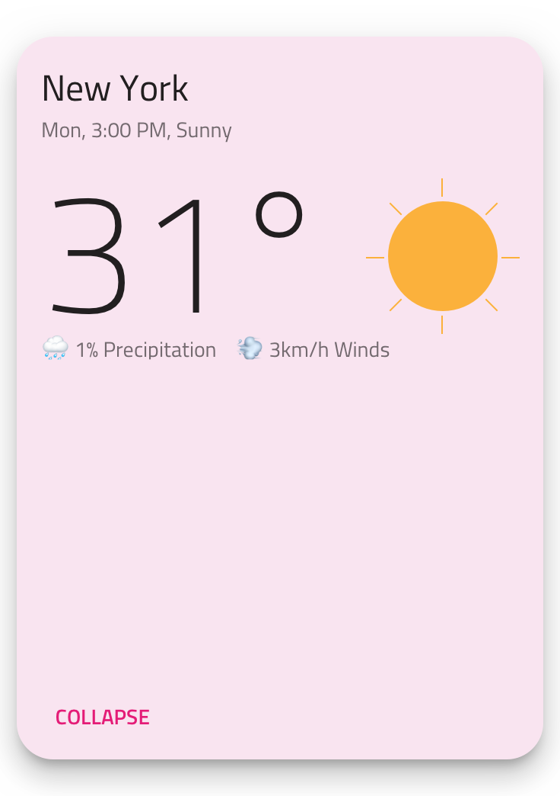
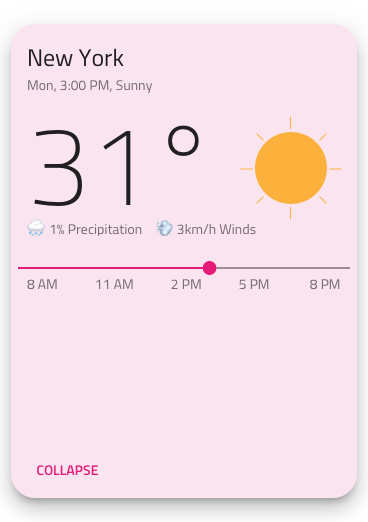
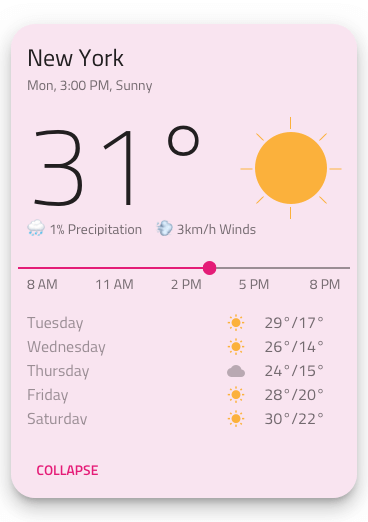
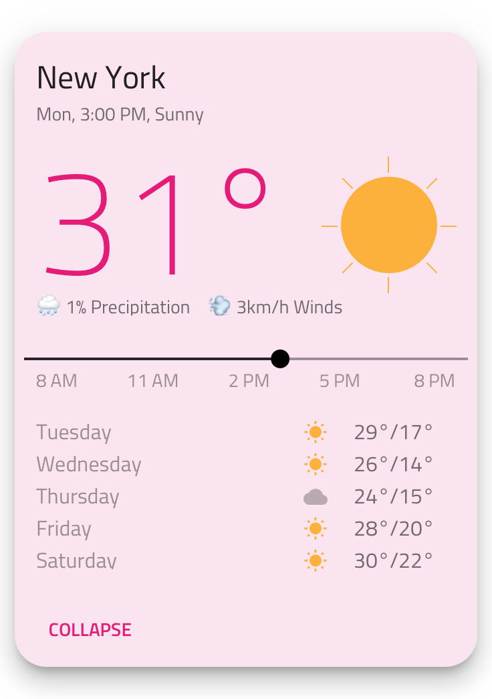

---
title: Custom Cards - デザイン システム コンポーネント
_description: Cards コレクションは、特別な Card タイプを含み、Custom レイアウトを作成できます。
_keywords: デザイン システム, Sketch, Ignite UI for Angular, コンポーネント, UI ライブラリ, ウィジェット
_language: ja
---

# Custom Cards (カスタム カード)

Custom Card コンポーネントは、通常のカードと同じタイプの情報を表示しますが、レイアウトを自由に変更できます。Custom Card は、[Ignite UI for Angular Card コンポーネント](https://jp.infragistics.com/products/ignite-ui-angular/angular/components/card.html)のレイアウトにカスタム コードを使用します。

## Custom Card デモ

## シンボルからデタッチ

Card レイアウトをカスタマイズするには、`Cards/Custom` をアートボードにドラッグして一番上を右クリックし、コンテキスト メニューの下の方にある `Detach from Symbol` オプションを選択します。新しく表示される `Cards/Custom` グループの下のレイヤー パネルには以下があります。

| レイヤー                   | 使用                                                                                                                           |
| -------------------------- | ------------------------------------------------------------------------------------------------------------------------------ |
| 🚫 igx-card/custom         | 禁止されたアイコンで開始する特定のロックされたレイヤー。このレイヤーはコード生成に必要なため、削除または変更しないでください。 |
| Custom Card                | Card レイアウト要素をグループ化                                                                                                |
| &nbsp;&nbsp; Card Area     | Card レイアウト要素をグループ化                                                                                                |
| &nbsp;&nbsp; 🌈 Background | カードの背景色を定義                                                                                                           |
| &nbsp;&nbsp; Mask          | `Radius` レイヤー プロパティを調整してカードの角を丸くします。                                                                 |
| &nbsp;&nbsp; Elevation     | カード コレクション背景に薄いシャドウをドロップします。                                                                        |
| 🕹️DataProperty             | データ バインディングのコード生成で使用されます。                                                                                    |

### スタイル設定

Custom Card は、スタイルに高い柔軟性があり、テキスト、ボタン、背景色などのさまざまなオーバーライドによって通常の Card とマッチすることができます。シンボルからでタッチを使用して角丸やエレベーション レベルなどを追加で制御できます。

| レイヤー             | 使用                            |
| -------------------- | ------------------------------- |
| Card Area            | Card レイアウト要素をグループ化 |
| &nbsp;&nbsp; Header  | Card レイアウト要素をグループ化 |
| &nbsp;&nbsp; Content | Card レイアウト要素をグループ化 |
| &nbsp;&nbsp; Actions | Card レイアウト要素をグループ化 |

### レイアウト

以下は、上記の天気 Card の複雑なレイアウトを 5 つのシンプルなステップで作成する方法です。空 Artboard に Custom Card をドラッグし、`Detach from Symbol` を選択して、背景色、角の半径、開始ポイントに必要なエレベーションを変更してベーシック スタイルを適用します。

1.  Header Style を再利用して Title と Subtitle Text の文字列を更新します。Content グループは後にして Actions Style へ移動します。ここでは、デフォルトで含まれる Icon Actions ではなく Button Actions へ変更します。最後に Left Button テキストを更新し、none に設定して Right Button を非表示にします。

  

2.  Content に戻り、天気予報のレイアウトを作成します。はじめに Cards/Blocks/Header/Large Title (Card 領域グループですべてのブロック タイプを使用可能) を挿入し、タイトルを H1 Size に更新して、シンボルをタイトルおよびサブタイトルの両方を表示するためにサイズ変更します。文字列値を更新後、デフォルト段落 Content Style を削除でき、次のようになります (デフォルト Content Style は他の要素も保持するため、Content グループを保存します)。

  

3.  次に太陽のイラストを Content Group に追加します。楕円形を数本の線形でグループ化してグループ幅と高さをプロパティ パネルで調整し、歪みを防止します。太陽イラストレーションを度タイトルの右に配置してレイアウトはこのようになります。

  

4.  One-thumb Slider Component および Cards/Blocks/Content/Paragraph Text を下のラベル配列に追加します。ターゲットとするデザインにするために Slider を選択して Label Text Style および Label Background を none にオーバーライドし、ラベル バルーンを非表示にします。Paragraph Text にラベル値を挿入後、これと同様のことができます。

  

5.  ここでは詳細な予報領域をデザインします。最も簡単な方法は Cards/Blocks/Content/Paragraph Text を 2 回挿入する方法です。1 回は平日用、1 回は度用です。これら 2 列のテキスト間に Small Icon を挿入後 4 回複製して垂直に配置した列をもう 1 列形成します。予測値で可視化を選択後、ターゲット レイアウトの完了です。

  

### 追加のスタイル

Custom Card レイアウトでは、カードに挿入されている要素に基づいてさまざまなスタイルを追加することが可能になります。たとえば気温の色を設定して強調し、スライダー ラベルや平日ラベルの段落などの追加情報に薄い色を設定できます。

## その他のリソース

関連トピック:

- [Avatar](avatar.md)
- [Button](button.md)
- [Icon](icon.md)
- [Slider](slider.md)
- [Card Collection パターン](../patterns/card-collection.md)
  

コミュニティに参加して新しいアイデアをご提案ください。

