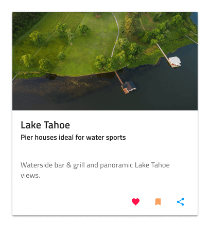
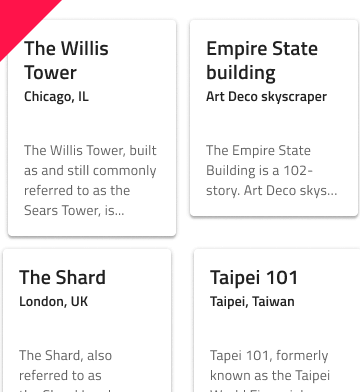

# Card

Card コンポーネントを使用して、画像、マップ、その他のメディア コンテンツ、およびテキストを介して単一のオブジェクトの情報を表示し、共有、「いいね」、ブックマークなどの関連するクイック操作をトリガーできます。これは通常、より詳細な情報の概要およびエントリ ポイントとして機能します。さまざまなコンテンツとレイアウトのカードを組み合わせて、ダッシュボードを作成できます。Card は、[Ignite UI for Angular Card コンポーネント](https://jp.infragistics.com/products/ignite-ui-angular/angular/components/card.html)と視覚的に同じものです。

## Card のデモ

## 領域

Card には 4 つの異なる領域があります: 画像またはマップ メディアを表示する上部の `image`、サムネイル Avatar、Title、Subtitle の組み合わせを保持する `header`、テキスト段落と Card の詳細を示す画像配列を保持する `content`、および Card に関連するクイック操作を備えたツールバーとして機能する `actions` です。

|         |                                                                                                |
| ------- | ---------------------------------------------------------------------------------------------- |
| image   |  |
| header  |  |
| content |  |
| actions |  |

## 画像

画像の領域は、9 つのバリアントのコレクションをサポートします - 世界の人口密集領域用の 6 つの大陸地図、1 つの World Map、1 つの Navigation Map、および Image です。

## ヘッダー

Card ヘッダーは、Avatar Thumbnail、Title、および Subtitle 要素を含むさまざまなレイアウトをサポートします。Figma では、自動レイアウトは、サイド パネルから選択された `header` 要素のプロパティに基づいてカード レイアウトを調整します。Sketch では、非表示にする要素を ~No Symbol に設定すると、スマート レイアウト ルールによってレイアウトが調整されます。Adobe XD では、Stack を使用することで、不要なレイヤーを削除するときに同じ結果を実現できます。

## コンテンツ

コンテンツは、短い説明テキストの Paragraph (段落) と、Contacts (連絡先) などのショートカットの Array をサポートしています。

## 操作

Card 操作には、6 つの異なるレイアウトがあります: 2 つの Flat Button と 3 つの Icon を備えた **Button + Icon Actions**、その逆に配置された逆 **Icon + Button Actions**、それらの Justified バリアントおよび Justified Button Actions と Justified Icon Actions のみを備えたバリアントです。6 つのそれぞれは、Figma で自動レイアウトのバリアントとして定義されており、右側のサイドバーの [Design] タブからタイプを選択できます。Sketch では、Actions はスマート レイアウトの オーバーライドとして定義されており、要素を ~No Symbol に設定して要素を削除し、残りを自動的に目的のレイアウトに調整できます。Adobe XD でも同様の機能が利用でき、Stack を使用することでレイアウトが自動的に調整されるため、不要なレイヤーを削除することもできます。

## Card レイアウト

Figma の自動レイアウト、Sketch のスマート レイアウトおよび Adobe XD の Stack を使用することにより、Card は特定の領域または要素を除外してさまざまなレイアウトを作成し、最初は同じコンポーネントに基づいてさまざまな異なるカードをサポートできます。

## スタイル設定

Card には、画像、ヘッダー、コンテンツ、およびテキスト スタイル、アイコン タイプ、色などの操作領域のオプションやボタン色および Card の背景色の選択などスタイル設定に柔軟性があります。

## 使用方法

Card は通常、概要 UI および詳細情報のエントリ ポイントとして機能します。情報が多すぎて目詰まりしないようにします。ダッシュボードを作成するときは、カードを常にサイズ変更しながら配置し、カード間の水平と垂直のギャップを均等にしてレイアウト グリッドを形成します。

| 良い例                                                                         | 悪い例                                                                          |
| -------------------------------------------------------------------------- | ------------------------------------------------------------------------------ |
|  |  |
|  |  |

## その他のリソース

関連トピック:

- [Avatar](avatar.md)
- [Button](button.md)
- [Icon](icon.md)
  

コミュニティに参加して新しいアイデアをご提案ください。
