---
title: Cards - デザイン システム コンポーネント
_description: Card コンポーネント シンボルは、シングル オブジェクトを説明するための関連操作で拡張した画像とテキストを含みます。
_keywords: デザイン システム, Sketch, Ignite UI for Angular, コンポーネント, UI ライブラリ, ウィジェット
_language: ja
---

## Cards

Card コンポーネントシンボルは、画像とテキストで単一オブジェクトの情報を表示し、共有、リンク、ブックマークなどの関連するクイック操作をトリガーできます。Card は通常概要を提供し、詳細情報のエントリ ポイントとして、ダッシュボード、テキスト、画像、アイコン、ボタンなどを表示します。 Card は、[Ignite UI for Angular Card コンポーネント](https://jp.infragistics.com/products/ignite-ui-angular/angular/components/card.html)と視覚的に同じものです。

### Card デモ

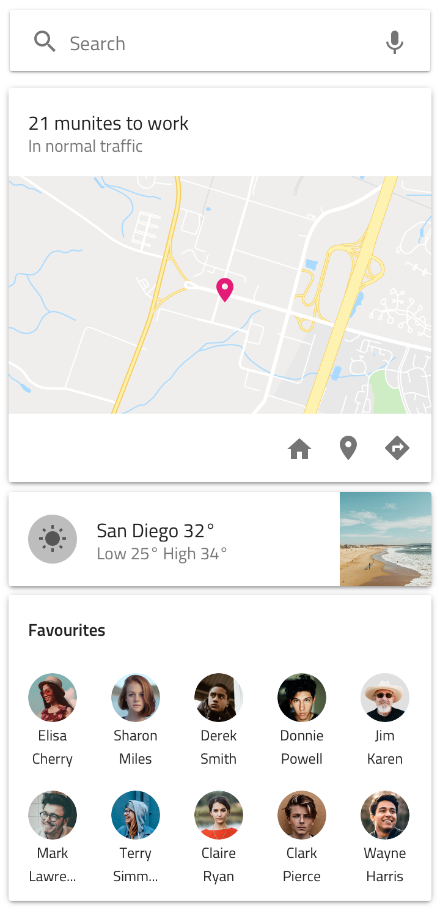

### 領域

Card には 3 つの領域 (`header` - タイトルとサブタイトルの組み合わせ、`content` - Card の画像と段落、`actions` - Card に関連するクイック操作のあるツールバー) があります。

|           |                                                                                                |
| --------- | ---------------------------------------------------------------------------------------------- |
| `header`  |              |
| `content` |  |
| `actions` |  |

### ヘッダー

Card ヘッダーは、3 種類のレイアウト (**Large Title** - 大きいタイトルとサブタイトル、Small Title - スモール タイトルとサブタイトル、Small Title - スモール タイトルのみ (サブタイトルなし) をサポートします。

### コンテンツ

Card コンテンツは、5 種類のレイアウト (連絡先のようなショートカットの**配列**、タイトルあり/なしの画像、地理的な位置を表すマップ、短い説明のテキストの段落) をサポートします。

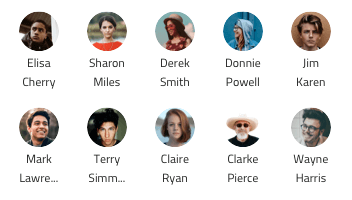

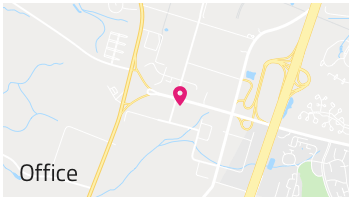

### 操作

Card 操作は 3 種類のレイアウトをサポートします。Flat ボタン数個のみのある**ボタン操作**、アイコン操作 (アイコン 3 つ迄)、アイコンとボタン操作の 2 つの組み合わせ。

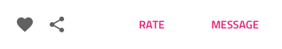

### タイプ

Card で以下のレイアウトのうちの 1 つを利用できます。

|                   |                                                                                                |
| ----------------- | ---------------------------------------------------------------------------------------------- |
| Point of Interest | 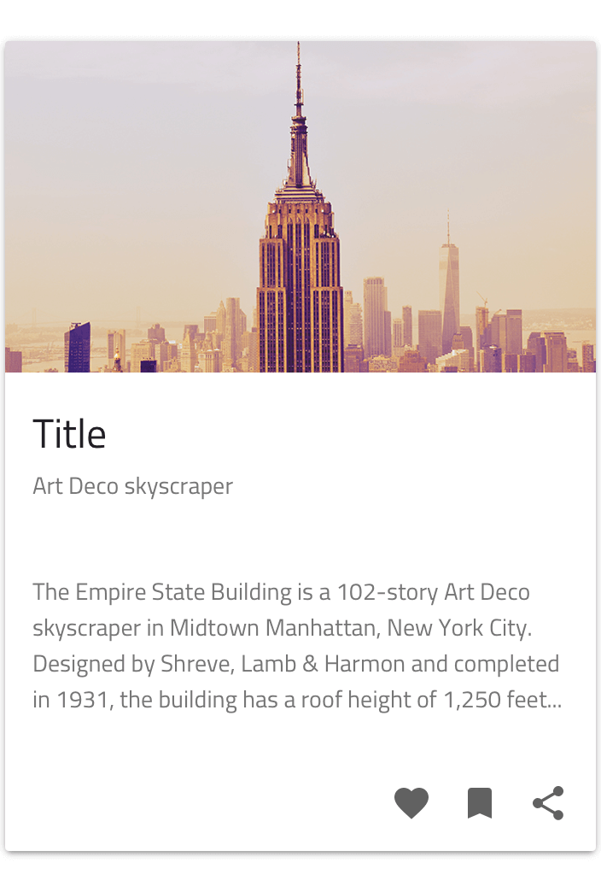                     |
| Audio Video Card  | 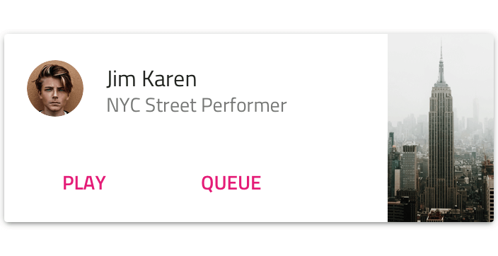                       |
| Normal Pin        | 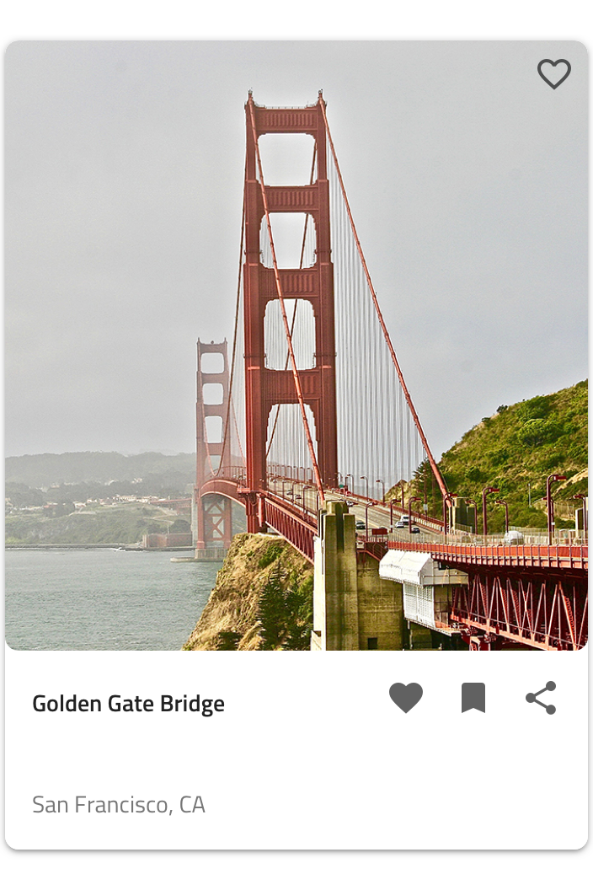       |
| Condensed Pin     | 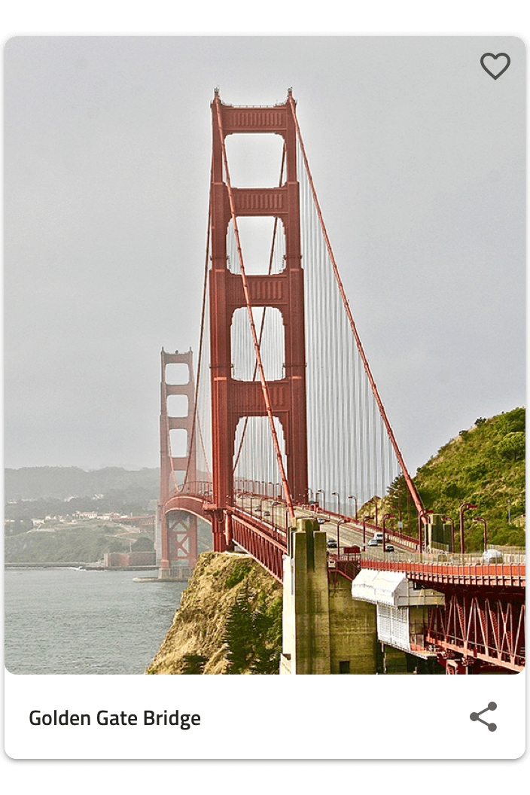 |
| Shortcuts         | 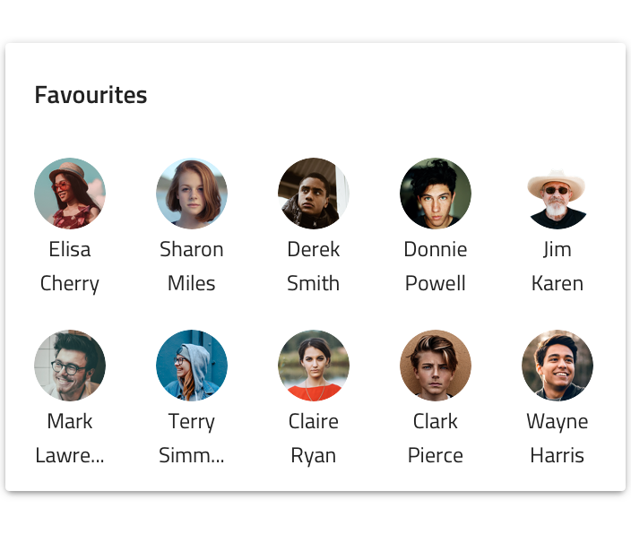         |
| Simple Card       | 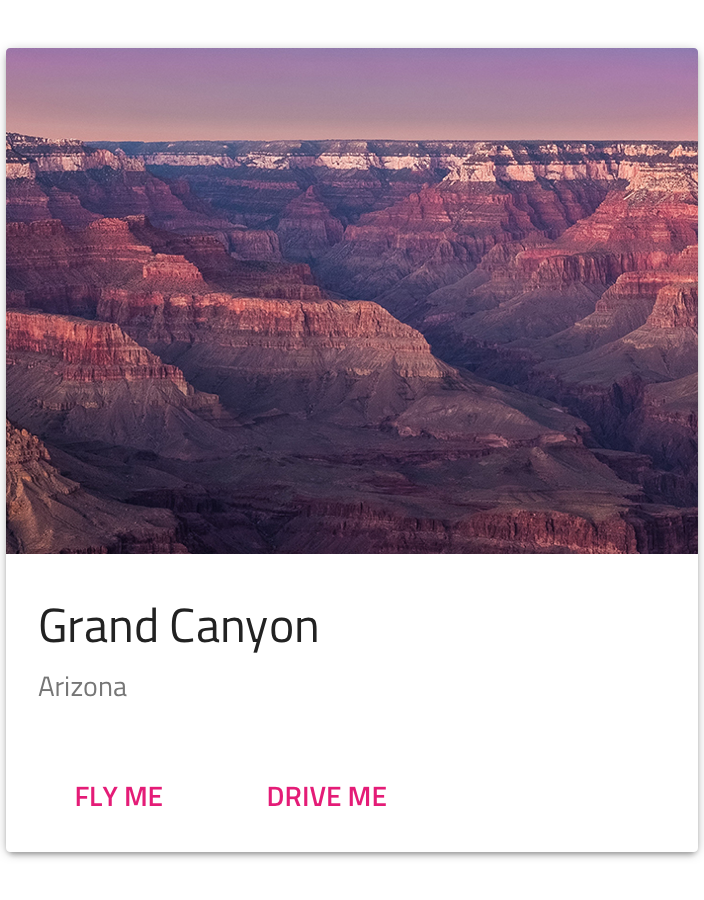               |
| Small Card        | 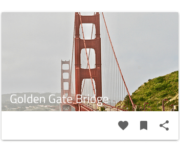                 |
| Square Card       | 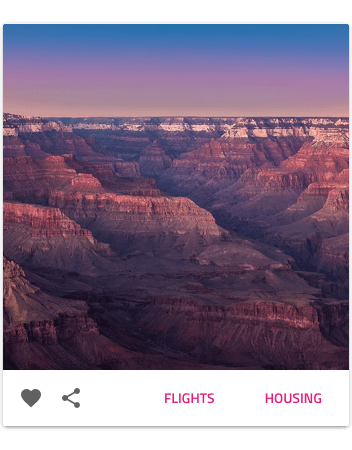               |
| Text Card         | 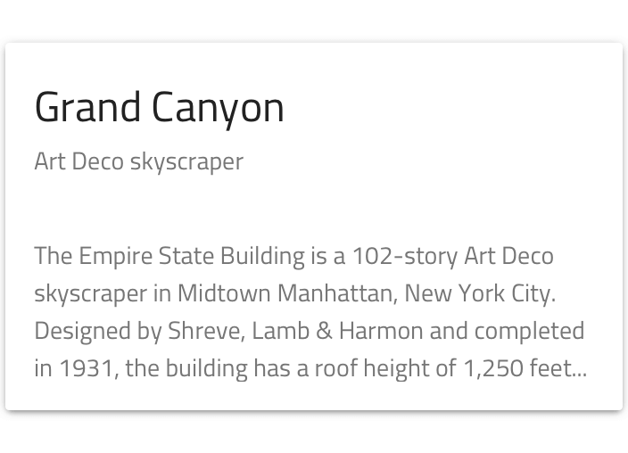                   |
| Timeline Card     | 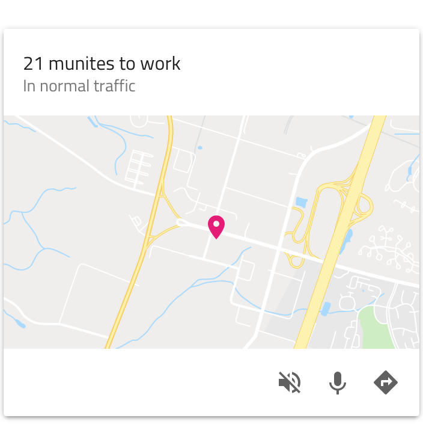           |

デザインに合わない場合は、[カスタム カード](cards-custom.md)を作成できます。

### スタイル設定

Card は、さまざまなオーバーライドでヘッダー、コンテンツ、テキスト、アイコン、ボタンの色などの操作領域の制御やカードの背景色の選択などスタイル設定に柔軟性があります。

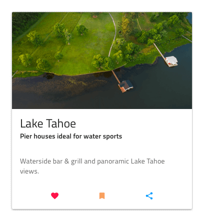

## 使用方法

Card はより詳細な情報についての概要やエントリ ポイントとなるため、情報をあまり入れすぎないようにします。カード ダッシュボードの作成時にカードを常にサイズ変更しながら配置し、カード間の水平と垂直のギャップを均等にしてレイアウト グリッドを形成します。

| 良い例                                                                     | 悪い例                                                                         |
| -------------------------------------------------------------------------- | ------------------------------------------------------------------------------ |
| 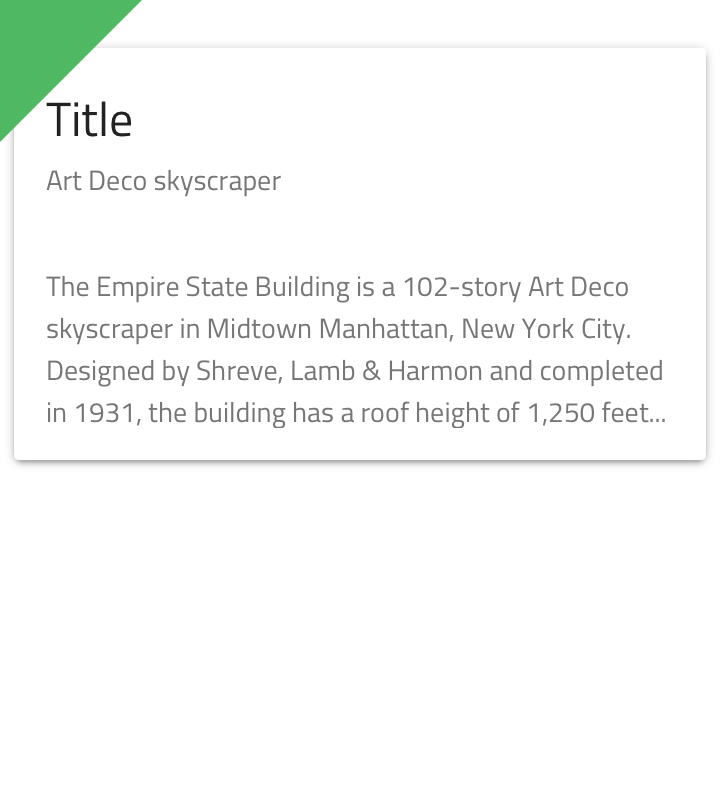 | 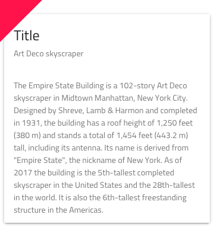 |
| 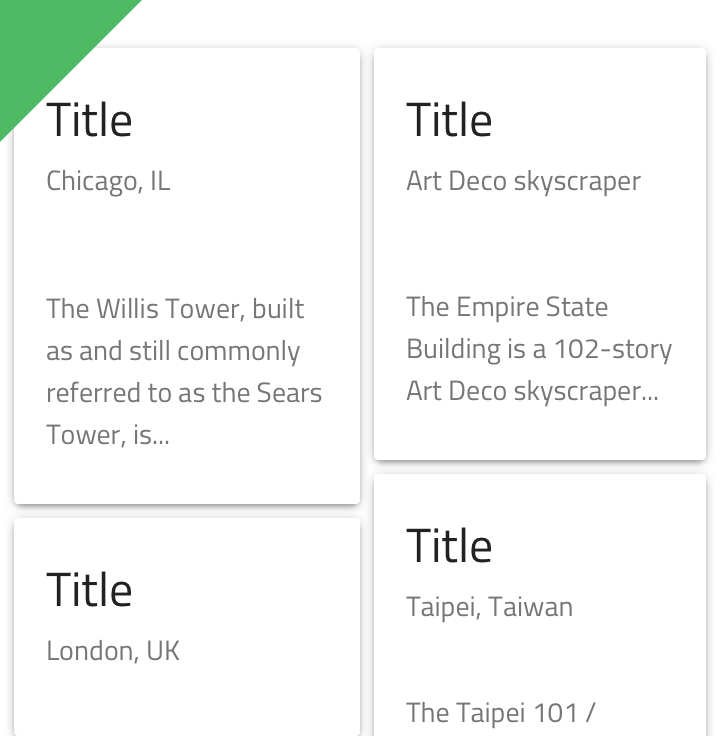 | 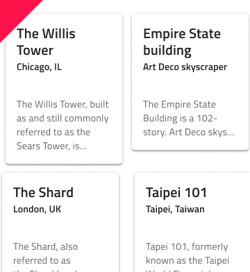 |

## その他のリソース

関連トピック:

- [Avatar](avatar.md)
- [Button](button.md)
- [Icon](icon.md)
- [Card Collection Pattern](../patterns/card-collection.md)
  

コミュニティに参加して新しいアイデアをご提案ください。

