# Category Chart (カテゴリ チャート)

Category Chart コンポーネント は、密度をラップして複雑なデータをシンプルに表示します。Category Charts は、関連データ セットできれいなダッシュボードを作成するために組み合わせて使用します。Category Chart は、[Ignite UI for Angular Category Chart コンポーネント](https://jp.infragistics.com/products/ignite-ui-angular/angular/components/category-chart.html)と視覚的に同じものです。

## Category Chart デモ

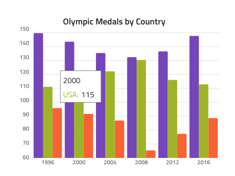

## ツールチップ

Category Chart は、ツールチップ表示のオーバーライドが可能です。ツールチップ非表示にする **Tooltip Off**、シリーズの一番上に表示する Tooltip On。

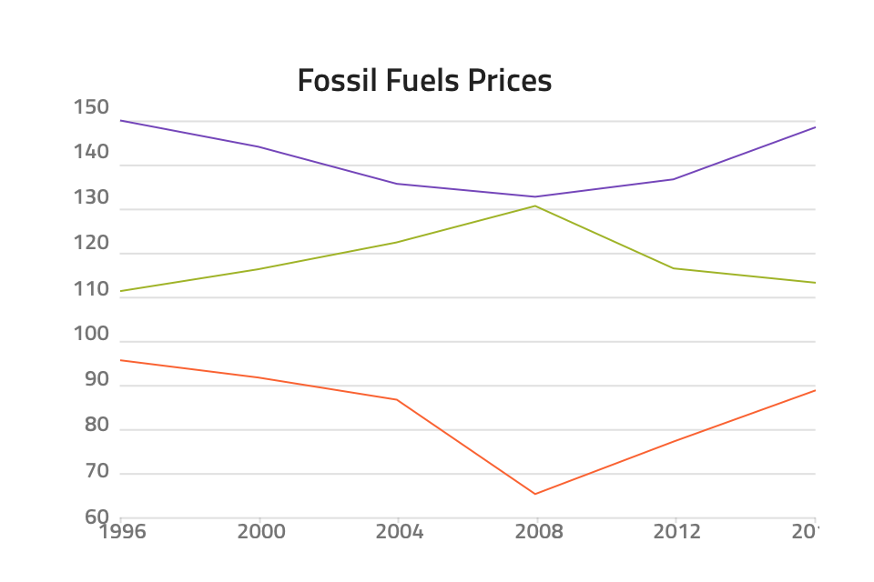
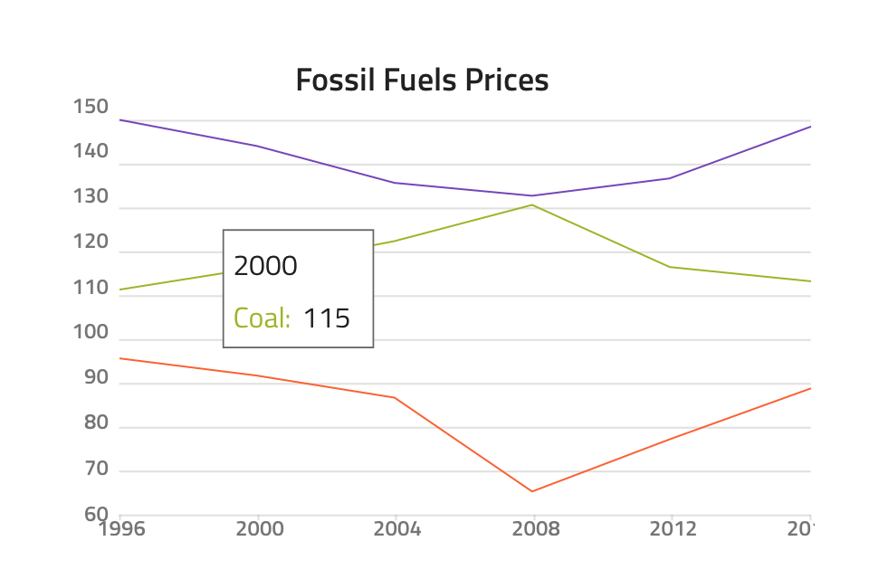

## タイプ

Category Chart は以下のようなさまざまなオーバーライドで Chart タイプを選択できる柔軟性があります。

|             |                                                                                                                |
| ----------- | -------------------------------------------------------------------------------------------------------------- |
| エリア        |               |
| 列      |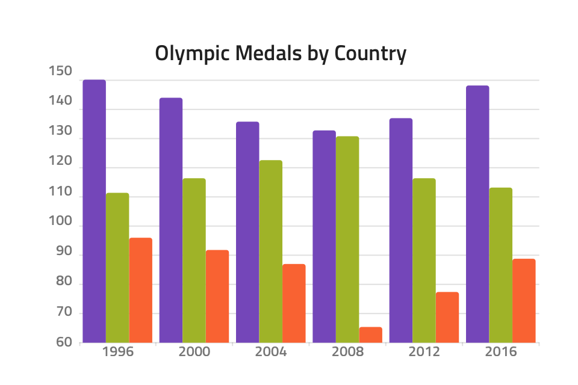           |
| 折れ線        |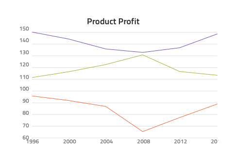               |
| ポイント       |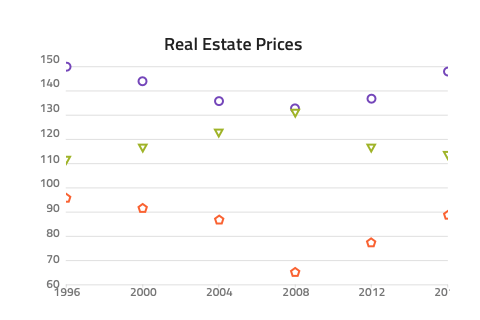             |
| スプライン      |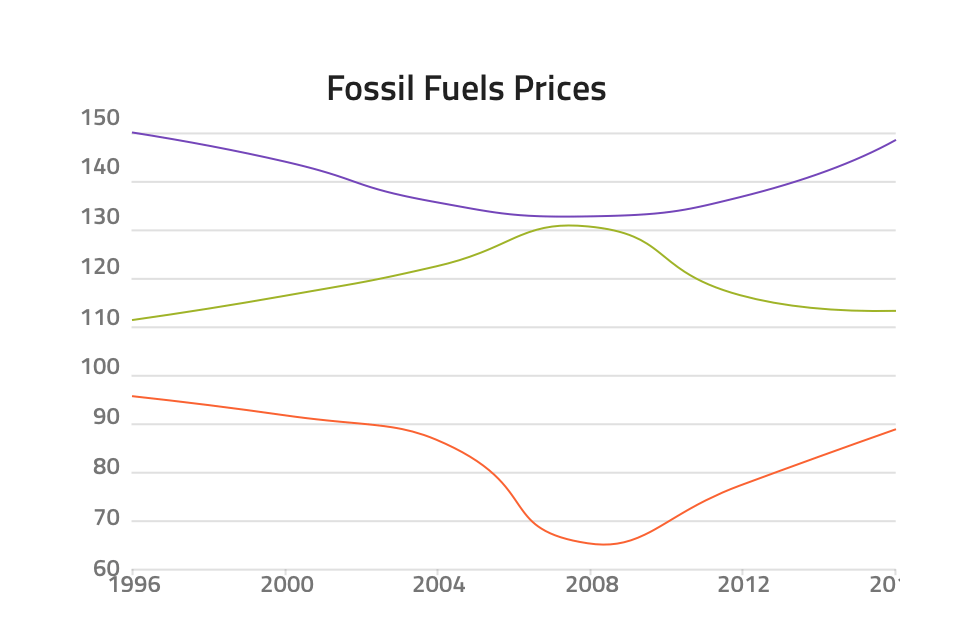           |
| スプライン エリア チャート|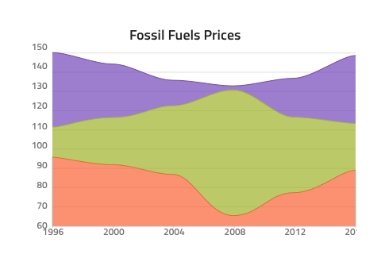 |
| ステップ エリア   |     |
| ステップ折れ線   |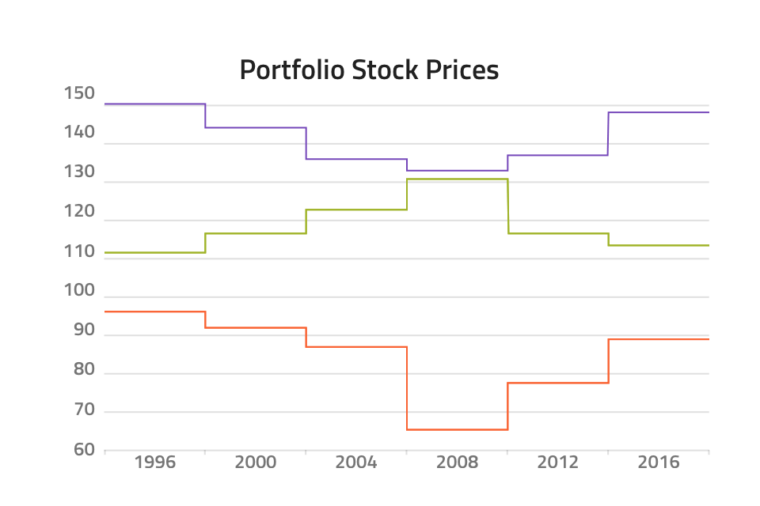     |
| ウォーターフォール   |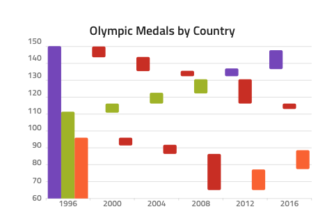     |

## シリーズ量

このオーバーライドは、描画するシリーズを 1 つ ～ **3** つ選択します。

## 使用方法

同じチャートで異なるシリーズ タイプを組み合わせる必要がある場合でも複数の Category Charts を互いに積み重ねないようにしてください。データ可視化の簡素化したステンシルのように Category Chart コンポーネント を使用します。

| 良い例                                                                                             |悪い例                                                                                              |
| ---------------------------------------------------------------------------------------------- | -------------------------------------------------------------------------------------------------- |
| 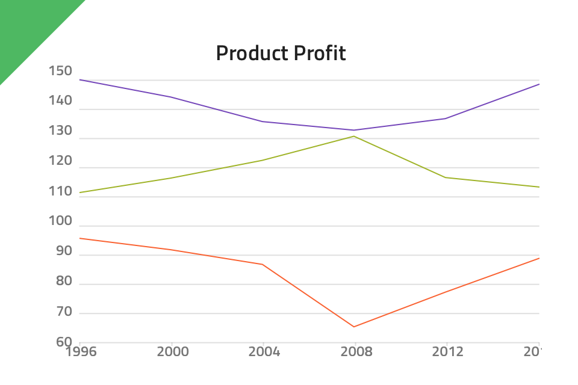|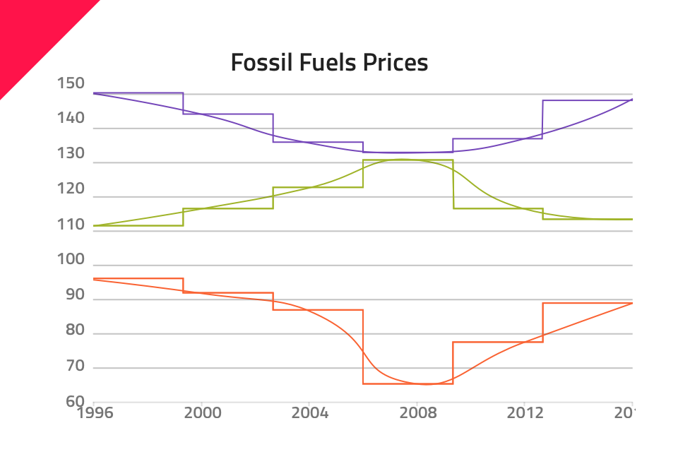 |

## コードの生成

このセクションは、オーバーライドとコード生成にどのような影響があるかについて説明します。

> [!WARNING]
> デザインの Category Chart のインスタンスで `Detach from Symbol` をトリガーすると、ほとんどの場合で Category Chart のためのコード生成機能が失われる結果となります。

### データ ソース プロパティ

`DataSource` 値はチャートの dataSource プロパティへの[バインディング](../codegen/data-binding.md)を設定するために使用されます。`DataSource` およびデータ ソースで有効なデータがない場合、Category Chart をランタイムに描画できません。

### チャート ディメンション

Category Chart は Sketch 内で取得した固定ディメンションで生成します。ディメンションは HTMl 内にフィットするように変更できます。幅と高さの有効な値は、ピクセル値とパーセント値です。例:

width=”300px” or width=”100%”

### チャート タイプ

チャートで指定したシリーズ タイプを使用するよう構成されます。Type が None の場合、チャートは描画しません。

### チャートのタイトル

Title プロパティには、テキスト、[テキストのバインディング](../codegen/data-binding.md)、またはその両方を含むことができます。例:

- 設定
- {settingsLabel}
- 重要な {labelText}

Title はオプションです。

## その他のリソース

関連トピック:

- [データ バインディング](../codegen/data-binding.md)
  

コミュニティに参加して新しいアイデアをご提案ください。

