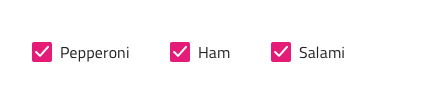
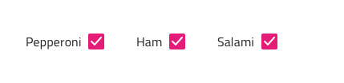
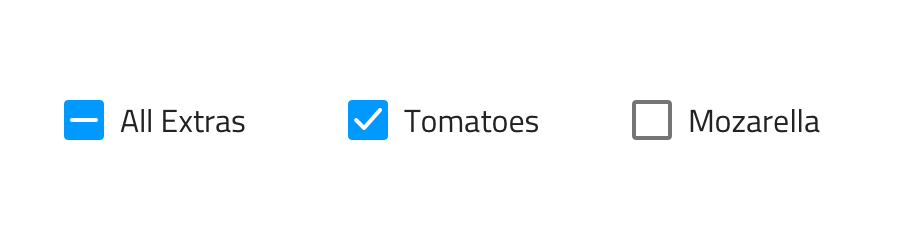

---
title: Checkbox - デザイン システム コンポーネント
_description: Checkbox コンポーネント シンボルは、ユーザーが選択にマークできる機能を提供します。
_keywords: デザイン システム, デザイン システム UX, UI キット, Sketch, Ignite UI for Angular, Sketch to Angular, Angular, Angular デザイン システム, Sketch からコードをエクスポート, Angular 用のデザイン キット, Sketch HTML, Sketch to HTML, Sketch UI キット, Figma, Figma to Angular, Figma からコードをエクスポート, Figma HTML, Figma to HTML, Figma UI キット
_language: ja
---

# Checkbox (チェックボックス)

Checkbox コンポーネント シンボルは、設定の変更やフォームでの同意などに最もよく利用されます。Checkbox は、[Ignite UI for Angular Checkbox コンポーネント](https://jp.infragistics.com/products/ignite-ui-angular/angular/components/checkbox.html)と視覚的に同じものです。

## Checkbox のデモ

## 操作状態

Checkbox は、有効または無効の状態で挿入できます。Sketch および Adobe XD では、コンポーネントを挿入する前に状態を選択する必要があります。ただし、Figma では、Enabled & Invalid (有効および無効)、Enabled & Hover (有効およびホバー)、Enabled Hover & Invalid (有効なホバーおよび無効)、Enabled & Focused (有効およびフォーカス)、および Enabled Focused & Invalid (有効なフォーカスおよび無効) などの状態が追加され、プロパティ パネルで切り替えることができます。

## レイアウト テンプレート

Sketch で Checkbox は、Checkbox 要素の前後に Checkbox ラベルが配置されるラベル位置のバリアントをサポートします。Figma では、「Label Position」プロパティを使用して、ラベルの位置を変更できます。Adobe XD では、Stacks を使用して、チェックボックスのビジュアルの左または右にドラッグするだけで、デザイン時にラベルとチェックボックスの位置を変更できるようにしています。

## 状態

Checkbox は、**オン**/オフと不確定状態があります。Figma ではプロパティ パネルの「State」プロパティで選択状態を切り替えることができます。Sketch ではこれを `Symbol Overrides` で実現していますが、Adobe XD では `Component States` パラダイムを使用して簡単に状態を切り替えることができます。

## スタイル設定

Checkbox には、チェックと塗りつぶしの色のさまざまなオプション、およびラベルの位置と色を設定するメカニズムによるスタイルの柔軟性があります。

## 使用方法

多くの Checkboxes を列グループに配置する必要がある場合にリストをすばやく簡単にスキャンできます。チェックボックスは単一行に隣接して配置できますが、複数列に配置しないようにします。

| 良い例                                                                             | 悪い例                                                                                 |
| ---------------------------------------------------------------------------------- | -------------------------------------------------------------------------------------- |
|  |  |

## その他のリソース

関連トピック:

- [Form パターン](../patterns/form.md)
  

コミュニティに参加して新しいアイデアをご提案ください。
