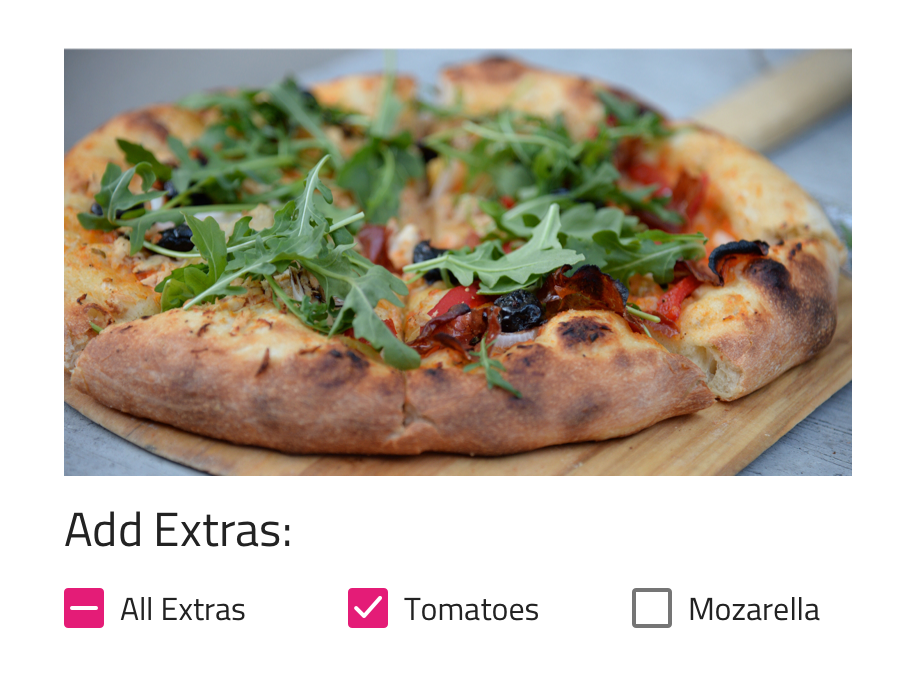
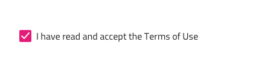
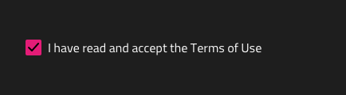
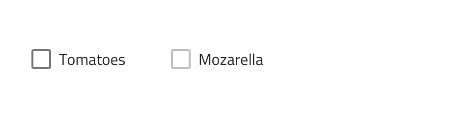
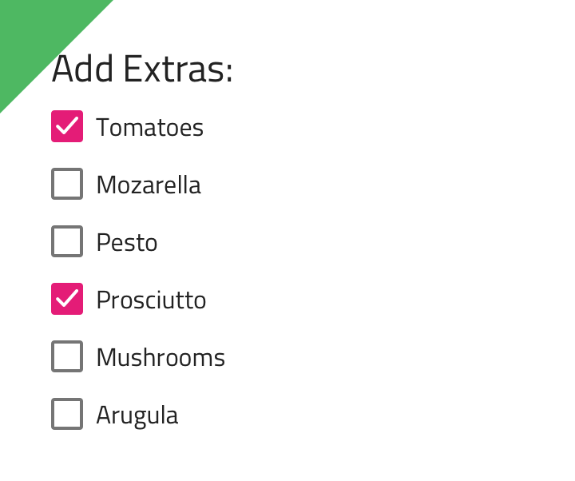
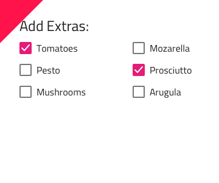

---
title: Checkbox - デザイン システム コンポーネント
_description: Checkbox コンポーネント シンボルは、ユーザーが選択にマークできる機能を提供します。
_keywords: デザイン システム, Sketch, Ignite UI for Angular, コンポーネント, UI ライブラリ, ウィジェット
_language: ja
---

## Checkbox

Checkbox コンポーネント シンボルは、設定の変更やフォームでの同意などに最もよく利用されます。Checkbox は、[Ignite UI for Angular Checkbox コンポーネント](https://jp.infragistics.com/products/ignite-ui-angular/angular/components/checkbox.html)と視覚的に同じものです。

### Checkbox デモ



### テーマ

Checkbox は、明暗バリアントで分かりやすく、背景に明暗のコントラストを付けてスタイル設定できます。




### 状態

Checkbox は、**オン**/オフと不確定状態があり、追加のバリアントとしてインタラクション無効の状態があります。




### スタイル設定

Checkbox は、さまざまなオーバーライドでチェック、色の塗りつぶし、ラベル テキストの色を制御することにより柔軟にスタイル設定できます。


## 使用方法

多くの Checkboxes を列グループに配置する必要がある場合にリストをすばやく簡単にスキャンできます。チェックボックスは単一行に隣接して配置できますが、複数列に配置しないようにします。

| いい例                                                                             | 悪い例                                                                                 |
| ---------------------------------------------------------------------------------- | -------------------------------------------------------------------------------------- |
|  |  |

## コードの生成

Checkbox のチェック マーク、チェック ボックス色、またはチェック状態を指定した場合、Checkbox HTML 要素は div でラップされます。ブラウザーによってネスト コンポーネント (他のコンポーネント内のコンポーネント) のスタイル設定が要求されます。また、State が off に設定されるか、無効される場合、コントロールは描画されません。

> [!WARNING]
> デザインの　 Checkbox のインスタンスで`シンボルからデタッチ`をトリガーすると、ほとんどの場合で Checkbox のためのコード生成機能が失われる結果となります。

### データ バインディング

データ バインディングは波括弧構文によって指定されます。例: {isAdmin}。テキスト フィールド (`🕹️DataProperty` および `🕹DataSource` 以外) も文字列補間構文をサポートします。例: 管理者: {isAdmin}。データ バインディングはネストまたはネストなしが可能です。ターゲット プロパティがネストされたプロパティの場合、ネストされたプロパティ チェーンを含みますがモデル オブジェクト名は含みません。実例:

#### ネストなし

```typescript
Customer {
  imageName: String;
}
```

DataProperty: `{imageName}`

#### ネストあり

```typescript
Profile {
  imageName: String;
}

Customer {
  profile: Profile;
}
```

DataProperty: `{profile.imageName}`

### リアクティブ フォーム

モデル オブジェクト名および `🕹️DataProperty` が提供される場合、Reactive Forms フォームを作成するためにフォーム ビルダー コードで TypeScript ngOnInit メソッドが生成されます。`🕹️DataProperty` はチェックボックス コントロールの formControlName プロパティを設定します。

### DataProperty

`🕹️DataProperty` 値は Angular Reactive Forms を使用してチェックボックスの checked プロパティへの 2-way データ バインディングを設定するために使用されます。`🕹️DataProperty` はオプションです。 `🕹️DataProperty` は、生成要求で提供されるモデル オブジェクト名で指定されたデータ オブジェクトのプロパティ名です。

### テーマ

Theme はチェックボックスが使用するテーマを指定します。Dark および Light テーマがあります。Theme が None の場合、コントロールは描画しません。

### 状態

State は、デザインで別の状態にあるチックボックスを表します。State が On ではない場合、チェックボックスは描画しません。Sketch 描画からチェックボックスのプロパティを確認して設定するために On に設定した State が必要です。

### テキスト

Text プロパティにテキスト、バインディング、または両方を含むことができます。例:

- 設定
- {settingsLabel}
- 重要な {labelText}

## その他のリソース

関連トピック:

- [Form Pattern](../patterns/form.md)
  <div class="divider--half"></div>

コミュニティに参加して新しいアイデアをご提案ください。

- [Indigo Design **GitHub** (英語)](https://github.com/IgniteUI/design-system-docfx)
