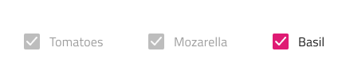

# Checkbox (チェックボックス)

Checkbox コンポーネント シンボルは、設定の変更やフォームでの同意などに最もよく利用されます。Checkbox は、[Ignite UI for Angular Checkbox コンポーネント](https://jp.infragistics.com/products/ignite-ui-angular/angular/components/checkbox.html)と視覚的に同じものです。

## Checkbox デモ

## 操作状態

The checkbox can be inserted in an enabled or disabled state.

## テーマ

Checkbox は、**暗い**と明るいバリエーションで分かりやすく、背景に明暗のコントラストを付けてスタイル設定できます。

## レイアウト テンプレート

The checkbox supports a label position where the Checkbox label is placed after or before the Checkbox box element.

## 状態

Checkbox は、**オン**/オフと不確定状態があります。

## スタイル設定

Checkbox は、さまざまなオーバーライドでチェック、色の塗りつぶし、ラベル位置およびラベル色を制御することにより柔軟にスタイル設定できます。

## 使用方法

多くの Checkboxes を列グループに配置する必要がある場合にリストをすばやく簡単にスキャンできます。チェックボックスは単一行に隣接して配置できますが、複数列に配置しないようにします。

| 良い例                                                                             | 悪い例                                                                                 |
| ---------------------------------------------------------------------------------- | -------------------------------------------------------------------------------------- |
|  |  |

## その他のリソース

関連トピック:

- [Form パターン](../patterns/form.md)
  

コミュニティに参加して新しいアイデアをご提案ください。
