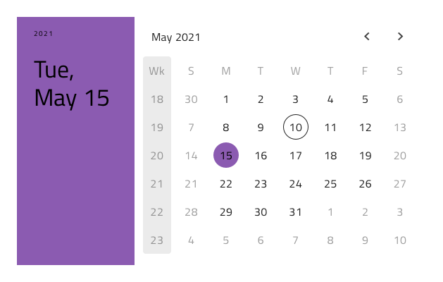

## Checkbox

Checkbox コンポーネント シンボルは、設定の変更やフォームでの同意などに最もよく利用されます。Checkbox は、[Ignite UI for Angular Checkbox コンポーネント](https://jp.infragistics.com/products/ignite-ui-angular/angular/components/checkbox.html)と視覚的に同じものです。

### Checkbox デモ


### テーマ

Checkbox は、明暗バリアントで分かりやすく、背景に明暗のコントラストを付けてスタイル設定できます。


### 状態

Checkbox は、**オン**/オフと不確定状態があり、追加のバリアントとしてインタラクション無効の状態があります。


### スタイル設定

Checkbox は、さまざまなオーバーライドでチェック、色の塗りつぶし、ラベル テキストの色を制御することにより柔軟にスタイル設定できます。



## 使用方法

多くの Checkboxes を列グループに配置する必要がある場合にリストをすばやく簡単にスキャンできます。チェックボックスは単一行に隣接して配置できますが、複数列に配置しないようにします。

| いい例                             | 悪い例                             |
| ------------------------------- | --------------------------------- |
|  |  |

## コードの生成

Checkbox の色またはチェック状態を指定した場合、Checkbox HTML 要素は div でラップされます。ブラウザーによってネスト コンポーネント (他のコンポーネント内のコンポーネント) のスタイル設定が要求されます。

> [!WARNING]
> デザインの　Checkbox のインスタンスで`シンボルからデタッチ`をトリガーすると、ほとんどの場合で Checkbox のためのコード生成機能が失われる結果となります。

### データ プロパティ バインディング

提供された場合、`🕹️DataProperty` バインドはネストあり/なしが可能です。プロパティがネストされたプロパティの場合、ネストされたプロパティ チェーンを含みますがモデル オブジェクト名は含みません。例:

#### 例: ネストなし

```PseudoCode
Customer {
Public checkState: boolean;
}

Sketch の DataProperty: {checkState}
```

### Event プロパティ

`🕹️Event` プロパティはコンポーネント TypeScript のメソッドを作成するために使用されて HTML に Angular クリック シグネチャーを追加します。Sketch の EventProperty: clickValue

## その他のリソース

関連トピック:

- [Form Pattern](forms.md)
  <div class="divider--half"></div>

コミュニティに参加して新しいアイデアをご提案ください。

- [Indigo Design **GitHub** (英語)](https://github.com/IgniteUI/design-system-docfx)
