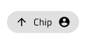

# Chip (チップ)

Chip コンポーネントは、タグや連絡先 (メール受信者など) を楕円にコンパクト表示します。チップ は、[Ignite UI for Angular Chip コンポーネント](https://jp.infragistics.com/products/ignite-ui-angular/angular/components/chip.html)と視覚的には同じです。

## Chip デモ

## Chip 密度

Chip は 3 つの密度バリアントがサポートされます。

- Comfortable - インタラクティブ シナリオに適しています。e.g. アクション トリガー
- Cosy - 電子メール作成ツールの受信者フィールドなど短い領域に適しています。
- Compact - グリッド セルの値などデータが密集したシナリオに最適です。

## チップの状態

When the user interacts with the Chip, it may change from the default **idle** state to focus and vice versa. This affords a more dynamic interaction design that can seamlessly flow into high-fidelity prototyping.

`idle`

`focus`

## Chip Selection

When a chip is selected a special check icon will appear at the far left to indicate this. The `🔣 Selection Icon` override provides the means to trigger this functionality.

## Remove Chip

When a chip can be removed a special cancel icon will appear at the far right to indicate this. The `🔣 Remove Icon` override provides the means to trigger this functionality.

`idle and removable`

## Chip コンテンツ

The Chip has rich support for content templating via the prefix and suffix containers allowing to insert icons and text before and after the chip main text content.

`Text`

`Prefix`

`Prefix+Suffix`

`Suffix`

## Chip のスタイル設定

Chip は、さまざまなオーバーライドで境界線と背景色、テキスト、Prefix、Suffix、選択、削除したアイコン色を制御することにより柔軟にスタイル設定できます。

## Chips Area

Chips Area コンポーネントを使用して Chips のコレクションを体系化します。Chips Area は Ignite UI for Angular で使用されるコンテナ領域と同一でヘルプの [Ignite UI for Angular Chip コンポーネント](https://jp.infragistics.com/products/ignite-ui-angular/angular/components/chip.html) トピックで説明します。

### Chips Area デモ

### Chips Area タイプ

The Chips Area is available in two distinct types: Chips, where the Chip collection is not related, and Connected Chips, where Chips appear in a predefined sequence.

### Chips Area のスタイル設定

Chips Area は Chips の継承スタイルがサポートされますが、コネクター アイコンの色とグリフも変更できます。

## 使用方法

When using a Chip, the obround will automatically size itself to fit the content and you only need to adjust the size of the instance accordingly. If the Chip is used as an action trigger for related content avoid using it in scenarios where there is only one available action, or for configurations presenting only one selectable option.

| 良い例                                                                         |悪い例                                                                          |
| -------------------------------------------------------------------------- | ------------------------------------------------------------------------------ |
|  |  |
|  |  |

Chips Area を使用する場合は、上記の各 Chip コンポーネントの提案に従ってください。また、接続した Chips Area を使用する場合、各チップはアクションとして設定せずに、関連するエンティティ (人の順序付きリストなど) にする必要があります。

| 良い例                                                                                     |悪い例                                                                                      |
| -------------------------------------------------------------------------------------- | ------------------------------------------------------------------------------------------ |
|  |  |

## その他のリソース

関連トピック:

- [Grid](grid.md)
  

コミュニティに参加して新しいアイデアをご提案ください。
