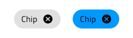
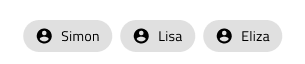

# Chip (チップ)

Chip コンポーネントは、タグや連絡先 (メール受信者など) を楕円にコンパクト表示します。チップ は、[Ignite UI for Angular Chip コンポーネント](https://jp.infragistics.com/products/ignite-ui-angular/angular/components/chip.html)と視覚的には同じです。

## Chip のデモ

## Chip サイズ

Chip は 3 つのサイズ バリアントがサポートされます。

- Large - インタラクティブ シナリオに適しています。e.g. アクション トリガー
- Medium - 電子メール作成ツールの受信者フィールドなど短い領域に適しています。
- Small - グリッド セルの値などデータが密集したシナリオに最適です。

## Chip タイプ

チップには 2 つのタイプのバリエーションがあります: Default と Primary です。

## 操作状態

Chip は、Enabled (有効) または Disabled (無効) の状態で挿入できます。Figma では、プロパティ パネルから Disabled ブール演算を使用して状態を変更できます。Sketch では、コンポーネントを挿入する前に状態を選択する必要があります。Adobe XD では Component States パラダイムを使用して簡単に状態を切り替えることができます。

## 状態

ユーザーが Chip を操作すると、デフォルトの **Idle (アイドル)** 状態から Hover (ホバー)、Focused (フォーカス済み)、または Selected (選択済み) に変化します。これには、Hi-Fi プロトタイプへシームレスにフローする動的なインタラクション デザインの作成が可能です。
Figma では、これらはプロパティ パネルの State プロパティから選択できます。Sketch ではこれを `Symbol Overrides` で実現していますが、Adobe XD では `Component States` パラダイムを使用して簡単に状態を切り替えることができます。

## Chip の削除

Chip を削除することが可能であると、これを示す特別なキャンセル アイコンが右端に表示されます。Figma では、Remove Icon ブール値プロパティを使用して、削除アイコンを表示/非表示にできます。Figma では、`🔣 Remove Icon` オーバーライドは、この機能をトリガーする手段を提供します。Adobe XD では、`🔣 Remove Icon` レイヤーを表示する必要があり、Chip の Stack も同様にレイアウトを調整します。Chip を削除可能にしたくない場合は、`🔣 Remove Icon` レイヤーを削除します。

## Chip コンテンツ

Chip は、prefix および suffix コンテナーを介したコンテンツ テンプレートをサポートしており、Chip のメイン ラベルの前後にアイコンとテキストを挿入できます。

Figma では、プロパティ パネルの 「Prefix Icon」 および 「Suffix Icon」 プロパティを使用して、プレフィックス アイコンとサフィックス アイコンを表示または非表示にすることができ、それに応じてレイアウトが自動的に調整されます。

Sketch では、Overrides/Input/Prefix/Container および Overrides/Input/Suffix/Container でプレフィックスおよびサフィックス コンテナーを追加するか、~No Symbol に設定して削除できます。

Adobe XD では、目的のレイヤーを表示し、不要な要素を削除する必要があります。プレフィックスまたはサフィックスを一度に削除するには、削除します。最終的に、使用されている Stack によってレイアウトが調整されます。

`Text`

`Prefix`

`Prefix+Suffix`

`Suffix`

## Chip のスタイル設定

Chip は、境界線と背景色のさまざまなオプション、およびテキストと Prefix、Suffix、選択、および適用可能な場合はアイコンの色の削除を通じて柔軟にスタイル設定できます。

## Chips Area (チップ領域)

Chips Area コンポーネントを使用して Chips のコレクションを体系化します。Chips Area は Ignite UI for Angular で使用される Chip Area と同一でヘルプの [Ignite UI for Angular Chip コンポーネント](https://jp.infragistics.com/products/ignite-ui-angular/angular/components/chip.html) トピックで説明します。

Chips Area は Chips の継承スタイルがサポートされます。

## 使用方法

Chip を使用する場合、楕円はコンテンツに合わせて自動的にサイズを変更するため、それに応じてインスタンスのサイズを調整するだけで済みます。Chip を関連コンテンツのアクション トリガーとして使用する場合、アクションが 1 つのみまたは設定で選択オプションが 1 つのみの場合は使用しないでください。

| 良い例                                                                         | 悪い例                                                                          |
| -------------------------------------------------------------------------- | ------------------------------------------------------------------------------ |
| |
|  |  |
|  |  |

## その他のリソース

関連トピック:

- [Grid](grid.md)
  

コミュニティに参加して新しいアイデアをご提案ください。
