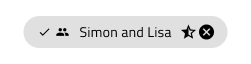

## Chip (チップ)

Chip コンポーネントは、タグや連絡先 (メール受信者など) を楕円にコンパクト表示します。チップ は、[Ignite UI for Angular Chip コンポーネント](https://jp.infragistics.com/products/ignite-ui-angular/angular/components/chip.html)と視覚的には同じです。

### Chip デモ



### Chip 密度

Chip は 3 つの密度バリアントがサポートされます。

- Comfortable - インタラクティブ シナリオに適しています。e.g. アクション トリガー
- Cosy - 電子メール作成ツールの受信者フィールドなど短い領域に適しています。
- Compact - グリッド セルの値などデータが密集したシナリオに最適です。


### チップの状態

ユーザーが Chip とインタラクションした際にさまざまな状態になります。ユーザーが選択的なアクションを実行したとき **idle**, selected になり、ユーザーがタブ インデックスをナビゲーションしているときはフォーカスされます。柔軟性が向上したことにより、Hi-Fi プロトタイプへシームレスにフローする動的なインタラクション デザインの作成が可能です。


`idle`


`idle when selected`


`focus`


`focus when selected`

Chip を削除可能にする場合はその他の状態も利用でき、 クリックまたはタップによって Chip を削除する要素の右端に特別なアイコンを追加します。


`idle and removable`


`idle and removable when selected`


`focus and removable`


`focus and removable when selected`

### Chip コンテンツ

Chip は、コンテンツ状態 (**OnlyText**, Prefix, Prefix+Suffix, Suffix) を使用して付加情報を伝えるために使用できるプレフィックスとサフィックス アイコンをサポートします。


### Chip のスタイル設定

Chip は、さまざまなオーバーライドで境界線と背景色、テキスト、Prefix、Suffix、削除したアイコン色を制御することにより柔軟にスタイル設定できます。


## Chips 領域

Chip 領域コンポーネントを使用して Chips のコレクションを体系化します。Chip 領域は Ignite UI for Angular で使用されるコンテナ領域と同一でヘルプの [Ignite UI for Angular Chip コンポーネント](https://jp.infragistics.com/products/ignite-ui-angular/angular/components/chip.html) トピックで説明します。

### Chips 領域デモ


### Chips 領域タイプ

Chips 領域は 2 つの異なるタイプがあり、Chip に関連のないコレクションを表す標準タイプ、Chips が定義済された順序で表示される接続したコレクションを表します。


### Chips 領域のスタイル設定

Chips 領域は Chips の継承スタイルがサポートされますが、コネクター アイコンの色とグリフも変更できます。


## 使用方法

Chips をサイズ調整してテキスト コンテンツがを一行に表示します。Chip が関連コンテンツのアクション トリガーとして使用する場合、アクションが 1 つのみまたは設定で選択オプションが 1 つのみの場合は使用しないでください。

| 良い例                                                                         |悪い例                                                                          |
| -------------------------------------------------------------------------- | ------------------------------------------------------------------------------ |
| | |
| | |
| | |

チップ領域を使用する場合は、上記の各 Chip コンポーネントの提案に従ってください。また、接続した チップ領域を使用する場合、各チップはアクションとして設定せずに、関連するエンティティ (人の順序付きリストなど) にする必要があります。

| 良い例                                                                                     |悪い例                                                                                      |
| -------------------------------------------------------------------------------------- | ------------------------------------------------------------------------------------------ |
| | |

## コードの生成

このセクションは、オーバーライドとコード生成にどのような影響があるかについて説明します。

> [!WARNING]
> デザインの Chip インスタンスで `Detach from Symbol` をトリガーすると、ほとんどの場合で チップ のためのコード生成機能が失われます。右側の Chips 領域はコードジェネレーションでデタッチする必要があります。

### チップの状態

このオーバーライドは Chip の状態を制御します。コード生成時に Chip テーマが生成される方法を主に制御します。Ignite UI for Angular の Chip コンポーネントに複数の状態があり、結果としてテーマにパラメーター番号が状態のテーマを制御します。このオーバーライドの値は設定される Ignite UI テーマのパラメーターを決定します。 

### Chip 選択アイコン

このオーバーライドは、Chip 選択時に使用されるアイコンを制御します。コード生成時に Ignite UI for Angular Icon コンポーネントが `ng-template` 内に生成され、このテンプレートが Chip コンポーネントの `selectIcon` プロパティに使用されます。

### Chip 削除アイコン

このオーバーライドは、この Chip の削除ボタンとして使用されるアイコンを制御します。コード生成時に Ignite UI for Angular Icon コンポーネントが `ng-template` 内に生成され、このテンプレートが Chip コンポーネントの `removeIcon` プロパティに使用されます。

### Chip Text

このオーバーライドは Chip 内で使用するテキストを制御します。[バインド](../codegen/data-binding.md)をオーバーライドに使用し、コード生成時に適切な HTML を作成してデータ バインディングをサポートします。

非バインディング:


バインディング:


### プレフィックス アイコン

このオーバーライドは Chip コンテンツの最初にアイコンを配置します。コード生成時に Ignite UI for Angular Icon コンポーネントは `igxPrefix` ディレクティブで Chip コンテンツに追加されます。Icon テーマは Sketch で指定した色でこのアイコンに色付けするために生成されます。

### サフィックス アイコン

このオーバーライドは Chip コンテンツの最後にアイコンを配置します。コード生成時に Ignite UI for Angular Icon コンポーネントは `igxSuffix` ディレクティブで Chip コンテンツに追加されます。Icon テーマは Sketch で指定した色でこのアイコンに色付けするために生成されます。

### イベント

このオーバーライドは、Chip の `onSelection` イベントに関数をフックするために使用されます。コード生成で名前がオーバーライド値であるコンポーネントの TypeScript の空関数を生成し、関数を HTML で Chip の `onSelection` イベントにフックします。以下のようになります。

Sketch:


HTML:

```html
<igx-chip (onSelection)=”mySelectEvent($event)”>
```

TypeScript:

```typescript
mySelectEvent(event): void {
}
```

### Chip 領域デタッチ シンボル

Chip 領域は正しくコード生成するためにデタッチする必要があります。デタッチ時に多数の子要素が含まれます。これらの要素は DataSource 要素とともに個々の Chip 要素になります。接続状態のチップの Chip 領域にコネクター要素が表示されます。各 Chip は上記の Chip と同じオーバライドです。コネクターのオーバーライドおよび要素は以下です。

### Chips 領域の DataSource

いくつかのデータに基づいてこの Chip 領域を生成する旨をコード生成に通知します。指定された値は、TypeScript プロパティである必要があります。配列またはタイプのリストです。コード生成時に Angular `ngFor` ディレクティブを生成し、TypeScript プロパティを繰り返して Ignite UI for Angular Chip コンポーネントを作成します。


HTML:

```html
<igx-chip-area>
    <ng-container *ngFor=”let chip of chipList; let last = last;”>
        <igx-chip></igx-chip>
    <ng-container>
</igx-chip-area
```

### Chips 領域コネクター アイコン

このオーバーライドは、Chips Area 内の Chips 間で使用するアイコン グリフを制御します。コード生成時に Ignite UI for Angular Icon コンポーネントを生成します。Icon で使用する Ignite UI for Angular Icon テーマも生成し、Sketch で指定した色が Angular でも保たれます。

## その他のリソース

関連トピック:

- [Grid](grid.md)
- [Data Binding](../codegen/data-binding.md)
  <div class="divider--half"></div>

コミュニティに参加して新しいアイデアをご提案ください。


