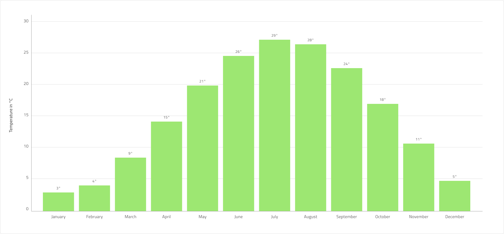

# Column Chart (縦棒チャート)

 Column Chart は、さまざまなカテゴリのデータの頻度、カウント、合計、平均を、幅が等しく高さが異なる垂直バーでエンコードされたデータとすばやく比較するために使用されるチャート タイプの 1 つです。項目の値の経時変化を示すのに理想的です。データは、チャートの下から上にデータ ポイントの値に向けて広がる矩形のコレクションよって表されます。Column Chart は、[Ignite UI for Angular Column Chart コンポーネント](https://jp.infragistics.com/products/ignite-ui-angular/angular/components/charts/types/column-chart.html)と視覚的に同じものです。

## Column Chart のデモ

Column Chart は、`Title`、デフォルトで非表示の `Legend`、および Idle 状態と Hover 状態で使用可能な `Chart Area` で構成されます。

## Title (タイトル)

Column Chart のタイトルは、必要に応じて変更または非表示にできます。Figma では、`Title` ブール値プロパティをオフに切り替えることでタイトルを非表示にすることができます。自動レイアウト機能のおかげで、チャートのレイアウトはそれに応じて自動的に調整されます。

## 状態

Column Chart には、Idle と Hover の 2 つの状態があります。Figma では、レイヤー パネルからネストされた Chart Area コンポーネントを選択し、プロパティ パネルから `Hover Tooltip` ブール値プロパティのオン/オフを切り替えることで、2 つの状態を切り替えることができます。Hover 状態では、データ ポイントの上にホバーするとツールチップが表示され、フォーカスされて他の列がグレーアウトされます。

## Y 軸

Column Chart の Y 軸は、Title、Labels、および軸自体で構成されます。Title と Labels は構成可能であり、Figma のレイヤー パネルからラベルを非表示にすることができます。色を `Transparent` に設定して軸線を非表示にし、一度にすべての要素を非表示にするには、ネストされた Y 軸コンポーネントを Figma のレイヤー パネルから非表示にします。

## Gridlines (グリッド線)

Column Chart には、データ ポイントを Y 軸の値に視覚的にトレースしやすくするための組み込みの Gridlines があります。Figma では、ネストされた Chart Area コンポーネントを選択し、プロパティ パネルからブール値プロパティ `Gridlines` のオン/オフを切り替えることで、それらを表示/非表示にすることができます。

## Data Points (テータ ポイント)

Column Chart のデータ ポイントは個々の縦棒で、Figma の自動レイアウト、Sketch のスマート レイアウトに配置され、チャート領域で簡単にデータ量を調整できます。Figma では、列の高さのフレームを選択し、プロパティ パネルから項目間の垂直方向の間隔を調整することで、列の高さを簡単に調整できます。さらに、列には X 軸の構成可能なラベルと注釈ラベルが含まれています。

## スタイル設定

Column Chart では、シリーズの色を変更できます。Series.1、series.2 などのバリアントを持つデータ可視化には、series.10 までのパレットの色のみを使用することをお勧めします。垂直軸と水平軸の色、グリッド線、チャート領域の背景色、境界線の色も変更できます。タイトル、ラベル、注釈値なども **Indigo.Design システム**の利用可能なテキスト スタイルでカスタマイズできます。

## 使用方法

一定期間の変化量を表示するには、Column Chart を使用します。数値軸を常に 0 から開始して、データを歪めないようにします。また、同じカテゴリに異なる色を使用しないようにしてください。カテゴリの変更を表すために日付や月などの時間を参照する場合、常に水平軸に設定します。Gridlines に目立たない色を使用して、目に優しい色にしましょう。より詳細な時系列ビジュアルが必要な場合は、代わりに Line Chart の使用を検討してください。

| 良い例                                                                                             | 悪い例                                                                                              |
| ---------------------------------------------------------------------------------------------- | -------------------------------------------------------------------------------------------------- |
|  |  |

## その他のリソース

関連トピック:

- [Line Chart](line-chart.md)
- [Spline Chart](spline-chart.md)
- [Step Chart](step-chart.md)
- [Pie Chart](pie-chart.md)
- [Skeleton Charts](skeleton-charts.md)
  

コミュニティに参加して新しいアイデアをご提案ください。
