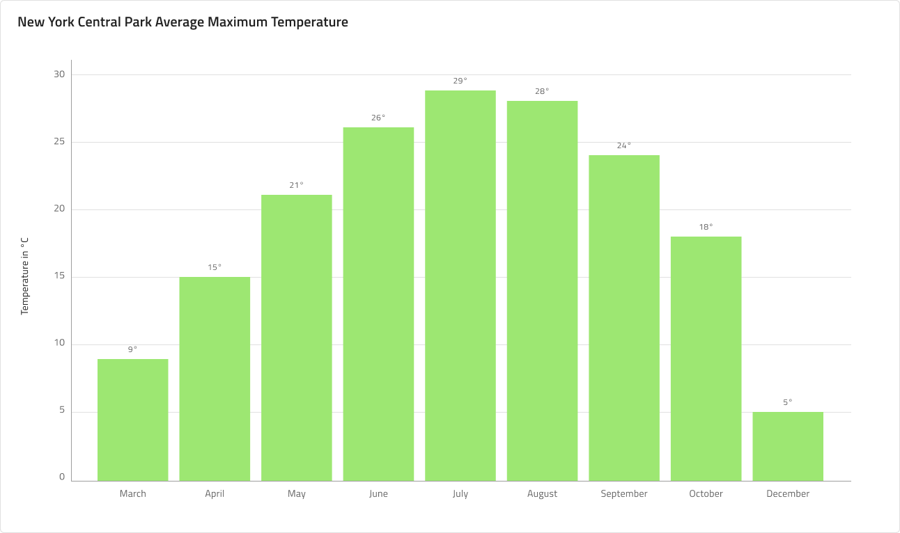

# Column Chart (縦棒チャート)

 Column Chart は、さまざまなカテゴリのデータの頻度、カウント、合計、平均を、幅が等しく高さが異なる垂直バーでエンコードされたデータとすばやく比較するために使用されるチャート タイプの 1 つです。項目の値の経時変化を示すのに理想的です。データは、チャートの下から上にデータ ポイントの値に向けて広がる矩形のコレクションよって表されます。

## Column Chart のデモ

Column Chart は、`Title`、デフォルトで非表示の `Legend`、および Idle 状態と Hover 状態で使用可能な `Chart Area` で構成されます。

## タイトル

Column Chart のタイトルは、オーバーライドを ~No Symbol に設定して変更または非表示にできます。

## 状態

Column Chart には、Idle と Hover の 2 つの状態があります。Hover 状態では、データ ポイントの上にホバーするとツールチップが表示され、フォーカスされて他の列がグレーアウトされます。

## Y 軸

Column Chart の Y 軸は、Title、Labels、および軸自体で構成されます。Title および Labels は構成可能で、ラベルを非表示にするには、オーバーライドを ~No Symbol に設定します。色を `Transparent` に設定して軸線を非表示にできます。また、すべての要素を非表示にするには、Y 軸のオーバーライドを ~No Symbol に変更します。

## Gridlines (グリッド線)

Column Chart には、データ ポイントを Y 軸の値に視覚的にトレースしやすくするための組み込みの Gridlines があります。非表示にするには、色を `Transparent` に設定します。

## Data Points (テータ ポイント)

Column Chart の Data Points は個々の列で、Sketch の Smart Layout を使用して Chart Area での量を調整できます。X 軸に構成可能なラベルと注釈ラベルがあります。

## スタイル設定

Column Chart では、シリーズの色を変更できます。Series.1、series.2 などのバリアントを持つデータ可視化には、series.10 までのパレットの色のみを使用することをお勧めします。垂直軸と水平軸の色、グリッド線、チャート領域の背景色、境界線の色も変更できます。タイトル、ラベル、注釈値なども **Indigo.Design システム**の利用可能なテキスト スタイルでカスタマイズできます。

## 使用方法

一定期間の変化量を表示するには、Column Chart を使用します。数値軸を常に 0 から開始して、データを歪めないようにします。また、同じカテゴリに異なる色を使用しないようにしてください。カテゴリの変更を表すために日付や月などの時間を参照する場合、常に水平軸に設定します。Gridlines に目立たない色を使用して、目に優しい色にしましょう。より詳細な時系列ビジュアルが必要な場合は、代わりに Line Chart の使用を検討してください。

| 良い例                                                                                             | 悪い例                                                                                              |
| ---------------------------------------------------------------------------------------------- | -------------------------------------------------------------------------------------------------- |
|  |  |

## その他のリソース

関連トピック:

- [Line Chart](../line-chart.md)
- [Spline Chart](spline-chart.md)
- [Step Line Chart](step-line-chart.md)
- [Skeleton Charts](../skeleton-charts.md)
  

コミュニティに参加して新しいアイデアをご提案ください。
