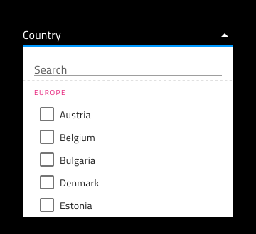

## コンボ

Combo コンポーネントでは、ユーザーがスクロール可能なリストでユーザー インタラクションに応じて表示されるコレクションから項目を選択できます。単一項目のみに制約する場合は、[Dropdown](dropdown.md)を代わりに使用してください。Combo は、[Ignite UI for Angular Combo コンポーネント](https://jp.infragistics.com/products/ignite-ui-angular/angular/components/combo.html)と視覚的に同じです。

### Combo デモ

Combo は 2 つのパーツに分かれます。現在の選択を含む入力と 1 つ以上の項目を選択するために表示するドロップダウン。

### Combo 入力タイプ

標準の [Input](input.md) のように Combo 入力は線タイプ (エアリー スタイル)、境界線タイプ (単色背景でよりはっきりと表示)、より読みやすくするために鮮明な画像の上に配置する際に最適なボックス タイプから選択が可能です。

`line`

`border`

`box`

### Combo 入力バリアント

標準 [Input](input.md) 同様、Combo 入力は、**明暗**バリアントでわかりやすく、背景に明暗のコントラストを付けてスタイル設定できます。

### 状態

ユーザーが Combo とインタラクティブに操作する際に入力はさまざまな状態を経由します。コンテンツの代わりにプレースホルダーがある**アイドル**状態、ドロップダウンが開いているときのフォーカス状態、ユーザーが選択を完了して次に進むときの塗りつぶし状態、Combo がインタラクションをサポートしない無効状態。柔軟性が向上したことにより、Hi-Fi プロトタイプへシームレスにフローする動的なインタラクション デザインの作成が可能です。

`idle`

`focused`

`filled`

`disabled`

経験豊富なデザイナーは、ユーザー入力を制限して無効な状態を防止するために、検証スタイルを使用します。Combo の検証スタイルには統一感のある標準 [Input](input.md) があり、成功、警告、エラーを表示する洗練されたデザインを提供します。

### レイアウト

Combo 入力にはレイアウト オプションが 1 つのみですが標準 [Input](input.md) と統一させてオーバーライドが保存されます。

### Combo Dropdown タイプ

Combo に使用される Dropdown は、標準 [Dropdown](dropdown.md) コンポーネント同様にデスクトップやモバイルに適切なサイズがサポートされます。

### Combo Dropdown 項目

Combo に使用されるドロップダウンは、3 つの項目タイプ (header、item、multiselect item) をサポートします。ヘッダーでグループの他の項目を体系化できます。

### Combo Dropdown 項目状態

Combo 内の Dropdown 項目は、5 つの状態をサポートします。disabled, **idle**、focused、selected、focused&selected。

### スタイル設定

Combo は入力とドロップダウン部分でスタイルの組み合わせに柔軟性があります。入力テキストの色と下線のスタイルと色、ドロップダウン背景色、項目やヘッダーの背景色とテキスト色などの Combo ドロップダウンの項目に関連するさまざまなオーバーライドを制御します。

## 使用方法

Combo を使用する際に入力とドロップダウンは同じ幅で左右の境界線が一致する必要があります。Combo がフォーカスされたときのドロップダウンの表示は、Combo が表示をトリガーしたあとに常にコンテンツの上に表示する必要があります。Combo は、コンテンツをアコーディオンのようにはプッシュしません。

| 良い例                                                                           |悪い例                                                                            |
| ---------------------------------------------------------------------------- | -------------------------------------------------------------------------------- |
| | |
| | |

## コードの生成

このセクションは、オーバーライドとコード生成にどのような影響があるかについて説明します。

> [!WARNING]
> デザインの Dropdown インスタンスで `Detach from Symbol` をトリガーすると、ほとんどの場合で チップ のためのコード生成機能が失われます。

### DataSource

`DataSource` 値は、Combo のデータソースを設定するために使用されます。項目の配列 (string または number) またはオブジェクトの配列に[バインド](../codegen/data-binding.md)できます。`DataSource` がサポートされない場合、Combo ドロップダウンで選択する値がありません。

### ValueDataProperty と DisplayDataProperty

`ValueDataProperty` と `DisplayDataProperty` を使用して `valueKey` と `displayKey` のフィールドの設定に使用されます。フィールドは、オブジェクトの配列である`DataSource` に[バインド](../codegen/data-binding.md)したときに使用されます。1 つのみ提供した場合、両フィールドに使用されます。`DataSource` がオブジェクト配列でない場合、Combo はデータを表示できません。  

### バリアント

テーマが明るいまたは暗いかどうかを決定します。None に設定される場合、コントロールは描画されません。

### 状態

None に設定される場合、コントロールは描画されません。

### レイアウト

None に設定される場合、コントロールは描画されません。

### ラベル

Combo ではサポートされません。

### Combo テキスト

Combo テキストは、値が選択されるまで Combo 入力でプレース ホルダー テキストとして使用されます。テキスト、[バインディング テキスト](../codegen/data-binding.md)、またはその両方を含むことができます。例:

- 設定
- {settingsLabel}
- 重要な {labelText}

## その他のリソース

関連トピック:

- [Dropdown](dropdown.md)
- [Form Pattern](../patterns/form.md)
- [Input](input.md)
- [Data Binding](../codegen/data-binding.md)
  

コミュニティに参加して新しいアイデアをご提案ください。

- [Indigo Design **GitHub** (英語)](https://github.com/IgniteUI/design-system-docfx)