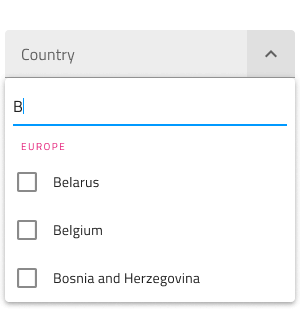
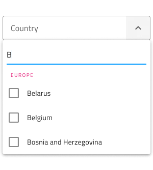
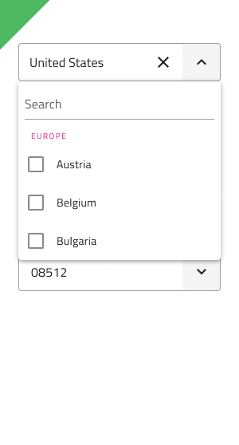

# Combo (コンボ)

Combo コンポーネントでは、ユーザーがスクロール可能なリストでユーザー インタラクションに応じて表示されるコレクションから項目を選択できます。単一項目のみに制約する場合は、[Dropdown](dropdown.md) を代わりに使用してください。Combo は、[Ignite UI for Angular Combo コンポーネント](https://jp.infragistics.com/products/ignite-ui-angular/angular/components/combo.html)と視覚的に同じです。

## Combo デモ

Combo は 2 つのパーツに分かれます。現在の選択を含む入力と 1 つ以上の項目を選択するために表示するドロップダウン。

## Input タイプ

Combo Input は線タイプ (エアリー スタイル)、境界線タイプ (単色背景でよりはっきりと表示)、より読みやすくするために鮮明な画像の上に配置する際に最適なボックス タイプから選択が可能です。

`line`

`border`

`box`

## 操作状態

3 つの Combo Input タイプはそれぞれ、有効または無効の状態で挿入できます。

## Input バリアント

Combo Input は、明暗バリアントで分かりやすく、背景に明暗のコントラストを付けてスタイル設定できます。

## 状態

ユーザーが Combo とインタラクティブに操作する際に入力はさまざまな選択状態を経由します。コンテンツの代わりにプレースホルダーがある**アイドル**状態、ドロップダウンが開いているときのフォーカス状態、ユーザーが選択を完了して次に進むときの塗りつぶし状態。柔軟性が向上したことにより、Hi-Fi プロトタイプへシームレスにフローする動的なインタラクション デザインの作成が可能です。

`idle`

`focused`

`filled`

経験豊富なデザイナーは、ユーザー入力を制限して無効な状態を防止するために、検証スタイルを使用します。Combo の検証スタイルには統一感のある標準 [Input](input.md) があり、成功、警告、エラーを表示する洗練されたデザインを提供します。

## レイアウト

Combo Input にはレイアウト オプションが 1 つのみですが標準 [Input](input.md) と統一させてオーバーライドが保存されます。

## Dropdown タイプ

Combo に使用される Dropdown は、標準 [Dropdown](dropdown.md) コンポーネント同様にデスクトップやモバイルに適切なサイズがサポートされます。

## Dropdown 検索入力

Dropdown には、暗いバリエーションと明るいバリエーションが付属する検索入力、状態の選択、および標準の [Input](input.md) と同様のレイアウトのオプションが含まれています。

## Dropdown 項目

Combo に使用される Dropdown は、ヘッダーと複数選択項目の 2 種類の項目をサポートします。ヘッダーを介して、項目をグループに体系化できます。

## Dropdown 項目状態

Combo 内の Dropdown 項目は、5 つの状態をサポートします: disabled, **idle**、focused、selected、selected&focused。

## スタイル設定

Combo は入力とドロップダウン部分でスタイルの組み合わせに柔軟性があります。入力テキスト要素の色と下線のスタイルと色を制御するオーバーライドがあります。Dropdown の場合、背景色を変更するか、検索入力や背景色とテキスト色の項目など、Combo Dropdown の項目に関連するさまざまなオーバーライドを使用できます。

## 使用方法

Combo を使用する際に入力とドロップダウンは同じ幅で左右の境界線が一致する必要があります。Combo がフォーカスされたときのドロップダウンの表示は、Combo が表示をトリガーしたあとに常にコンテンツの上に表示する必要があります。Combo は、コンテンツを展開パネルのようにはプッシュしません。

| 良い例                                                                           |悪い例                                                                            |
| ---------------------------------------------------------------------------- | -------------------------------------------------------------------------------- |
|  |  |
|  |  |

## その他のリソース

関連トピック:

- [Dropdown](dropdown.md)
- [Form パターン](../patterns/form.md)
- [Input](input.md)
  

コミュニティに参加して新しいアイデアをご提案ください。

